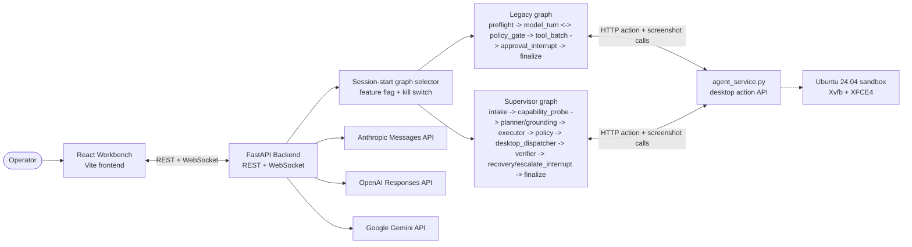

# computer-use

A local workbench for running, inspecting, and debugging provider-native
computer-use agents on a controlled Ubuntu desktop.

[](LICENSE)
[](pyproject.toml)
[](https://github.com/pypi-ahmad/computer-use/commits)

Repository URL: https://github.com/pypi-ahmad/computer-use.git

`computer-use` is a local, single-user research workbench that lets you run
real computer-use sessions against an isolated desktop, watch the desktop as the
model sees it, inspect every turn, and audit the runtime decisions that connect
the model to the sandbox. It combines a React/Vite frontend, a FastAPI backend,
and a Dockerized Ubuntu/XFCE desktop into one opinionated environment for
testing Anthropic, OpenAI, and Google Computer Use behavior in a way that is
reproducible, inspectable, and safer than pointing a model at your host machine.

If you only need the shortest path to trying the project, jump to
[Quickstart](#quickstart). If you want the operating manual, see [USAGE.md](USAGE.md).
If you want the architecture and code-level contract map, see
[TECHNICAL.md](TECHNICAL.md). If you want the rollout playbook and operator
note for the supervisor graph, see
[docs/supervisor-rollout-plan.md](docs/supervisor-rollout-plan.md) and
[docs/operator-supervisor-graph-migration.md](docs/operator-supervisor-graph-migration.md).

Core stack quick scan:

[](https://www.python.org/)
[](https://fastapi.tiangolo.com/)
[](https://react.dev/)
[](https://vite.dev/)
[](https://www.langchain.com/langgraph)
[](https://www.docker.com/)
[](https://playwright.dev/)
[](https://www.anthropic.com/)
[](https://openai.com/)
[](https://deepmind.google/technologies/gemini/)

## Tech stack

The full badge grid below expands that core stack into the backend,
frontend, sandbox, provider, and testing layers.

<table>
<tr>
<td valign="top" width="50%">

**Backend &amp; Orchestration**

[](https://www.python.org/)
[](https://fastapi.tiangolo.com/)
[](https://www.uvicorn.org/)
[](https://www.langchain.com/langgraph)
[](https://sqlite.org/)
[](https://developer.mozilla.org/en-US/docs/Web/API/WebSockets_API)

</td>
<td valign="top" width="50%">

**Frontend**

[](https://react.dev/)
[](https://vite.dev/)
[](https://nodejs.org/)
[](https://developer.mozilla.org/en-US/docs/Web/JavaScript)

</td>
</tr>
<tr>
<td valign="top">

**Sandbox &amp; Desktop**

[](https://www.docker.com/)
[](https://ubuntu.com/)
[](https://xfce.org/)
[](https://novnc.com/)
[](https://playwright.dev/)

</td>
<td valign="top">

**Providers &amp; Quality**

[](https://www.anthropic.com/)
[](https://openai.com/)
[](https://deepmind.google/technologies/gemini/)
[](https://pytest.org/)
[](https://docs.astral.sh/ruff/)

</td>
</tr>
</table>

## Table of contents

- [Executive summary](#executive-summary)
- [Tech stack](#tech-stack)
- [Why this project exists](#why-this-project-exists)
- [Who this is for](#who-this-is-for)
- [Who this is not for](#who-this-is-not-for)
- [At a glance](#at-a-glance)
- [What the repository contains](#what-the-repository-contains)
- [System architecture](#system-architecture)
- [How a session actually runs](#how-a-session-actually-runs)
- [Supported models](#supported-models)
- [Why the model matrix matters](#why-the-model-matrix-matters)
- [Quickstart](#quickstart)
- [Windows quickstart](#windows-quickstart)
- [Rebuilding the sandbox and daily operations](#rebuilding-the-sandbox-and-daily-operations)
- [What you should expect on first boot](#what-you-should-expect-on-first-boot)
- [A guided first session](#a-guided-first-session)
- [Configuration philosophy](#configuration-philosophy)
- [Configuration overview](#configuration-overview)
- [Sandbox and security model](#sandbox-and-security-model)
- [Provider behavior by vendor](#provider-behavior-by-vendor)
- [Frontend experience](#frontend-experience)
- [Observability and traceability](#observability-and-traceability)
- [Project workflows and example tasks](#project-workflows-and-example-tasks)
- [Development workflow](#development-workflow)
- [Testing and quality gates](#testing-and-quality-gates)
- [Troubleshooting guide](#troubleshooting-guide)
- [FAQ](#faq)
- [Documentation map](#documentation-map)
- [Contributing](#contributing)
- [Support and project expectations](#support-and-project-expectations)
- [Roadmap mindset](#roadmap-mindset)
- [License](#license)
- [Acknowledgments](#acknowledgments)

## Executive summary

This repository is not a generic browser bot and it is not a repository-aware
coding agent. It is a local workbench for people who want to evaluate,
understand, and iterate on real provider-native Computer Use implementations.
The key distinction is that the project tries to preserve each provider's actual
wire shape, safety handshake, screenshot contract, and action semantics instead
of flattening them behind an artificial lowest-common-denominator layer.

That design choice matters. Anthropic, OpenAI, and Google expose materially
different computer-use contracts. They differ in how screenshots are sent, how
safety interruptions happen, how action batches are represented, how reasoning
state is carried from turn to turn, how coordinates are interpreted, and where
the line sits between the model SDK and your local executor. If you hide those
differences too aggressively, you get a tool that feels simple at first but is
hard to trust when you need to debug a real failure. `computer-use` takes the
opposite approach: it keeps the system operator-friendly, but it does not erase
the things you eventually need to inspect.

From a practical perspective, the project gives you a web UI for choosing a
provider and model, starting a sandbox, entering a task, watching the live
desktop, inspecting per-turn logs, handling safety interruptions, and exporting
session traces. The backend handles model validation, key resolution, WebSocket
broadcasting, graph orchestration, and container management. The sandbox is an
Ubuntu 24.04 desktop with Xvfb, XFCE4, browsers, and an in-container HTTP agent
service that turns abstract actions into real desktop operations.

The resulting workflow is straightforward: pick a model, describe a task, start
the environment, watch the agent operate on a virtual desktop, and inspect what
happened if the run succeeds, stalls, or fails. That simplicity at the surface
is supported by deliberate engineering underneath: provider-specific adapters,
checkpointed session state, explicit model allowlists, loopback-first defaults,
and test coverage for many of the brittle seams where desktop automation, model
APIs, and safety requirements collide.

## Why this project exists

Computer-use systems are usually demoed at the point where they look the most
magical: a model sees a screen, clicks around, types into applications, and
appears to behave like a human operator. What gets omitted in many demos is the
engineering work required to make those sessions understandable, reproducible,
and governable. Once you try to move from a polished demo to actual adapter work
or policy work, you immediately run into harder questions.

What exact screenshot did the model receive on the turn where it went off the
rails? Did the provider ask for a safety confirmation and did the harness really
stop, or did it silently auto-acknowledge? Are the model's coordinates meant to
be interpreted as normalized 0-999 values or as literal pixels? If the backend
dies during a manual approval, can you resume cleanly, or is the session now in
an undefined state? Did your abstraction layer accidentally strip a field that a
provider requires on replay? If the browser automation path behaves differently
from the desktop path, can you tell from the trace what really happened?

This repository exists to make those questions answerable. It is meant for the
moment after the first demo, when you care less about the novelty of the model
moving a mouse and more about the integrity of the entire system around that
model. It provides a place to compare providers, harden a sandbox, audit model
behavior, and improve the adapter layer without hand-waving away the
differences.

It also exists because a local workbench is still the right shape for many kinds
of experimentation. You do not need a multi-tenant cloud control plane to learn
how a provider's tool schema behaves, validate a replay fix, tune a prompt,
inspect a trace, or reproduce a bug in safety handling. For those tasks, a
single-machine environment with explicit boundaries is often faster, easier to
debug, and safer.

The project therefore optimizes for clarity over mass deployment. It assumes a
single operator. It binds to loopback by default. It does not ship a built-in
auth layer intended for external exposure. It keeps the desktop in Docker. It
surfaces model-visible screenshots. It treats safety prompts as operator events
instead of silent control flow. Those are not incidental details. They are the
core reasons the system is useful.

## Who this is for

This repository is aimed at technical users who need more than a simple "click
run and hope" interface.

It is a good fit for:

- engineers integrating a provider's computer-use API into an internal system
- researchers comparing how different vendors express action semantics,
  screenshots, and safety interrupts
- maintainers working on adapter behavior, desktop execution, or runtime safety
- evaluators who need traces, reproducible failure cases, and a visible
  execution environment
- technically curious users who want to understand how real CU sessions behave
  rather than consume a black-box demo

It is especially useful if you care about the seams. By seams, think: the point
where a provider response becomes an action batch, where a screenshot gets
resized or normalized, where a pause is persisted across a restart, or where a
UI command and a backend session can get out of sync. Those are the places where
production bugs usually hide, and they are exactly the places this workbench is
designed to make visible.

The project is also valuable for contributors who want a concrete environment in
which to make focused changes. Because the repository includes a frontend,
backend, sandbox, and extensive tests, it is possible to land targeted fixes
without needing to invent a new harness first. If your interest is in an
Anthropic tool-version change, a Gemini safety behavior, an OpenAI replay issue,
a Docker hardening improvement, or a frontend timeline bug, the surface area is
already present.

## Who this is not for

This repository is intentionally not trying to be everything.

It is not a hosted SaaS product. It is not a remote multi-user control plane. It
is not a browser-only automation framework. It is not a replacement for
Playwright, Selenium, or a traditional end-to-end UI test runner. It is not a
secure public service that you should expose to the Internet as-is. It is not a
remote coding assistant that understands your source tree and edits your
application from the desktop.

If your primary goal is stable deterministic browser testing, you probably want
conventional automation tools. If your primary goal is secure team-scale access
to an AI workstation over the network, you will need an additional auth,
authorization, and hosting layer around this repo. If your primary goal is a
minimal demo with no operational detail, this repository may feel too explicit
about the underlying machinery.

That is acceptable. The design target here is not "the simplest possible AI
desktop toy." The design target is "a professional local environment in which
computer-use behavior can be exercised and understood."

## At a glance

If you want the fastest high-level read, these are the decisions that define the
project:

- The desktop runs in Docker, not on the host.
- The frontend is a React/Vite workbench.
- The backend is a FastAPI service with WebSocket streaming.
- Session orchestration is modeled as a LangGraph state machine.
- Anthropic, OpenAI, and Google adapters keep vendor-specific behavior rather
  than pretending all providers are identical.
- The model list is controlled by `backend/models/allowed_models.json`.
- The backend binds to loopback by default.
- Safety prompts are surfaced to the operator instead of silently accepted.
- Session state is traceable, and paused sessions can resume after a backend
  restart when the runtime path supports it.
- The repository is optimized for local research, evaluation, and adapter work.

The canonical Git remote is:

```text
https://github.com/pypi-ahmad/computer-use.git
```

If you are preparing onboarding material, internal notes, or pull requests,
prefer that URL so the project is referenced consistently.

## What the repository contains

The repo is deliberately organized around the boundaries that matter at runtime.

- `frontend/` contains the operator workbench. That includes the screen view,
  model/provider picker, session control flow, safety modal, and the WebSocket
  client logic that turns backend events into UI state.
- `backend/` contains the server, model registry loader, adapter layer,
  LangGraph orchestration, tracing, and container management logic.
- `docker/` contains the sandbox image, entrypoint, and the in-container agent
  service that performs actions and captures screenshots.
- `tests/` contains a large suite of unit, policy, regression, and hot-path
  tests that lock in the behavior of adapters, server validation, security
  expectations, coordinate scaling, and failure handling.
- `evals/` contains evaluation-oriented harness code and degraded-state checks.
- [USAGE.md](USAGE.md) is the operator reference.
- [TECHNICAL.md](TECHNICAL.md) is the code-and-architecture reference.

This split is intentional. The README should help a new visitor understand the
project, why it is useful, how to start it, and where to go next. The deeper
operator and implementation details live in the dedicated companion docs.

## System architecture

At runtime, the system is a three-plane loop.

The first plane is the frontend. It is a browser-based workbench used by the
operator. It renders the live session, receives WebSocket events, shows logs and
steps, and offers a UI for selecting provider, model, and task parameters.

The second plane is the backend. It validates requests, resolves the selected
model against the allowlist, resolves API keys from the UI or environment,
starts or checks the sandbox, coordinates the LangGraph state machine, handles
pause/resume logic, proxies noVNC, and broadcasts run events to the UI.

The third plane is the sandbox. It is an Ubuntu 24.04 container with Xvfb,
XFCE4, hardened browsers, common desktop apps such as LibreOffice, XFCE
Settings/Task Manager, Ristretto, galculator, GIMP, Inkscape, and VS Code,
plus the VNC plumbing and HTTP agent service the backend drives.
The backend tells that agent service to click, type, drag, scroll, and capture
screenshots. The model never touches the host directly.



The reason this architecture works well for a research workbench is that each
boundary is inspectable. The UI is not where model decisions are made. The
backend is not the place where desktop actions are executed. The sandbox is not
the place where API keys should be broadly inherited. By keeping those concerns
separate, the repo is easier to reason about and safer to modify.

## How a session actually runs

A session begins when the operator chooses a provider and model in the frontend
and submits a task. The frontend calls `POST /api/agent/start` and keeps `/ws`
open for real-time updates. The backend validates the request, checks the model
against the allowlist, resolves credentials, starts the sandbox if needed, and
waits for the container-side agent service to become healthy.

Once the environment is ready, the backend creates an `AgentLoop`, builds the
provider adapter, selects either the legacy or supervisor graph once per
session, and enters the graph-driven execution flow. The supervisor path is
requested with `CUA_USE_SUPERVISOR_GRAPH=1`; otherwise the legacy path remains
the default. The exact internal details differ by provider, but the broad
pattern is the same: capture a screenshot, send a provider request, receive a
structured response that may contain text, actions, or safety state, execute
any returned actions through the desktop executor, capture the next screenshot,
and continue until the run ends.

The state machine is designed to make pauses and retries explicit. A provider
may require a human acknowledgment before a sensitive or policy-triggering step.
When that happens, the session enters an approval state that is surfaced to the
frontend. On the legacy path that pause lands at `approval_interrupt`; on the
supervisor path it lands at `escalate_interrupt`. The operator can approve or
deny. If the backend restarts during that pause window, the persisted graph
state allows the session to resume in a way that is far more reliable than
keeping everything only in in-memory callbacks.

During the run, the frontend shows the live desktop, the model-visible
screenshot stream, the log stream, and the timeline of steps. After the run,
the trace and checkpoint data remain available for inspection. That post-run
inspectability is one of the most important properties of the project. The goal
is not just to make the model do something interesting once. The goal is to make
the run understandable enough that you can trust, debug, and improve it.

## Supported models

At the time of writing, the workbench exposes the current computer-use-capable
model set through `backend/models/allowed_models.json`. The backend uses that file at
runtime, and the frontend consumes the resulting `/api/models` response.

The current selectable CU-capable models are:

| Provider | Model | CU path | Notes |
|---|---|---|---|
| Anthropic | `claude-opus-4-7` | `computer_20251124` | Highest-capability Anthropic path, strongest option for long-horizon or dense reasoning tasks. |
| Anthropic | `claude-sonnet-4-6` | `computer_20251124` | Balanced default for many desktop tasks. |
| OpenAI | `gpt-5.5` | built-in `computer` tool | Default OpenAI CU model. Uses the Responses API with stateless replay, `phase` preservation, and `detail: "original"` screenshot outputs. `Reasoning Effort` defaults to `medium` per OpenAI's GPT-5.5 model page. |
| OpenAI | `gpt-5.4` | built-in `computer` tool | Still supported for CU workloads that need the prior GPT-5.4 behavior. `Reasoning Effort` defaults to `none` per OpenAI's GPT-5.4 model page. |
| Google | `gemini-3-flash-preview` | `types.Tool(computer_use=...)` | Sole Gemini Computer Use SKU per Google's official docs. |

The registry also contains `gpt-5.4-nano`, but it is intentionally marked as not
supporting Computer Use and therefore is not surfaced as a selectable CU model.
That distinction matters: being listed in the JSON file is not the same thing as
being exposed by `/api/models`. The frontend only sees entries that are both
allowlisted and marked `supports_computer_use: true`.

If you change the model set, edit `backend/models/allowed_models.json`. That file is the
source of truth for what the workbench should expose. The rest of the system is
designed to follow it.

For exact `gpt-5.5` and `gpt-5.4` selections, the workbench exposes a
`Reasoning Effort` dropdown with a blank `Default` option plus the official
model-page values `none`, `low`, `medium`, `high`, and `xhigh`. The default
option follows the selected model's own docs: `medium` for GPT-5.5 and `none`
for GPT-5.4.

## Why the model matrix matters

It is tempting to think of model selection as a simple UI preference, but in a
computer-use harness it is really a runtime behavior decision. Different
providers do not merely have different quality or price characteristics. They
have different protocol and orchestration implications.

Anthropic models, for example, are sensitive to tool versioning and screenshot
scaling. OpenAI requires careful replay semantics and treats safety
acknowledgments through a different field shape than Gemini. Google uses
normalized coordinates and has its own safety continuation pattern. Some models
work best at the default 1440x900 viewport, while others benefit from a
higher-resolution path. Some support richer zoom behavior. Some send multiple
actions in one turn. Some have more pronounced cost implications if session
history grows too large.

That is why the README lists models as part of the system description rather than
as marketing decoration. If you are evaluating behavior, the model matrix is not
an optional appendix. It is one of the central operating parameters of the whole
stack.

## Quickstart

The quickest way to run the project on macOS or Linux is:

```bash
git clone https://github.com/pypi-ahmad/computer-use.git
cd computer-use
cp .env.example .env
# add at least one provider API key

bash setup.sh
docker compose up -d

source .venv/bin/activate
python -m backend.main

# in a second terminal
cd frontend
npm run dev
```

Then open `http://localhost:3000`, click **Start Environment**, choose a
provider and model, and enter a task.

If you want the shortest summary of prerequisites before you try that flow, they
are:

- Docker 24+
- Python 3.11+
- Node.js 20+
- at least one valid provider API key

The repository URL for cloning is:

```text
https://github.com/pypi-ahmad/computer-use.git
```

That URL is also the canonical remote you should use in internal references,
automation scripts, onboarding notes, and documentation.

## Windows quickstart

On Windows PowerShell, use the repository in the same general order but with the
Windows setup script and activation path:

```powershell
git clone https://github.com/pypi-ahmad/computer-use.git
cd computer-use
Copy-Item .env.example .env
# add at least one provider API key

.\setup.bat
docker compose up -d

.venv\Scripts\Activate.ps1
python -m backend.main

# in a second terminal
cd frontend
npm run dev
```

If PowerShell blocks local script execution, a temporary session-scoped policy
change is usually enough:

```powershell
Set-ExecutionPolicy -Scope Process -ExecutionPolicy RemoteSigned
```

The repo is designed to be workable on Windows hosts, but remember that the
actual desktop the model controls still lives inside Docker. Windows is your
operator platform, not the execution surface the model sees.

## Rebuilding the sandbox and daily operations

The Quickstart commands assume a fresh repository. In day-to-day use you will
sometimes pull new commits, switch branches, or hit a stale layer cache. The
following recipes cover the recurring situations and explain what each command
actually does, so you do not run a destructive command without understanding it.

### Full clean rebuild from scratch

Use this when you have changed `docker/Dockerfile`, bumped pinned package
versions, or you suspect a stale layer is masking a fix. It is the safest
"start over" path because it forces every layer to be re-fetched and rebuilt.

```powershell
# 1. Stop and remove the running sandbox container plus the project network.
#    `down` is non-destructive: images, volumes, and the local source tree
#    are untouched. It only tears down the live container and network.
docker compose down

# 2. Reclaim disk by removing every image not currently referenced by a
#    running container. -a includes images without a container reference,
#    -f skips the interactive confirmation. This is safe for this project
#    because the image is reproducible from the Dockerfile.
docker image prune -a -f

# 3. (Optional) Wipe the BuildKit layer cache. Use this only if you suspect
#    a corrupted cache or want a fully cold build. It will make the next
#    build noticeably slower because nothing is cached anymore.
docker builder prune -f

# 4. Build the sandbox image without using any cache. --no-cache forces
#    every Dockerfile instruction to re-execute; cua-environment is the
#    service name from docker-compose.yml.
docker compose build --no-cache cua-environment

# 5. Start the sandbox in detached mode. -d returns control to the shell
#    immediately; the container keeps running in the background. Logs are
#    available via `docker logs -f cua-environment`.
docker compose up -d
```

### Running the backend and frontend after a rebuild

The Docker container only hosts the sandbox desktop. The FastAPI backend and
the Vite frontend run on your host machine and must be started separately.

```powershell
# Backend ─ first terminal
cd a:\computer-use
.venv\Scripts\Activate.ps1               # activates the project virtualenv

# Create or refresh your API-key file. The example file ships with the repo;
# .env is gitignored so your real keys never leave your machine.
Copy-Item .env.example .env              # only needed if .env doesn't exist
# Edit .env and set ANTHROPIC_API_KEY / OPENAI_API_KEY / GOOGLE_API_KEY for
# whichever provider(s) you intend to use. The backend reads them on start.

python -m backend.main                   # serves http://localhost:8100
```

```powershell
# Frontend ─ second terminal (leave the backend running in the first one)
cd a:\computer-use\frontend
npm install                              # only on first run, or after deps change
npm run dev                              # serves http://localhost:3000
```

Open `http://localhost:3000` in your browser. The frontend will connect to the
backend on `8100` and the backend will connect to the sandbox container on
`9222` (agent service) and `9223` (Chrome DevTools Protocol, used by the
Gemini Playwright path).

### Restart after a code change in the sandbox image

When you have only changed Python code under `backend/` or files copied late
in the Dockerfile (`backend/`, `docker/agent_service.py`, `docker/entrypoint.sh`)
you do **not** need a full clean rebuild. Cached layers are still valid up to
the COPY of those files, so a normal up-down cycle picks up your changes:

```powershell
docker compose down
docker compose up -d
```

If you also edited `docker/Dockerfile` or `requirements.txt`, run the full
clean rebuild above instead.

### "Container name already in use"

When `docker compose up -d` fails with

```text
Error response from daemon: Conflict. The container name "/cua-environment"
is already in use by container "<id>".
```

an old container with the same name still exists outside the current compose
project (for example, left over from an earlier branch or a different
`COMPOSE_PROJECT_NAME`). `docker compose down` only removes containers it owns,
so the orphan must be removed directly:

```powershell
# -f forces removal even if the container is running. The image and
# everything else are kept; only the named container is deleted.
docker rm -f cua-environment

docker compose up -d
```

After this, the next `docker compose up -d` will create the container cleanly.

## What you should expect on first boot

The first image build is not instant. The Docker image includes the desktop
stack, browsers, fonts, utility packages, and Python dependencies needed for the
agent service. On a cold machine, the initial build can take several minutes.
That is normal. Subsequent runs are much faster because the layers are already
present.

When the frontend opens for the first time, you should expect to see the
workbench in a "not started" or "starting" state until the environment is
ready. The backend will not attempt to run the provider loop until the
container-side agent service answers its health check. If something goes wrong
at that stage, the goal is to fail early and explicitly, not to let you enter a
run that later dies on the first screenshot or action call.

If the environment comes up cleanly, the live desktop panel will eventually show
the noVNC session, and the model picker should populate from `/api/models`. At
that point the platform is ready for real work, not just a static UI demo.

## A guided first session

The best first session is a small, obvious task that forces the full stack to do
real work without introducing unnecessary ambiguity. A simple example is:

> Open Chrome and search for "weather in New York."

That single sentence exercises model selection, screenshot capture, provider
request construction, action translation, desktop execution, and UI event
broadcasting. It is short enough that you can spot mistakes quickly, but real
enough that it validates the end-to-end system.

When you run a task like that, watch four things:

1. the environment state in the top UI strip
2. the WebSocket connection state
3. the live timeline of model turns and actions
4. the difference between the noVNC desktop and the model-visible screenshot
   stream

The timeline is especially important. It tells you whether the model returned
text, one action, or a batch of actions; whether the backend executed those
actions; and what the next screenshot looked like. The ability to observe the
session at that level is one of the main reasons to use this repo instead of a
lighter, less inspectable prototype.

For your first few runs, choose tasks that are explicit, bounded, and visually
verifiable. Good examples include opening a browser, navigating to a public
page, typing text into a form, launching a desktop application, or saving a
small file into a known directory. Avoid large or open-ended tasks until you are
confident the environment is behaving correctly.

## Configuration philosophy

The configuration model is intentionally simple and operator-friendly.

The project assumes a local, single-user control surface, so it resolves secrets
in a pragmatic order: explicit value from the UI first, then `.env`, then the
system environment. That order gives you two desirable properties at once.
First, the UI can be used as a temporary per-session override without writing
secrets to disk. Second, a local operator can still keep the common case simple
by placing keys in `.env` and letting the UI discover them automatically.

The backend also leans heavily toward safe defaults. It binds to loopback, not a
public interface. The WebSocket and VNC paths can be gated by a token when you
intentionally step outside the default trust boundary. The container is started
with a constrained user and a limited action surface. The goal is not perfect
security theater. The goal is to make the default path safer than the obvious
alternatives while still keeping the system practical for local research.

Finally, configuration is split across documents on purpose. The README is meant
to be a professional, comprehensive entry point, but the full variable matrix is
still best maintained in [USAGE.md](USAGE.md). That keeps the README useful to
first-time visitors while allowing the operator reference to stay exact and
auditable.

## Configuration overview

At a high level, configuration falls into five buckets:

1. provider API keys
2. backend bind and runtime behavior
3. sandbox desktop settings
4. provider-specific tuning
5. observability and development settings

Here are the most important environment variables to understand first:

| Variable | Typical value | Why it matters |
|---|---|---|
| `ANTHROPIC_API_KEY` | your Anthropic key | Required for Claude sessions |
| `OPENAI_API_KEY` | your OpenAI key | Required for GPT-5.5 and GPT-5.4 sessions |
| `GOOGLE_API_KEY` | your Google AI key | Required for Gemini sessions (preferred name) |
| `GEMINI_API_KEY` | your Google AI key | Accepted as a fallback alias for the Gemini provider |
| `HOST` / `PORT` | `127.0.0.1` / `8100` | Backend bind address and port |
| `CUA_WS_TOKEN` | custom secret | Needed when you intentionally expose `/ws` or `/vnc/websockify` beyond loopback |
| `SCREEN_WIDTH` / `SCREEN_HEIGHT` | `1440` / `900` | Default virtual desktop size |
| `CUA_USE_SUPERVISOR_GRAPH` | `0` / `1` | Requests the supervisor graph for new sessions; legacy remains the default |
| `CUA_SUPERVISOR_FAILURE_RATE_THRESHOLD` | `0.20` | Kill-switch trip threshold for supervisor node session failure rate |
| `CUA_SUPERVISOR_FAILURE_RATE_MIN_SESSIONS` | `100` | Rolling window size before the supervisor kill switch can trip |
| `OPENAI_REASONING_EFFORT` | model default | Overrides OpenAI reasoning effort; GPT-5.5 defaults to `medium`, GPT-5.4 defaults to `none` |
| `CUA_CLAUDE_CACHING` | `1` or unset | Enables Claude tool-definition prompt caching |
| `CUA_OPUS47_HIRES` | `1` or unset | Enables Opus 4.7 hi-res behavior |
| `CUA_GEMINI_THINKING_LEVEL` | `high` | Controls Gemini reasoning depth |

If you want the full field-by-field matrix with defaults and code ownership, use
[USAGE.md](USAGE.md#configuration-reference). That document is the better place
to audit exact runtime variable behavior.

## Sandbox and security model

The most important security property in this project is simple: the agent does
not run on your host desktop. It runs inside a Dockerized Ubuntu desktop
environment. That is not a perfect containment boundary, but it is a far better
default than letting a model drive your real machine directly.

The sandbox is configured to reduce blast radius in several ways. It runs as a
non-root `agent` user. The image drops Linux capabilities, uses
`no-new-privileges`, and avoids host filesystem mounts by default. The backend
and container communicate through the in-container agent service with a
per-session token. Browser launches are hardened and use a minimal environment.
The backend uses loopback-first defaults and requires intentional operator
action to expose sensitive surfaces more broadly.

The action surface is also constrained. The harness is not a generic "run any
shell command the model asks for" bridge. It exposes the actions that the engine
needs and treats many other legacy or dangerous action paths as unavailable
unless you explicitly re-enable them for development or compatibility reasons.
That matters because the easiest way to create an unsafe AI desktop harness is
to make every possible power path implicitly available.

Safety prompts are surfaced to the operator. This point deserves emphasis. When
a provider indicates that a confirmation or acknowledgment is required, the
system treats that as a real decision point, not a field to auto-fill. That is
the correct posture for a research workbench where you want both visibility and
control.

This repository is still not a drop-in secure public service. If you plan to
bind it beyond loopback, you need to put real authentication and network
controls in front of it. But as a local workbench, the security model is clear,
deliberate, and significantly safer than a host-bound equivalent.

For deeper sandbox details, see [docker/SECURITY_NOTES.md](docker/SECURITY_NOTES.md).

## Provider behavior by vendor

One of the biggest strengths of the repo is that it does not flatten vendor
behavior into a fiction. Each provider gets an adapter that preserves the parts
of the contract you need to reason about.

### Anthropic

Anthropic sessions are handled through the Messages beta computer-use path.
Current supported Anthropic entries use the `computer_20251124` tool contract.
That tool path supports the newer coordinate and zoom behavior, and it behaves
differently from the older Claude compatibility path that many early examples on
the Internet still reference. In this repository, Opus 4.7 and Sonnet 4.6 are
the active Anthropic models. Opus 4.7 is the premium option for harder planning,
denser UIs, and longer-horizon tasks.
When the workbench's Web Search toggle is enabled, Anthropic sessions also
attach the official `web_search_20250305` server tool alongside the computer-
use tool. When the toggle is off, Claude receives only the computer-use tool.

### OpenAI

OpenAI sessions use the Responses API and the built-in `computer` tool shape for
`gpt-5.5` and `gpt-5.4`. The important implementation detail is stateless replay. The adapter
does not rely on server-side conversation state through `previous_response_id`.
Instead it replays sanitized outputs and carries forward encrypted reasoning
state in the supported form. That is both a correctness choice and a
data-handling choice. It also means the adapter logic has to be careful about
exactly which fields are preserved during replay.

For the two OpenAI CU models surfaced in the workbench, the `Reasoning Effort`
control follows OpenAI's current model pages. GPT-5.5 defaults to `medium` and
GPT-5.4 defaults to `none`; the UI exposes those values plus `low`, `high`, and
`xhigh`, and the backend applies the model-specific default whenever the field
is left blank.

When the workbench's Web Search toggle is enabled, OpenAI sessions advertise
the official `web_search` tool alongside `computer`, which matches the
documented combined-tool Responses flow. When the toggle is off, the request
uses only `computer`.

### Google

Google sessions use the Gemini computer-use tool path. Gemini returns normalized
coordinates, which the executor denormalizes to actual pixels before passing
them to the container-side desktop service. That distinction is easy to miss if
you are comparing provider logs casually, but it is critical when debugging
action accuracy. Browser-mode Gemini sessions default to the
Playwright-over-CDP path against the in-container Chrome session, with
`CUA_GEMINI_USE_PLAYWRIGHT=0` falling back to the xdotool path. The repo
standardizes on `gemini-3-flash-preview`, the only Gemini SKU on Google's
current Computer Use supported-model list that this project ships against.
When the workbench's Web Search toggle is enabled, Gemini sessions attach
`google_search` alongside `computer_use` and set
`include_server_side_tool_invocations=True`, following Google's documented
combined-tool configuration. When the toggle is off, Gemini receives only the
Computer Use tool.

### Document attachments

The backend and React workbench both support provider-native document
grounding. The sidebar uploader posts to `POST /api/files/upload`, stores the
returned ids in `attached_files`, and forwards them on
`POST /api/agent/start`. Direct API callers can use the same flow manually.
OpenAI turns those server-side file ids into a vector store and attaches the
`file_search` tool. Gemini uploads into a File Search store, runs a one-shot
file-search-only RAG pre-step because Google's docs forbid combining File
Search with other tools in the same call, then injects the grounded text into
the Computer Use loop. Anthropic uses the official Files API: `.pdf` and
`.txt` become `document` blocks, while `.md` and `.docx` are extracted to
plain text because Claude document blocks only support PDF and `text/plain`.

## Frontend experience

The frontend is not an afterthought bolted on top of a backend demo. It is the
operator surface through which the rest of the system becomes usable.

The model and provider picker is populated from the backend's filtered model
list. The screen panel lets you switch between a live noVNC desktop and the
model-visible screenshot stream. The logs panel exposes runtime messages that
would otherwise be hidden in the server. The timeline turns raw run events into
something a human can scan. The safety modal makes the confirmation path
explicit. Session state is managed so that stop/retry behavior is visible to the
operator rather than silently swallowed.

This design follows a simple principle: if a person is supposed to trust the
system, they should be able to see what it is doing. The frontend therefore
focuses on state visibility, action legibility, and clear transitions between
"environment not ready," "run active," "needs approval," and "finished."

## Observability and traceability

This repository treats observability as a first-class feature, not a cleanup
task left for later.

During a live session, the frontend receives streamed log events, step events,
screenshot events, graph-state events, and finish events over WebSocket. That
makes it possible to watch a run as it happens and understand where time is
being spent.

After the run, the backend writes traces and graph state in ways that support
postmortem analysis. Trace payloads are structured and redacted. Session
snapshots are kept in the LangGraph SQLite checkpoint store. If a run is paused
on a human approval, that persisted state makes restart-resume possible in
supported paths.

When the supervisor graph is enabled, the backend also keeps an operator-facing
rollout snapshot at `GET /api/agent/graph-rollout`. That endpoint exposes the
selected graph counts, per-node latency histograms and failure rates, verifier
verdict distribution, policy escalation rate, recovery classification
distribution, planner-stage long-term-memory hit rate, and the automatic kill
switch state that falls new sessions back to the legacy graph if a supervisor
node exceeds its configured failure-rate window.

From an engineering perspective, this is one of the most valuable traits of the
project. A surprising number of agent systems are easy to demo but hard to
investigate. This one is designed for investigation.

## Project workflows and example tasks

The easiest way to understand the project is to think in terms of concrete task
shapes.

### Web task

"Open a browser, navigate to a public site, fill a form, and confirm success."

This exercises navigation, typing, clicking, screenshot refresh, and post-action
verification. GPT-5.5 is often a strong fit here because its tool batches can
reduce the number of turns needed for repetitive browser work.

### Cross-application desktop task

"Open LibreOffice, create or edit a document, save it to a known folder, then
use the file manager to confirm the result exists."

This exercises desktop state transitions, window focus, file save paths, and UI
reading in a more varied environment than a browser tab. Claude Sonnet 4.6 is a
good balanced default here.

### Reasoning-heavy research task

"Compare a few pages, extract key details, summarize a policy or pricing result,
and stop when the answer is grounded."

This is the sort of work where model reasoning quality matters more than raw
action speed. Claude Opus 4.7 is often the strongest fit here. If you need the
Google path, `gemini-3-flash-preview` is the only supported Gemini CU SKU and
can also ground itself on uploaded documents through the backend's pre-step RAG
path.

### Sandbox and policy debugging task

"Trigger a path that should require user confirmation and verify that the UI and
backend both pause correctly."

This is less glamorous than a browser demo, but it is exactly the kind of run
that matters if you are maintaining the harness. The project is built to make
that sort of validation practical.

## Development workflow

For day-to-day development, the broad rhythm is:

1. create or activate the Python virtual environment
2. install backend dependencies
3. install frontend dependencies
4. bring up the Docker sandbox
5. run the backend
6. run the frontend
7. make a small, targeted change
8. validate with the narrowest relevant test or command first

Typical local commands:

```bash
python -m venv .venv
source .venv/bin/activate
pip install -r requirements.txt

cd frontend
npm install
cd ..

docker compose up -d
python -m backend.main

# in another terminal
cd frontend && npm run dev
```

For backend-oriented changes, you will often want to use targeted pytest runs
instead of full-suite runs at first. The test suite is extensive enough that a
narrow validation loop saves time, but broad enough that you can still close out
changes with meaningful confidence once the specific slice passes.

This repo responds best to small, falsifiable changes. If you suspect a provider
adapter regression, isolate the relevant test file. If you changed the model
registry, run the model-policy and server-validation slices. If you changed the
Dockerfile or requirements, validate the security checks that CI actually runs.
That discipline keeps the repository maintainable.

## Testing and quality gates

The project includes a large pytest suite covering adapter wire shapes, server
validation, WebSocket lifecycle, security hardening, model policy, coordinate
scaling, session replay, and many regression cases around earlier fixes.

Typical commands:

```bash
pytest -q
pytest --collect-only
ruff check backend tests evals docker
python -m backend.models.validation --json
python -m backend.infra.observability list
```

The suite is intentionally not ornamental. Many of the tests exist because the
failure they describe already happened once or could happen easily during adapter
work. When you see a file like `tests/test_fixes_wave_apr2026.py` or
`tests/test_gap_coverage.py`, read it as living institutional memory. Those
tests are there to prevent known classes of regression from quietly returning.

CI also exercises dependency and security surfaces. If you update the Dockerfile
or Python dependencies, do not treat that as a documentation-only change. Those
changes can affect security audit results, build stability, or runtime behavior.

## Troubleshooting guide

### The frontend loads, but no models appear

The frontend model list comes from `GET /api/models`, which is driven by the
runtime allowlist. If the dropdown is empty, verify the backend is running,
check the network tab for the models request, and confirm the backend is not
failing on startup. Also remember that only entries with
`supports_computer_use: true` are surfaced to the UI.

### The container starts, then exits immediately

Check `docker logs cua-environment`. Common causes include first-run VNC
configuration issues, image build problems, or an unexpected error in the
entrypoint path. The backend cannot make the desktop usable if the container
itself never reaches a healthy state.

### The session fails on the first screenshot

This usually means the container-side agent service is unhealthy, unreachable,
or returning a broken screenshot payload. The project has guards for empty or
short screenshot responses in multiple adapters, but the real fix is to inspect
the health and screenshot path, not to rely on a graceful failure message.

### The noVNC desktop looks fine, but the model behaves as if it saw something
else

Switch to the screenshot-view mode and compare. The live noVNC view is for the
operator. The screenshot stream is for the model. They often match, but what the
model receives is the truth when debugging action decisions.

### A safety prompt appears and the run pauses

That is expected behavior. The repository is designed to surface required
confirmations rather than auto-bypass them. Approve or deny in the UI. If the
backend restarts during the pause, the checkpointed graph state is what allows a
clean resume path.

### The backend is reachable on my machine. Can I expose it publicly?

Not safely by default. The project is built for loopback-first local operation.
If you need any public or team-visible deployment, treat that as a separate
infrastructure problem and put proper auth, network controls, and operational
policy in front of it.

### I changed a model in the JSON, but the UI still shows the old set

Restart the backend if it had already loaded the registry, make sure the edited
entry still has the right `supports_computer_use` flag, and verify the frontend
is not using stale state from an older session. The allowlist is central, but a
running server still needs to reload it to reflect changes.

### The model is too slow or too expensive for my task

Start by changing the model, not the entire system. Claude Opus 4.7 is
excellent but not always necessary. Gemini 3 Flash Preview, GPT-5.4, or a
lower-effort GPT-5.5 run can be much better fits for narrower tasks. When cost
becomes an issue, think in terms of task shape, screenshot frequency, session
length, and reasoning effort, not just provider branding.

### The README gives me the overview, but I need the exact operating details

Use [USAGE.md](USAGE.md) for the operator reference and [TECHNICAL.md](TECHNICAL.md)
for the implementation map. This README is intentionally comprehensive, but the
other docs still carry the most detailed operator and code-level reference
material.

## FAQ

### Is this repository production-ready?

It is production-grade in the sense that it contains deliberate security
hardening, explicit runtime boundaries, tests for fragile behavior, and a clear
architectural split between UI, backend, and sandbox. It is not production-ready
in the sense of being a public multi-tenant service you should expose to the
Internet without additional infrastructure.

### Why does Docker matter so much here?

Because the fundamental safety question in a computer-use harness is where the
model actually acts. If the model acts on your host desktop, you inherit a much
larger blast radius. Docker is not perfect isolation, but it is a substantial
improvement over host-bound execution for the local research use case.

### Why keep provider-specific behavior instead of standardizing everything?

Because the thing you eventually need to debug is usually provider-specific.
Abstractions are useful until they erase the exact field, turn shape, or safety
handshake that caused the problem. This project tries to keep the common runtime
surface manageable without destroying the information you need for diagnosis.

### Why is the frontend important in a research repo?

Because the frontend is what turns invisible backend state into something an
operator can understand. It is not just a pretty wrapper. It is how you inspect
turns, safety pauses, screenshots, logs, and session state without manually
reconstructing everything from server output.

### Is the README intentionally long?

Yes. GitHub recommends that a README answer what the project does, why it is
useful, how to get started, where to get help, and who maintains it. Long-form
projects benefit from a more complete entry point. This README is intentionally
long because the project has enough moving parts that a one-screen summary would
be too shallow to be useful. The deeper documents still exist, but the README is
meant to stand on its own for a serious first read.

### What is the best first model to try?

If you want balance, start with `claude-sonnet-4-6` or `gpt-5.5`. If you want
the strongest Anthropic path for harder tasks, use `claude-opus-4-7`. If you
want the earlier OpenAI reasoning profile, choose `gpt-5.4`. If you want a
lower-cost Google option, use `gemini-3-flash-preview` — the only Gemini SKU
on Google's official Computer Use supported-model list.

### Can I point this at my code repository and ask it to implement features?

Not in the sense of a repository-aware coding agent. The project is a desktop
automation workbench. You can certainly open VS Code or another editor inside
the sandbox and ask a model to interact with files the way a person would, but
the system is not designed as a semantic code assistant with repository-native
planning and edit tools.

### How should I think about screenshots?

Think of screenshots as the primary sensor input of the agent. If a session goes
wrong, the first question should usually be: what screenshot did the model see at
that point? That is why the screenshot path, scaling behavior, and UI toggle are
so important in this repository.

### Why is there both a README and separate docs?

Because they serve different purposes. The README is the front door. It should
orient a new visitor, establish confidence, explain the value of the project,
and make getting started realistic. The operator and implementation documents
are still the best places for exhaustive reference material.

### What should I do if I want to add or remove a model?

Start with `backend/models/allowed_models.json`, then update any tests and docs
that still describe the old state. In this repository, model drift between runtime,
frontend, tests, and docs is one of the easiest ways to create confusion.

## Documentation map

Use this README for the project narrative and the fastest route to getting
oriented. Use the companion docs for deeper work:

- [USAGE.md](USAGE.md) for the operator reference, environment variable matrix,
  workflows, and troubleshooting details
- [TECHNICAL.md](TECHNICAL.md) for the code-level architecture, adapter layer,
  graph orchestration, and module boundaries
- [docs/supervisor-rollout-plan.md](docs/supervisor-rollout-plan.md) for the
  phased supervisor rollout plan and kill-switch policy
- [docs/operator-supervisor-graph-migration.md](docs/operator-supervisor-graph-migration.md)
  for the operator migration note and rollout dashboard fields
- [docker/SECURITY_NOTES.md](docker/SECURITY_NOTES.md) for sandbox hardening and
  the rationale behind the container design
- [CHANGELOG.md](CHANGELOG.md) for historical decisions and notable changes

This split is deliberate. A strong README should get people started and help
them understand the project. It should also make it obvious where the more
specialized documentation lives.

## Contributing

Issues and pull requests are welcome. For large changes, open an issue first so
the scope and intent are clear before implementation begins.

The most effective contributions in this repo are usually narrow and test-backed.
Examples include:

- fixing a provider-specific regression
- improving the Docker sandbox hardening path
- updating the model registry and the tests that enforce it
- clarifying a UI state transition or operator workflow
- improving trace quality or server validation

When changing adapter or sandbox behavior, include or update tests whenever you
can. The repository already contains many examples of how to lock in behavior at
the right level. Use those as a pattern rather than treating the test suite as a
final afterthought.

If you are changing docs, keep the runtime source of truth in mind. For model
availability in particular, the registry file, the API output, the UI, the
tests, and the docs should all agree.

## Support and project expectations

The project is maintained as an engineering-focused local workbench. The fastest
way to get help is usually to gather the exact failing command, relevant logs,
the provider/model used, and whether the issue is in the frontend, backend,
container startup, or adapter path.

Useful information to collect before opening an issue includes:

- your operating system
- whether the backend and frontend both start cleanly
- whether `docker compose up -d` leaves the sandbox healthy
- the exact model and provider selected
- whether the failure happened before the run, during the run, or while
  resuming after an approval pause
- any relevant trace or screenshot observations

The more specific your report is, the more likely it is that someone can quickly
reproduce the problem.

## Roadmap mindset

This repository evolves in waves of hardening, adapter alignment, regression
tests, and documentation cleanup. The right way to think about future work is
not "make it do everything." The right way is "make the existing boundaries
more correct, visible, and trustworthy."

Good future work in a project like this often looks like:

- tightening the model policy and documentation so runtime behavior is obvious
- closing gaps between provider contracts and the shared orchestration layer
- expanding tests around failure and replay behavior
- improving operator visibility into session state
- making the sandbox safer without making it unusable

That mindset is more sustainable than chasing flashy but shallow additions.

## License

This project is licensed under the [MIT License](LICENSE).

## Acknowledgments

This repository stands on top of several important sources of inspiration and
reference material.

- Anthropic's `computer-use-demo` for sandbox and scaling ideas
- OpenAI's Computer Use guide for Responses API behavior and screenshot details
- Google's computer-use preview examples for Gemini CU patterns
- LangGraph for the checkpointed orchestration layer

It also benefits from the broader documentation culture around strong project
READMEs. In shaping this README, the guiding ideas were consistent with GitHub's
own guidance on what a README should answer, with the structure-and-scannability
advice from Make a README, and with the audience-first emphasis often repeated
in high-quality technical writing references. The result is intentionally more
comprehensive than the previous version: clearer project framing, clearer setup,
clearer boundaries, clearer support routes, and a stronger first impression for
technical readers evaluating whether this repository is worth their time.
