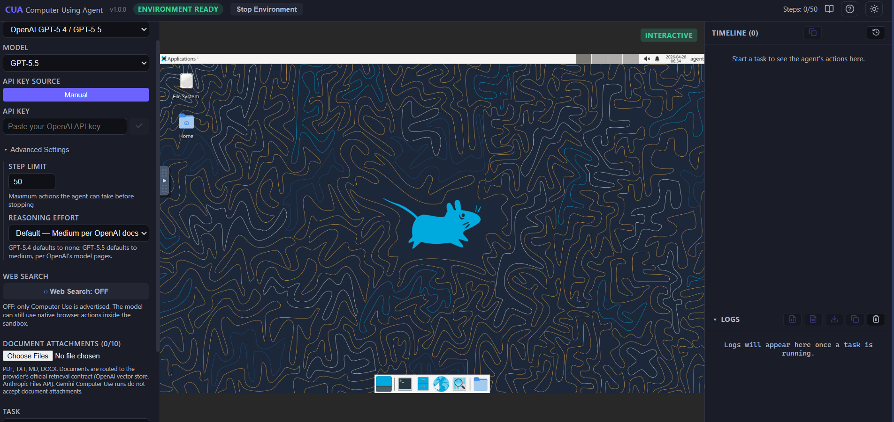

# CUA — Computer Using Agent


### Tech stack

[](https://skillicons.dev)

**Providers:** OpenAI GPT-5.4 / 5.5 · Anthropic Claude Opus 4.7 / Sonnet 4.6 · Google Gemini 3 Flash

A local, single-user workbench for running **provider-native Computer Use** agents inside a fully isolated Docker desktop sandbox. The model controls the screen; your host machine is never touched.

---

## Screenshot



*The workbench showing the live XFCE desktop sandbox, the control panel (provider, model, Web Search toggle, file attachments), and the action timeline. The environment status badge reads **ENVIRONMENT READY**.*

---

## Table of Contents

1. [Overview](#overview)
2. [Architecture](#architecture)
3. [Project Structure](#project-structure)
4. [Supported Models](#supported-models)
5. [Tool Matrix](#tool-matrix)
6. [Installation & Setup](#installation--setup)
7. [Running the Project](#running-the-project)
8. [API Reference](#api-reference)
9. [Core Logic](#core-logic)
10. [Key Features](#key-features)
11. [Configuration](#configuration)
12. [Testing](#testing)
13. [Deployment & Docker](#deployment--docker)
14. [Security](#security)
15. [Limitations](#limitations)
16. [Provider References](#provider-references)

---

## Overview

CUA is a **provider-native Computer Use workbench**. It does one thing: run a multi-turn AI agent that controls a virtual Ubuntu/XFCE desktop to complete tasks you describe in natural language.

The product surface is deliberately minimal:

> **Computer Use + optional Web Search + optional provider file retrieval.**

There is no prompt orchestration layer, no intermediate planning engine, and no additional tooling abstractions. The backend translates your request directly into the documented tool contracts of each AI provider and lets the model drive the desktop through mouse, keyboard, scroll, and navigation primitives.

**What it solves:** Running Computer Use agents from any of the three major providers — OpenAI, Anthropic, Gemini — from a single UI without writing provider-specific code, while keeping all desktop actions strictly isolated inside Docker.

---

## Architecture

```
┌─────────────────────────────────────────────────────────────────┐
│  Browser (React 19 / Vite 6)                                    │
│  WorkbenchPage → useSessionController → useWebSocket            │
│  Control Panel · Timeline · ScreenView · LogsPanel              │
└────────────────────────┬────────────────────────────────────────┘
                         │ REST + WebSocket  (port 3000 → 8100)
┌────────────────────────▼────────────────────────────────────────┐
│  FastAPI backend  (port 8100)                                   │
│  server.py — HTTP routes, WS broadcast, rate limiting           │
│  loop.py   — AgentLoop: session lifecycle bridge                │
│  files.py  — upload store, provider file prep                   │
│  safety.py — operator safety confirmation registry              │
└────────────────────────┬────────────────────────────────────────┘
                         │ SDK calls (HTTPS to provider)
┌────────────────────────▼────────────────────────────────────────┐
│  Provider Engine Layer  (backend/engine/)                       │
│  ComputerUseEngine facade → OpenAICUClient / ClaudeCUClient     │
│                          → GeminiCUClient                       │
│  Per-turn: screenshot → model call → action batch → executor    │
└────────────────────────┬────────────────────────────────────────┘
                         │ HTTP  (loopback :9222)
┌────────────────────────▼────────────────────────────────────────┐
│  Docker container  cua-environment                              │
│  Xvfb :99 + XFCE4 + xdotool + scrot                           │
│  Google Chrome · Firefox ESR · LibreOffice · VS Code · GIMP    │
│  agent_service.py — /action  /screenshot  /health              │
│  noVNC / websockify  (port 6080)                                │
└─────────────────────────────────────────────────────────────────┘
```

**Data flow for a single agent turn:**

1. *(Optional)* If `use_builtin_search` is true, a one-shot **planning pass** runs first against the provider's native search tool only (no `computer` tool). It returns a compact execution brief (interpreted task, environment assumptions, step-by-step plan, verification condition, pitfalls).
2. The CU loop starts. Engine client requests a screenshot from `DesktopExecutor`.
3. `DesktopExecutor` calls `GET /screenshot` on the container's agent service (port 9222).
4. The base64 PNG is embedded in the provider's next API request alongside the task (or the merged task + planner brief) and the Computer Use tool definition.
5. The provider returns a tool call: a structured action batch (click, type, scroll, etc.).
6. `DesktopExecutor` translates each action into an `xdotool` command via `POST /action` on the agent service.
7. A fresh screenshot is captured and fed back to the provider to close the perceive → act loop.
8. The loop continues until the model declares completion, the step limit is reached, or a stop is requested.

The model never has direct socket access to the host machine. All action dispatch goes through the container's HTTP action service, which enforces an explicit allowlist of permitted action names. During the desktop execution phase, the advertised tool list is computer-only — web search is intentionally not available, so the model cannot stall on irrelevant searches.

---

## Project Structure

```
computer-use/
├── backend/
│   ├── server.py          # FastAPI app: all HTTP endpoints, WebSocket fan-out,
│   │                      #   rate limiting, CORS/CSP/Host-allowlist hardening
│   ├── loop.py            # AgentLoop: request → provider run bridge,
│   │                      #   step recording, stuck-agent detection, callbacks
│   ├── executor.py        # ActionExecutor protocol + DesktopExecutor impl;
│   │                      #   screenshot capture, action dispatch, Gemini
│   │                      #   normalized-coord denormalization
│   ├── files.py           # Provider-aware file prep: OpenAI vector store,
│   │                      #   Anthropic Files API, Gemini rejection
│   ├── prompts.py         # Provider-specific system prompt templates
│   ├── safety.py          # Async event+decision registry for safety confirms
│   ├── main.py            # uvicorn entry point
│   ├── engine/
│   │   ├── __init__.py    # ComputerUseEngine facade, shared helpers,
│   │   │                  #   retry logic, transient-error classification
│   │   ├── openai.py      # OpenAICUClient: Responses API stateless replay,
│   │   │                  #   screenshot downscale, CU-only loop, file_search
│   │   ├── claude.py      # ClaudeCUClient: Messages beta, registry-backed
│   │   │                  #   tool-version routing, web-search org probe,
│   │   │                  #   Files API document blocks
│   │   └── gemini.py      # GeminiCUClient: GenerateContent, normalized coords,
│   │                      #   atomic history pruning, early-stop guard
│   ├── providers/
│   │   ├── _common.py     # ProviderTools dataclass and stream bridge
│   │   ├── planner.py     # Optional provider-native Web Search planning pass
│   │   ├── openai.py      # OpenAI public run() wrapper
│   │   ├── anthropic.py   # Anthropic public run() wrapper
│   │   └── gemini.py      # Gemini public run() wrapper
│   ├── models/
│   │   ├── allowed_models.json      # Canonical model allowlist (single source of truth)
│   │   ├── engine_capabilities.json # Engine metadata & action vocabulary
│   │   ├── schemas.py     # Pydantic request/response models
│   │   ├── registry.py    # Model registry helpers
│   │   └── validation.py  # Tool-parity cross-checks
│   └── infra/
│       ├── config.py      # Env-var config with clamped ranges
│       ├── docker.py      # Container lifecycle (build / start / stop / health)
│       ├── storage.py     # FileStore: in-memory + disk temp upload store
│       └── observability.py # Session-scoped logging ctx + JSON formatter + trace recorder
├── frontend/
│   └── src/
│       ├── main.jsx               # React 19 entry point
│       ├── api.js                 # Typed REST client
│       ├── index.css              # Global styles
│       ├── components/            # CompletionBanner, ErrorBoundary, SafetyModal,
│       │                          #   ScreenView, ToastContainer, WelcomeOverlay
│       ├── hooks/
│       │   ├── useSessionController.js  # Session lifecycle (start/stop/completion)
│       │   └── useWebSocket.js          # WS message routing + screenshot subscription
│       ├── pages/
│       │   ├── WorkbenchPage.jsx        # Main application page
│       │   ├── NotFound.jsx
│       │   └── workbench/
│       │       ├── ControlPanelView.jsx # Provider/model/key/task/search/files form
│       │       ├── Timeline.jsx         # Step-by-step action timeline
│       │       ├── LogsPanel.jsx        # Streaming logs with export
│       │       ├── HistoryDrawer.jsx    # localStorage session history
│       │       ├── ExportMenu.jsx       # HTML / JSON / TXT export
│       │       ├── constants.js         # Provider definitions
│       │       └── exporters.js         # Session export formatters
│       └── utils.js               # escapeHtml, formatTime, estimateCost,
│                                  #   getSessionHistory, theme helpers
├── docker/
│   ├── Dockerfile         # Ubuntu 24.04 + Xvfb + XFCE4 + Chrome + Firefox ESR
│   │                      #   + LibreOffice + GIMP + VS Code + Node 20
│   ├── agent_service.py   # In-container HTTP action service (port 9222)
│   ├── entrypoint.sh      # Start Xvfb → XFCE → noVNC → agent service
│   └── SECURITY_NOTES.md  # Action-surface allowlist documentation
├── tests/
│   ├── engine/            # ClaudeCUClient, GeminiCUClient, OpenAICUClient unit tests
│   ├── docker/            # agent_service contract tests
│   ├── integration/       # Live SDK transport tests (marked integration, excluded by default)
│   ├── test_server.py     # FastAPI endpoint tests
│   ├── test_server_validation.py  # Schema, rate-limit, host-allowlist validation
│   ├── test_provider_run_contract.py  # Provider run() public contract
│   ├── test_files.py      # File store + provider prep
│   ├── test_executor_split.py         # DesktopExecutor action dispatch
│   ├── test_models.py     # Registry, schema, and model validation
│   └── conftest.py        # Shared fixtures and patches
├── docs/
│   ├── computer-use-prompt-guide.md      # Task prompt patterns and anti-patterns
│   └── gemini-successor-evaluation.md    # Model-upgrade evaluation checklist
├── evals/
│   └── test_degraded_container_startup.py  # Deterministic runtime-boundary evals
├── dev.py                 # One-command launcher: ports cleanup → Docker → backend → frontend
├── docker-compose.yml     # Container definition with security hardening
├── requirements.txt       # Python dependencies (pinned)
├── pyproject.toml         # pytest / ruff / mypy configuration
├── TECHNICAL.md           # Architecture reference for contributors
├── USAGE.md               # Operator usage guide
└── CHANGELOG.md           # Release notes
```

---

## Supported Models

The model allowlist is the single source of truth at `backend/models/allowed_models.json`. The backend reads it at runtime; no code change is needed to add a model.

| Provider | Model ID | Display Name | Computer Use | Notes |
|---|---|---|---|---|
| Google | `gemini-3-flash-preview` | Gemini 3 Flash Preview | ✅ | Only Gemini CU SKU exposed by this app |
| Anthropic | `claude-opus-4-7` | Claude Opus 4.7 | ✅ | `computer_20251124` tool; up to 2576 px long edge |
| Anthropic | `claude-sonnet-4-6` | Claude Sonnet 4.6 | ✅ | `computer_20251124` tool; beta endpoint required |
| OpenAI | `gpt-5.5` | GPT-5.5 | ✅ | Default OpenAI CU model as of 2026-04-26 |
| OpenAI | `gpt-5.4` | GPT-5.4 | ✅ | Responses API `computer` tool |

---

## Tool Matrix

Runtime behavior is determined by two request flags: `use_builtin_search` (boolean) and whether `attached_files` is non-empty. Web Search is a separate provider-native planning pass; the Computer Use execution loop stays computer-only.

| Request state | OpenAI | Anthropic | Gemini |
|---|---|---|---|
| Web Search off, no files | `computer` | `computer_20251124` | `computer_use` |
| Web Search on, no files | planning: `web_search`; execution: `computer` | planning: `web_search_20250305`; execution: `computer_20251124` | planning: `google_search`; execution: `computer_use` |
| Files + Web Search off | `computer` + `file_search` (vector store) | `computer_20251124` + Files API document blocks | **Rejected** |
| Files + Web Search on | planning: `web_search`; execution: `computer` + `file_search` | planning: `web_search_20250305`; execution: `computer_20251124` + Files API docs | **Rejected** |

**Why Gemini file uploads are rejected:** Google's Gemini File Search API is not documented as part of the Computer Use path. Combining them is explicitly excluded from this app's scope. The backend returns a `400` before the provider call.

**Anthropic file handling:** PDFs and TXT are uploaded to the Anthropic Files API and referenced as `document` content blocks. Markdown and DOCX are extracted to inline text (Anthropic document blocks do not accept these formats in the Computer Use beta context).

**OpenAI file handling:** All uploaded files are indexed into a per-run `vector_store` via the Responses API `file_search` tool. The vector store is cleaned up after the session ends.

---

## Installation & Setup

### Prerequisites

| Requirement | Version |
|---|---|
| Docker | 24+ |
| Python | 3.11+ |
| Node.js | 20+ |
| Provider API key | OpenAI, Anthropic, or Google AI |

### First-Time Setup

```bash
git clone https://github.com/pypi-ahmad/computer-use.git
cd computer-use

# Copy and populate environment file
cp .env.example .env
```

Edit `.env` and add at least one key:

```dotenv
OPENAI_API_KEY=sk-...
ANTHROPIC_API_KEY=sk-ant-...
GOOGLE_API_KEY=AIza...
# GEMINI_API_KEY= (also accepted as an alias for GOOGLE_API_KEY)
```

Bootstrap the environment (builds the Docker image, installs Python and Node dependencies):

```bash
python dev.py --bootstrap
```

This command:
1. Creates a Python virtual environment at `.venv` if absent
2. Installs `requirements.txt`
3. Runs `npm install` in `frontend/`
4. Builds the Docker image `cua-ubuntu:latest`
5. Starts `docker-compose up -d`

### Manual Installation

```bash
python -m venv .venv
# Windows:
.\.venv\Scripts\Activate.ps1
# Linux/macOS:
source .venv/bin/activate

pip install -r requirements.txt

cd frontend && npm install && cd ..

docker compose up -d
```

---

## Running the Project

### Daily Launch (recommended)

```bash
python dev.py
```

`dev.py` performs three steps before starting processes:

1. **Port cleanup** — kills any process listening on ports `8100` (backend), `3000` (frontend), `6080` (noVNC), or `9222` (agent service). This recovers from interrupted previous runs without manual `kill` commands.
2. **Docker** — ensures `cua-environment` is running and healthy.
3. **Processes** — spawns the FastAPI backend and Vite dev server as subprocesses, forwarding their stdout/stderr to the terminal.

Once running, open **http://localhost:3000**.

### Manual Start

```bash
# Terminal 1 — backend
.venv/Scripts/Activate.ps1   # or source .venv/bin/activate
python -m backend.main

# Terminal 2 — frontend
cd frontend
npm run dev
```

### Port Reference

| Port | Service |
|---|---|
| `3000` | Vite frontend dev server |
| `8100` | FastAPI backend (REST + WebSocket) |
| `6080` | noVNC web client (live desktop view) |
| `5900` | VNC (raw) |
| `9222` | In-container agent action service |

### Production Build

```bash
cd frontend
npm run build    # outputs to frontend/dist/
```

There is currently no production static-file serving path in the FastAPI app. Serve `frontend/dist/` with a reverse proxy (nginx, Caddy) and point it at the backend on port 8100.

---

## API Reference

All endpoints are under `http://localhost:8100`. The Vite dev server proxies `/api`, `/ws`, and `/vnc` to the backend automatically — no CORS preflight is needed from the browser in development.

### Health & Readiness

| Method | Route | Description |
|---|---|---|
| `GET` | `/api/health` | Liveness probe — always `{"status":"ok"}` if the process is alive |
| `GET` | `/api/ready` | Readiness probe — checks Docker daemon, at least one API key in env, and container state |

### Models & Engines

| Method | Route | Description |
|---|---|---|
| `GET` | `/api/models` | Returns the CU-capable model list from `allowed_models.json` |
| `GET` | `/api/engines` | Returns the single supported engine (`computer_use`) |

### Container Management

| Method | Route | Description |
|---|---|---|
| `GET` | `/api/container/status` | Container and agent-service health state |
| `POST` | `/api/container/start` | Start (or build-and-start) the sandbox |
| `POST` | `/api/container/stop` | Stop all sessions, then stop and remove the container |
| `POST` | `/api/container/build` | Rebuild the Docker image |
| `GET` | `/api/agent-service/health` | Probe the in-container action service directly |

### File Upload

| Method | Route | Description |
|---|---|---|
| `POST` | `/api/files/upload` | Upload a reference file; returns `{file_id, filename, size_bytes, mime_type}` |
| `GET` | `/api/files/{file_id}` | Get file metadata |
| `DELETE` | `/api/files/{file_id}` | Delete a file from the store |

**Request:** `multipart/form-data` with a `file` field.  
**Allowed extensions:** `.pdf`, `.txt`, `.md`, `.docx`  
**Limits:** max 1 GB per file, max 10 files per session.

### Agent Session

| Method | Route | Description |
|---|---|---|
| `POST` | `/api/agent/start` | Start a Computer Use session |
| `POST` | `/api/agent/stop/{session_id}` | Stop a running session |
| `GET` | `/api/agent/status/{session_id}` | Poll current session state |

#### `POST /api/agent/start` — Request Schema

```json
{
  "task": "Open the browser and go to example.com",
  "provider": "openai",
  "model": "gpt-5.5",
  "api_key": "sk-...",
  "max_steps": 50,
  "use_builtin_search": false,
  "attached_files": [],
  "reasoning_effort": "medium",
  "engine": "computer_use",
  "execution_target": "docker"
}
```

| Field | Type | Default | Notes |
|---|---|---|---|
| `task` | `string` | required | 1–10,000 characters |
| `provider` | `string` | required | `"openai"` / `"anthropic"` / `"google"` |
| `model` | `string` | required | Must be in `allowed_models.json` |
| `api_key` | `string` | optional | Falls back to `.env` / system env |
| `max_steps` | `int` | `50` | 1–200; hard capped at 200 server-side |
| `use_builtin_search` | `bool` | `false` | Adds provider-native web search tool |
| `attached_files` | `list[string]` | `[]` | Server-side file IDs from `/api/files/upload` |
| `reasoning_effort` | `string` | model-dependent | OpenAI only: `minimal/low/medium/high/xhigh` |
| `engine` | `string` | `"computer_use"` | Only `"computer_use"` is supported |
| `execution_target` | `string` | `"docker"` | Only `"docker"` is supported |

The schema uses `extra="forbid"` — any unrecognized field returns HTTP 422.

#### `POST /api/agent/start` — Response

```json
{
  "session_id": "550e8400-e29b-41d4-a716-446655440000",
  "status": "running",
  "engine": "computer_use",
  "provider": "openai"
}
```

#### `GET /api/agent/status/{session_id}` — Response

```json
{
  "session_id": "550e8400-...",
  "status": "completed",
  "current_step": 12,
  "total_steps": 50,
  "last_action": {"action": "click", "coordinates": [720, 400], "reasoning": "..."},
  "final_text": "Task completed. The page title is Example Domain.",
  "gemini_grounding": null
}
```

### WebSocket

Connect to `ws://localhost:8100/ws` (or `ws://localhost:3000/ws` via the Vite proxy).

Optionally pass `?session_id=<id>` to subscribe a screenshot stream for a specific session.

**Inbound messages** (client → server):

```json
{"event": "screenshot_subscribe", "session_id": "..."}
{"event": "screenshot_unsubscribe", "session_id": "..."}
{"event": "ping"}
```

**Outbound events** (server → client):

| Event | Payload fields |
|---|---|
| `log` | `log: {timestamp, level, message, data}` |
| `step` | `step: {step_number, timestamp, action, error}` |
| `screenshot` | `screenshot: <base64 PNG>` |
| `agent_finished` | `session_id, status, steps, final_text, gemini_grounding` |
| `safety_prompt` | `session_id, prompt` |
| `pong` | — |

### Safety Confirmation

| Method | Route | Description |
|---|---|---|
| `POST` | `/api/safety/confirm` | Confirm or deny a `require_confirmation` action |

```json
{"session_id": "...", "confirmed": true}
```

### API Keys

| Method | Route | Description |
|---|---|---|
| `GET` | `/api/keys/status` | Returns availability and source for all provider keys |
| `POST` | `/api/keys/validate` | Validate a specific API key against its provider |

### Screenshot

| Method | Route | Description |
|---|---|---|
| `GET` | `/api/screenshot` | Current desktop screenshot as `{"screenshot": "<base64>"}` |

---

## Core Logic

### Two-Phase Web Search Planning (`backend/providers/planner.py`)

When `use_builtin_search` is true, the run is split into two phases instead of advertising web search and computer tools to the same model at the same time.

**Phase 1 — Planning.** A short provider-native call runs with only the search tool exposed:

- OpenAI: `web_search` on the Responses API (with `reasoning.effort="low"` for `gpt-5*` to keep planning latency bounded).
- Anthropic: `web_search_20250305` on the beta Messages API, gated by the same org-level enablement probe used for inline search.
- Gemini: `google_search` grounding tool on `GenerateContent`.

The planner asks the model to return a fixed-shape execution brief (interpreted task, environment assumptions, step-by-step plan, verification condition, pitfalls). It must not perform desktop actions in this phase — the computer tool is not advertised.

**Phase 2 — Execution.** The original task and the planner brief are merged via `build_planned_computer_use_task` and handed to the Computer Use loop with `force_computer_only=True`. The advertised tool list contains only the provider's computer tool plus, when files are attached, the OpenAI `file_search` tool or Anthropic Files API document blocks. Web search tools are not advertised to the executing model, so the agent cannot waste turns on irrelevant search calls during desktop work.

This split is implemented entirely in `backend/providers/`:

- `planner.py` — builds the planning prompt and runs the per-provider plan call.
- `_common.py` — `maybe_plan_with_web_search` runs the planner once and yields its events into the same stream as the CU loop; `stream_client_run_loop` honors the `force_computer_only` flag.
- `openai.py` / `anthropic.py` / `gemini.py` — thin per-provider `run()` wrappers that call the planner, then drive the CU client.

### Agent Loop (`backend/loop.py`)

`AgentLoop` is the session bridge between the HTTP layer and the provider engine. It owns:

- Session lifecycle (`IDLE → RUNNING → COMPLETED / STOPPED / ERROR`)
- Real-time callbacks: `on_step`, `on_log`, `on_screenshot` (fire-and-forget, exceptions swallowed to keep the loop alive)
- **Stuck-agent detection**: hashes `(action_name + coordinates + text)` for each turn. Three consecutive identical fingerprints trigger a stop request and cancel the in-flight provider task immediately — the engine does not run to its turn limit.
- Safety confirmation handoff: broadcasts a `safety_prompt` WS event and awaits the operator's response via `backend/safety.py`. Times out after 60 seconds with an automatic denial.

### Provider Engine (`backend/engine/`)

`ComputerUseEngine` is the public facade. It selects the correct client (`OpenAICUClient`, `ClaudeCUClient`, or `GeminiCUClient`) based on the `Provider` enum and delegates `execute_task(goal, turn_limit, on_safety, on_turn, on_log)`.

**OpenAI (`engine/openai.py`):**

- Uses the Responses API with a stateless replay strategy: the full conversation history is replayed on every request (no `previous_response_id`). This is intentional for ZDR (Zero Data Retention) compatibility.
- Screenshots are resized before upload if they exceed 10,240,000 pixels or a 6000 px edge (OpenAI's `detail: "original"` ceiling). The resize scale factor is tracked so returned coordinates are remapped back to real screen space.
- A heuristic guards against false early completions on pure-screenshot first turns where no UI action has yet been taken.
- The CU loop itself never advertises `web_search`. When the user enables Web Search, the optional planning pass in `backend/providers/planner.py` runs first and feeds its brief into the executing CU run.

**Anthropic (`engine/claude.py`):**

- Uses `client.beta.messages.create()` (beta endpoint required for Computer Use).
- Tool version (`computer_20251124`) and beta flag (`computer-use-2025-11-24`) are resolved from `allowed_models.json` registry metadata, not from model-name substrings.
- Web-search org-level enablement is probed once per API key on first use, then cached for 24 hours. `CUA_ANTHROPIC_WEB_SEARCH_ENABLED=1` skips the probe.
- Files API upload and document-block injection is handled turn-by-turn with a per-session cache to avoid re-uploading the same file.

**Gemini (`engine/gemini.py`):**

- Uses `google-genai` SDK with `GenerateContent` and the `Tool(computer_use=ComputerUse(...))` documented tool type.
- Coordinates are in a normalized 0–999 grid, converted to real pixels via `denormalize_x` / `denormalize_y` in `executor.py`.
- History pruning is atomic: entire turns are dropped (not field-rewritten) to preserve `toolCall`, `toolResponse`, `thoughtSignature`, and related fields required by Gemini's tool-calling replay rules. Configurable via `max_history_turns` (default 10).
- Google Search grounding is used only in the provider planning pass when Web Search is on. The Computer Use loop itself receives only `computer_use`.

### Desktop Executor (`backend/executor.py`)

`DesktopExecutor` implements the `ActionExecutor` protocol. It communicates with `docker/agent_service.py` over `http://127.0.0.1:9222`.

- `capture_screenshot()` — `GET /screenshot?mode=desktop`. Falls back to `docker exec scrot` if the service is unreachable.
- `execute(name, args)` — `POST /action` with `{name, args}`. Returns a `CUActionResult`.
- Key combination validation: only allowlisted xdotool keysyms can be sent. Non-allowlisted tokens are dropped before reaching `xdotool`, preventing keystroke injection attacks.

### File Store (`backend/infra/storage.py` + `backend/files.py`)

Files uploaded via `/api/files/upload` are persisted to a process-scoped temp directory (`~/.../cua-uploads/`). An idle GC thread sweeps entries older than 6 hours.

At session start, `backend/files.py` prepares provider-specific file contexts:

- **OpenAI**: creates a `vector_store`, uploads all files, attaches the store ID to the `file_search` tool definition, and deletes the store after the session ends.
- **Anthropic**: uploads PDFs/TXTs to the Files API and creates `document` content blocks; extracts Markdown/DOCX to inline text.
- **Gemini**: raises `ValueError` with a user-facing message before any API call.

---

## Key Features

- **Three-provider Computer Use** — OpenAI GPT-5.5/5.4, Anthropic Claude Opus 4.7/Sonnet 4.6, Google Gemini 3 Flash Preview — from one UI and one codebase.
- **Isolated sandbox** — all desktop actions execute inside `cua-environment` (Ubuntu 24.04 + XFCE4). The host machine's filesystem, processes, and peripherals are never touched by the agent.
- **Strict tool contract** — the backend exposes only the documented provider-native tool set. No extra tools, no middleware logic, no agentic orchestration outside the provider's own loop.
- **Provider-native Web Search planning** — a single toggle runs a short provider-native planning/search pass first: `web_search` for OpenAI, `web_search_20250305` for Anthropic, `google_search` for Gemini. The desktop execution phase then runs with only the Computer Use tool.
- **Reference file retrieval** — upload PDF, TXT, MD, or DOCX files before a session. OpenAI indexes them into a per-run vector store; Anthropic uploads them to the Files API as document blocks.
- **Real-time streaming** — screenshots, step events, and logs stream over WebSocket throughout the session. Screenshot publishing is deduplicated and suspended when no subscriber is connected.
- **Stuck-agent detection** — three consecutive identical action fingerprints (action + coordinates + text hash) trigger an automatic stop without waiting for the turn limit.
- **Operator safety confirmation** — provider `require_confirmation` events surface as a modal in the UI. The agent pauses and waits up to 60 seconds for an explicit confirm or deny.
- **Session history** — the last 50 sessions are persisted to `localStorage` with task, model, step count, and status. No server-side storage.
- **Export** — session timelines and logs can be exported as HTML, JSON, or plain text.
- **Rate limiting** — a sliding-window per-IP limiter allows max 10 agent starts per minute and max 3 concurrent sessions.

---

## Configuration

All settings are read from environment variables or `.env`. The `Config` dataclass in `backend/infra/config.py` defines defaults and clamps every numeric value to a safe range on load.

### Key Environment Variables

| Variable | Default | Description |
|---|---|---|
| `OPENAI_API_KEY` | — | OpenAI API key |
| `ANTHROPIC_API_KEY` | — | Anthropic API key |
| `GOOGLE_API_KEY` / `GEMINI_API_KEY` | — | Google / Gemini API key |
| `HOST` | `127.0.0.1` | Backend bind address. **Do not change to `0.0.0.0` unless you have also set `CUA_WS_TOKEN` and added auth in front.** |
| `PORT` | `8100` | Backend listen port |
| `DEBUG` | `0` | Enable debug logging |
| `CUA_RELOAD` | `0` | Enable uvicorn hot-reload (dev only) |
| `MAX_STEPS` | `50` | Default agent step limit (1–200) |
| `SCREEN_WIDTH` / `SCREEN_HEIGHT` | `1440` / `900` | Virtual display resolution |
| `CONTAINER_NAME` | `cua-environment` | Docker container name |
| `AGENT_SERVICE_HOST` / `AGENT_SERVICE_PORT` | `127.0.0.1` / `9222` | Agent service address |
| `CUA_WS_TOKEN` | — | Optional shared secret for WebSocket authentication |
| `CUA_ALLOWED_HOSTS` | — | Comma-separated extra hosts for the Host allowlist |
| `CUA_ANTHROPIC_WEB_SEARCH_ENABLED` | `0` | Skip the org-level probe for Anthropic web search |
| `CUA_WS_SCREENSHOT_INTERVAL` | `1.5` | Screenshot publish cadence in seconds |
| `CUA_WS_SCREENSHOT_SUSPEND_WHEN_IDLE` | `1` | Suspend screenshot capture when no WS subscriber |
| `CUA_CONTAINER_READY_TIMEOUT` | `30.0` | Max seconds to wait for the agent service to be healthy |
| `CUA_MAX_BODY_BYTES` | `262144` | Max HTTP request body size (256 KiB) |
| `CUA_CLAUDE_MAX_TOKENS` | `32768` | Per-turn max_tokens budget for Claude |
| `LOG_FORMAT` | `console` | Set to `json` for structured log output |
| `LOG_LEVEL` | `INFO` | Logging verbosity |
| `CUA_TRACE_DIR` | `~/.computer-use/traces/` | Directory for session trace JSON files |
| `CUA_UPLOAD_DIR` | system temp | Override upload storage directory |
| `AGENT_SERVICE_TOKEN` | — | Optional bearer token for agent service requests |
| `CUA_ENABLE_LEGACY_ACTIONS` | `0` | Re-enable deprecated action handlers in the container service |

### CORS

CORS origins default to `localhost:5173`, `localhost:3000`, and `127.0.0.1:3000/5173`. Override via `CORS_ORIGINS` (comma-separated). Each entry is validated against a strict `scheme://host[:port]` regex.

---

## Testing

The test suite uses `pytest` with `asyncio_mode = "auto"`. Integration tests (live SDK / transport) are marked `integration` and excluded from the default run.

### Full suite

```bash
python -m pytest -p no:cacheprovider tests evals --tb=short
```

### Focused checks

```bash
# Provider contract tests
python -m pytest tests/test_provider_run_contract.py --tb=short

# File store + provider file prep
python -m pytest tests/test_files.py --tb=short

# Schema and server validation
python -m pytest tests/test_server_validation.py --tb=short

# Engine client unit tests
python -m pytest tests/engine/test_openai.py tests/engine/test_claude.py tests/engine/test_gemini.py --tb=short

# Action dispatch
python -m pytest tests/test_executor_split.py --tb=short
```

### Test layout

```
tests/
├── engine/            # Per-provider CU client unit tests
├── docker/            # agent_service contract tests
├── integration/       # Live SDK tests (requires real API keys; excluded by default)
├── test_server.py     # HTTP endpoint integration tests
├── test_server_validation.py   # Security, rate-limiting, schema validation
├── test_provider_run_contract.py  # Public run() shape contract
├── test_files.py      # File store and provider file prep
├── test_executor_split.py  # DesktopExecutor dispatch
├── test_models.py     # Registry and schema checks
├── test_infra.py      # Config clamping, observability
└── conftest.py        # Shared fixtures (TestClient, patched executor, etc.)
```

---

## Deployment & Docker

### Container Details

The sandbox image (`docker/Dockerfile`) is based on **Ubuntu 24.04** and includes:

- **Display:** Xvfb virtual framebuffer at `:99`, 1440×900×24
- **Desktop:** XFCE4 + xfce4-terminal + xfce4-taskmanager
- **Browsers:** Google Chrome (stable), Firefox ESR (Mozilla official tarball)
- **Applications:** LibreOffice, GIMP, Inkscape, VS Code (`code`), Ristretto, galculator, gedit, VLC, Evince, xournalpp
- **Tools:** xdotool, scrot, xclip, imagemagick, ffmpeg, Node.js 20
- **Service:** `docker/agent_service.py` on port 9222
- **Remote access:** noVNC + websockify on port 6080

### docker-compose.yml hardening

- All Linux capabilities dropped (`cap_drop: ALL`)
- `no-new-privileges: true`
- Ports bound to `127.0.0.1` only
- Memory limit: 4 GB, CPU limit: 2 cores, PID limit: 256
- tmpfs mounts for `/tmp` (512 MB) and `/var/run` (16 MB)
- Screensavers and power management removed from the image to prevent focus stealing

### Remote / multi-user deployment

The default configuration is a **single-user localhost workbench**. To expose it beyond loopback:

1. Set `CUA_WS_TOKEN` to a strong secret — this gates WebSocket connections.
2. Add auth in front of the REST API (nginx `auth_basic`, mTLS, or a reverse-proxy auth middleware).
3. Set `HOST=0.0.0.0` and `CORS_ORIGINS=https://your-domain.com`.
4. Add `CUA_ALLOWED_HOSTS=your-domain.com` for the Host header allowlist.
5. Do not use `CUA_ENABLE_LEGACY_ACTIONS=1` in any internet-facing deployment.

---

## Security

- **Loopback-only by default.** All ports (`3000`, `8100`, `6080`, `9222`) bind to `127.0.0.1` unless overridden.
- **Host header allowlist.** Every HTTP request is checked against an allowlist derived from CORS origins. DNS-rebinding attacks are blocked at the middleware layer.
- **CSRF / origin gate.** All state-changing REST endpoints require a matching `Origin` header or a loopback connection. Requests from unlisted origins return `403`.
- **WebSocket token gate.** When `CUA_WS_TOKEN` is set, WebSocket connections without a matching `?token=` parameter are rejected with code `4401`.
- **Request body cap.** All `POST /api/*` endpoints reject bodies over 256 KiB (configurable via `CUA_MAX_BODY_BYTES`) before buffering.
- **Security response headers.** Every non-`/vnc/*` response includes `X-Content-Type-Options`, `X-Frame-Options: DENY`, `Content-Security-Policy`, `Cross-Origin-Opener-Policy`, `Cross-Origin-Embedder-Policy`, and `Permissions-Policy`.
- **Rate limiting.** Per-IP sliding-window limiter: max 10 agent starts per minute, max 3 concurrent sessions, max 20 key-validations per minute.
- **Agent action allowlist.** The container's `agent_service.py` rejects any `POST /action` request whose action name is not on the live allowlist. Legacy/dangerous actions (shell execution, clipboard, window management) are disabled by default and only re-enabled via `CUA_ENABLE_LEGACY_ACTIONS=1`.
- **Secret scrubbing.** All WebSocket-broadcast messages and log entries pass through a secret scrubber to redact API keys that appear in model output or task text.
- **File upload validation.** Extension allowlist + magic-byte cross-check + 1 GB per-file cap. Path traversal is rejected at the filename normalisation layer.

---

## Limitations

- **Single-user, single-process.** In-memory session state and the rate limiter are not shared across multiple worker processes. Do not run with `uvicorn --workers N > 1`.
- **No authentication by default.** Any process that can reach port 8100 can start agents, consume API keys, and read live screenshots. Use `CUA_WS_TOKEN` and a reverse proxy for any non-localhost deployment.
- **Gemini reference files not supported.** Gemini File Search is not documented as part of the Gemini Computer Use path. Uploads for Gemini sessions are rejected.
- **Pixel-based interaction only.** The agent sees screenshots and emits pixel coordinates. There is no DOM selector or accessibility-tree access.
- **No persistent agent memory.** Each session starts from a clean prompt. The agent does not retain information about previous sessions.
- **Coordinate systems differ by provider.** Gemini uses a normalized 0–999 grid; Claude and OpenAI use real pixel coordinates. The executor handles conversion, but a task prompt that hardcodes coordinates will behave differently across providers.
- **Claude task budgets not wired.** The Anthropic `task-budgets-2026-03-13` beta (`output_config.effort` / `output_config.task_budget`) is not implemented.
- **`ChromiumPlaywrightExecutor` unreferenced.** `backend/engine/playwright_executor.py` exists as a reference implementation but is not connected to any active code path.
- **Frontend dead files.** `frontend/src/components.jsx`, `frontend/src/pages/Workbench.jsx`, `frontend/src/pages/workbench/ControlPanel.jsx`, and `frontend/src/pages/workbench/panels.jsx` are pre-refactor merged archives that are never imported. Safe to delete.

---

## Provider References

**Anthropic:**
- [Computer Use tool](https://docs.claude.com/en/docs/agents-and-tools/tool-use/computer-use-tool)
- [Web Search tool](https://docs.claude.com/en/docs/agents-and-tools/tool-use/web-search-tool)
- [Files API](https://platform.claude.com/docs/en/build-with-claude/files)

**Google Gemini:**
- [Computer Use](https://ai.google.dev/gemini-api/docs/computer-use)
- [Google Search grounding](https://ai.google.dev/gemini-api/docs/google-search)
- [File Search](https://ai.google.dev/gemini-api/docs/file-search)

**OpenAI:**
- [Computer Use](https://platform.openai.com/docs/guides/tools-computer-use)
- [Web Search](https://platform.openai.com/docs/guides/tools-web-search)
- [File Search](https://developers.openai.com/api/docs/guides/tools-file-search)

---

## License

See [LICENSE](LICENSE).
