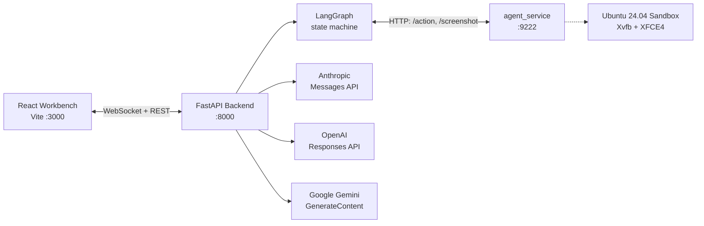

# computer-use

A local research workbench for building and observing computer-using agents on top of provider-native Computer Use APIs.

[](LICENSE)
[](pyproject.toml)
[](tests/)
[](docker/Dockerfile)

## Overview

`computer-use` runs a full Linux desktop inside a Docker sandbox, streams it to a React workbench over WebSocket, and lets a vision-language model drive the desktop through the provider's native Computer Use protocol. The backend translates the provider's tool calls into `xdotool` / `scrot` actions against an Xvfb display inside the container.

Four providers are supported: Anthropic (Claude Opus 4.7, Claude Sonnet 4.6), OpenAI (GPT-5.4 via the Responses API's built-in `computer` tool), and Google (Gemini 3 Flash Preview via the `google-genai` SDK's `Tool(computer_use=...)`). The adapter layer is split so each provider's request shape, safety handshake, and reasoning-continuation idiom stays isolated.

This is a **local single-user research workbench**, not a multi-tenant service. The backend binds to `127.0.0.1` by default, the sandbox has no outbound network except the provider APIs, and there is no authentication on the REST surface beyond an optional `CUA_WS_TOKEN` shared secret. Do not run it on a shared host without reading [docker/SECURITY_NOTES.md](docker/SECURITY_NOTES.md) first.

## Architecture

The runtime is a three-tier loop: the React UI holds a WebSocket to the FastAPI backend; the backend talks HTTP to an in-container agent service that executes desktop actions; the backend also talks to the chosen provider's CU API. The LangGraph state machine (`preflight → model_turn ⇄ tool_batch → approval_interrupt → finalize`) owns orchestration and checkpoints every node transition to SQLite so a paused session can resume after a backend restart.



## Supported Computer Use models

| Provider | Model ID | Tool version | Status |
|---|---|---|---|
| Anthropic | `claude-opus-4-7` | `computer_20251124` | Current flagship; 1:1 pixel coordinates up to 2576 px long-edge, opt-in hi-res |
| Anthropic | `claude-sonnet-4-6` | `computer_20251124` | Current workhorse; downscales internally to 1568 px / 1.15 MP |
| Anthropic | `claude-opus-4-6` | `computer_20251124` | Prior flagship; kept for session compatibility |
| Anthropic | `claude-sonnet-4-5` | `computer_20250124` | Legacy; on the older tool path with the 2025-01-24 beta |
| OpenAI | `gpt-5.4` | built-in `computer` tool | Current default on the Responses API |
| OpenAI | `gpt-5` | built-in `computer` tool | Prior generation; kept for compatibility |
| Google | `gemini-3-flash-preview` | `types.Tool(computer_use=...)` | Built-in CU; normalized 0–999 coordinate space |
| Google | `gemini-2.5-flash` / `gemini-2.5-pro` | same | Legacy compatibility; Gemini 3 Flash is preferred |

`gemini-3.1-pro-preview` is **not** CU-enabled per Google's official docs (2026-03-25). See [CHANGELOG.md](CHANGELOG.md) for the documented decision. `gpt-5.4-nano` is registered but flagged `supports_computer_use: false` per OpenAI's 2026-04-20 changelog entry.

## Quickstart

### Prerequisites

- Docker 24+ (the container runs Ubuntu 24.04 with XFCE4 + Xvfb)
- Python 3.11+ for the backend (the container ships its own Python)
- Node.js 20+ for the frontend dev server
- At least one provider API key

### 30-second run

```bash
cp .env.example .env           # add your API key(s)
docker compose up --build      # builds the sandbox, starts backend + frontend
# open http://localhost:3000
```

### Manual build

```bash
python -m venv .venv
source .venv/bin/activate      # Windows: .venv\Scripts\activate
pip install -r requirements.txt
cd frontend && npm install && cd ..
python -m backend.main &        # FastAPI on 127.0.0.1:8000
cd frontend && npm run dev      # Vite on 127.0.0.1:3000
```

The frontend proxies REST to `127.0.0.1:8000` and opens a WebSocket on `/ws`. The backend starts and stops the Docker sandbox on demand when you click **Start Environment** in the workbench header.

## Configuration

Core environment variables (full reference lives in [USAGE.md § Configuration reference](USAGE.md#configuration-reference)):

| Variable | Default | Purpose |
|---|---|---|
| `ANTHROPIC_API_KEY` / `OPENAI_API_KEY` / `GOOGLE_API_KEY` | – | Provider API keys (resolved: UI > .env > system env) |
| `HOST` / `PORT` | `127.0.0.1` / `8000` | Backend bind. Default is loopback only |
| `SCREEN_WIDTH` / `SCREEN_HEIGHT` | `1440` / `900` | Sandbox viewport; also accepts Anthropic-style `WIDTH` / `HEIGHT` aliases |
| `CUA_WS_TOKEN` | unset | Shared secret for `/ws` + `/vnc/websockify`; required for any non-loopback bind |
| `OPENAI_REASONING_EFFORT` | `high` | `minimal` / `low` / `medium` / `high`; CU floor is `high` per OpenAI's guide |
| `CUA_OPUS47_HIRES` | unset | Opus 4.7 only: bypass the pixel cap, enforce only 2576-px long-edge |
| `CUA_CLAUDE_CACHING` | unset | Add `cache_control: ephemeral` to the `computer_20251124` tool block |
| `CUA_GEMINI_RELAX_SAFETY` | unset | Opt into `BLOCK_ONLY_HIGH` safety thresholds (default is Google's own "Off" for Gemini 3) |

## Development

```bash
python -m venv .venv && source .venv/bin/activate
pip install -r requirements.txt
pytest                                              # full suite
ruff check backend/ tests/ evals/ docker/           # lint
python -m backend.certifier --json                  # engine capability certification
python -m backend.tracing list                      # inspect persisted session traces
```

The backend package splits cleanly: `backend/agent/` holds the LangGraph nodes and the approval interrupt, `backend/engine/` has one adapter file per provider (`claude.py`, `openai.py`, `gemini.py`) sharing the `DesktopExecutor` and `CUTurnRecord` types from `backend/engine/__init__.py`. Provider-specific system prompts live in `backend/agent/prompts.py`.

## Testing

The suite has three tiers:

- **Unit** (`tests/`): adapter wire shapes, coordinate math, screenshot pruning, prompt audits, sandbox env gates. 400+ tests run under 2 minutes.
- **Integration** (`tests/test_integration_hot_paths.py`, `tests/test_gap_coverage.py`): FastAPI endpoints, WebSocket lifecycle, container-readiness gating.
- **Evals** (`evals/`): deterministic end-to-end replay evals. A stub engine yields canned `TurnEvent`s through the real graph; assertions cover the full trace including approval handshakes and terminal states.

Run the full suite with `pytest`. Coverage: `pytest --cov=backend --cov-report=term-missing`.

## Deployment

`computer-use` is designed to run on one developer's machine, not on shared infrastructure. The REST surface is unauthenticated by default; only the WebSocket upgrade path honours `CUA_WS_TOKEN`. A `CUA_ALLOW_PUBLIC_BIND=1` guardrail refuses to start on a non-loopback `HOST` unless `CUA_WS_TOKEN` is also set, but that only covers the WebSocket surface — the REST endpoints still need to be fronted by your own auth or network isolation if you expose them.

For the sandbox posture (package union across the four providers, OpenAI browser hardening, Gemini Chromium routing, Opus 4.7 hi-res opt-in), see [docker/SECURITY_NOTES.md](docker/SECURITY_NOTES.md).

## Security

- **Sandbox isolation.** The desktop runs in a non-root `agent` user inside a Docker container with `no-new-privileges`, dropped Linux capabilities, and a minimal env passed to the browser subprocess (no API-key leakage via `**os.environ`).
- **API key handling.** Keys entered in the UI are sent per-request over loopback and never persisted. `.env` and system env are read-only fallbacks. API-key-shaped tokens are redacted in logs, WS frames, and the SQLite checkpoint via `backend.engine.scrub_secrets`.
- **Agent service authentication.** The in-container HTTP API (`agent_service.py`) requires a shared `AGENT_SERVICE_TOKEN`, generated per session and never written to `docker inspect` metadata.
- **Safety handshake.** The `require_confirmation` / `pending_safety_checks` contracts from each provider route through the LangGraph `approval_interrupt` node. Denials produce a clean terminal state; the ToS-mandated `safety_acknowledgement: "true"` echo is never auto-sent.
- **Action-surface minimisation.** `docker/agent_service.py` serves only the actions the engine actually emits; legacy actions (`run_command`, window management, etc.) are disabled by default and gated behind `CUA_ENABLE_LEGACY_ACTIONS=1` with an explicit opt-in.

## Contributing

Contributions welcome for bug fixes, adapter-level corrections against current provider docs, and sandbox hardening. Please open an issue before sending a large patch so the scope can be agreed. Tests are required for any adapter change; the existing adapter tests under `tests/test_adapters_april2026.py` and `tests/test_sandbox_*.py` are good starting patterns.

## License

MIT — see [LICENSE](LICENSE).

## Acknowledgments

- [Anthropic computer-use-demo](https://github.com/anthropics/anthropic-quickstarts/tree/main/computer-use-demo) — the sandbox package baseline and scaling helpers mirror this reference.
- [OpenAI Responses API CU guide](https://developers.openai.com/api/docs/guides/tools-computer-use) — the `detail: "original"` contract, ZDR replay pattern, and browser-security posture.
- [Google Gemini Computer Use docs](https://ai.google.dev/gemini-api/docs/computer-use) — the normalized 0-999 coordinate contract and `safety_decision` handshake.
- [LangGraph](https://github.com/langchain-ai/langgraph) — the state-machine + checkpointer underlying the graph layer.
