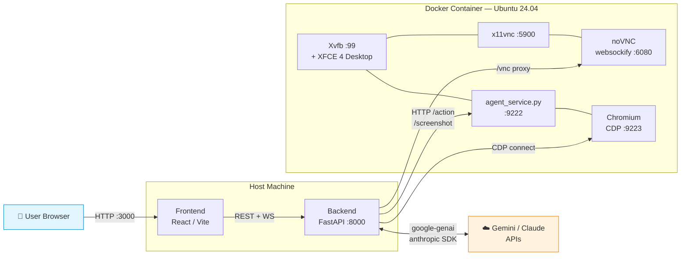
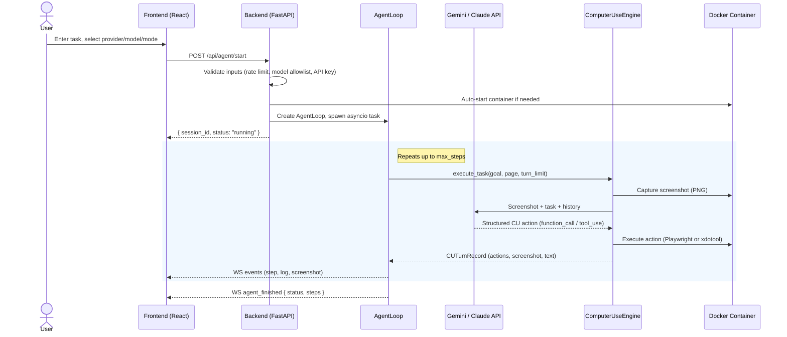
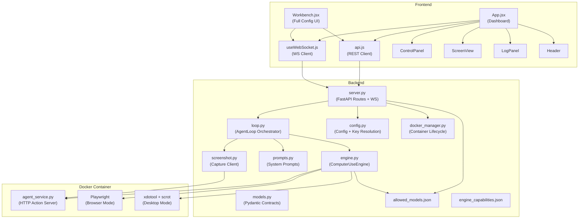
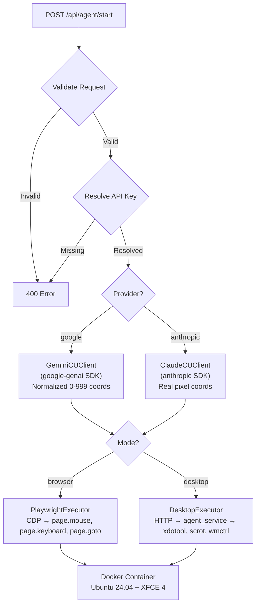
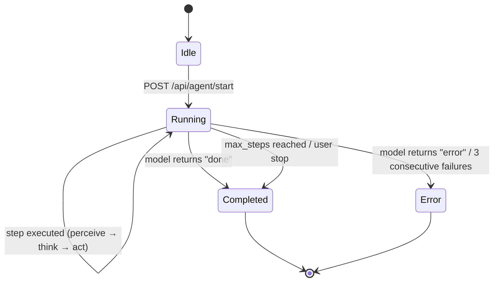

<div align="center">

# 🖥️ CUA — Computer Using Agent

**An open-source workbench for building, testing, and observing autonomous computer-using agents powered by native Computer Use protocols from Google Gemini and Anthropic Claude.**

[](LICENSE)
[](https://python.org)
[](https://react.dev)
[](https://fastapi.tiangolo.com)
[](https://docker.com)
[](#-testing)
[](#supported-models)
[](#supported-models)

---

Run a full **Linux desktop + Chromium browser inside Docker**, stream it live to a **React web UI**, and let a vision-language model drive browser and desktop tasks autonomously using pixel-level **perceive → think → act** loops.

**For:** AI/ML engineers, researchers, and developers who want a local, sandboxed environment to experiment with computer-using agents without giving LLMs access to their real machines.

[Quickstart](#-quickstart) · [Architecture](#-architecture) · [API Reference](#-api--websocket-reference) · [Configuration](#-configuration) · [Contributing](#-contributing)

</div>

---

## Table of Contents

| | | |
|---|---|---|
| 1. [Overview](#-overview) | 7. [API & WebSocket Reference](#-api--websocket-reference) | 13. [Troubleshooting](#-troubleshooting) |
| 2. [Features](#-features) | 8. [Quickstart](#-quickstart) | 14. [Safety & Security](#-safety--security) |
| 3. [Architecture](#-architecture) | 9. [Installation](#-installation) | 15. [Roadmap & Known Limitations](#-roadmap--known-limitations) |
| 4. [How The Engine Works](#-how-the-engine-works) | 10. [Configuration](#-configuration) | 16. [Contributing](#-contributing) |
| 5. [Agent Loop & Lifecycle](#-agent-loop--lifecycle) | 11. [Usage](#-usage) | 17. [License](#-license) |
| 6. [Supported Models](#-supported-models) | 12. [Testing](#-testing) | |

---

## 🔭 Overview

CUA implements a **perceive → think → act** loop for autonomous computer control:

1. **Perceive** — capture a screenshot of a virtual Linux desktop running inside Docker
2. **Think** — send the screenshot + user task to a vision-language model (Gemini or Claude)
3. **Act** — receive a structured action command via the model's native Computer Use tool protocol and execute it inside the sandbox

This cycle repeats until the task completes, an unrecoverable error occurs, or the step limit is reached.

The system uses **native Computer Use protocols exclusively** — Gemini's `function_call` and Claude's `tool_use` — for pixel-level interaction. No text parsing of model responses is required. All actions execute inside a resource-limited Docker container in either **browser mode** (Playwright Chromium via CDP) or **desktop mode** (xdotool + scrot for any X11 application).

A React web UI provides real-time desktop streaming (WebSocket screenshots + interactive noVNC), session management, step-by-step action timeline, and log viewing.

---

## ✨ Features

| Category | Details |
|---|---|
| **Native CU Engine** | Uses Gemini and Claude native Computer Use tool protocols (`function_call` / `tool_use`) for structured, pixel-level browser and desktop automation |
| **Two Execution Modes** | **Browser** — Playwright CDP page actions (mouse, keyboard, navigation) · **Desktop** — xdotool + scrot for any X11 application |
| **Multi-Provider AI** | Google Gemini and Anthropic Claude with a centralized model allowlist enforced at the API layer |
| **Docker Sandbox** | All automation runs inside an Ubuntu 24.04 container with resource limits, `no-new-privileges`, and localhost-only port bindings |
| **Real-Time Streaming** | Live screenshot stream via WebSocket + interactive noVNC desktop access proxied through the backend |
| **Cross-Platform Host** | Backend + frontend run on Windows, macOS, or Linux; Docker provides the sandboxed Linux desktop |
| **Safety Confirmation** | CU safety gates (e.g., `require_confirmation`) surface to the UI for explicit user approval before execution |
| **Input Validation** | Rate limiting (10 starts/min), concurrent session cap (3), model allowlist enforcement, UUID session IDs, task length bounds |
| **Context Pruning** | Automatic pruning of old screenshots from the conversation context to prevent unbounded token growth |
| **119 Hermetic Tests** | Unit tests using mocks/patches — no running container or network required |

---

## 🏗️ Architecture

The system is a **three-process architecture** spanning the host and a Docker container:

| Layer | Technology | Entry Point | Port |
|---|---|---|---|
| **Frontend** | React 19 / Vite 6 / React Router 7 | `frontend/src/main.jsx` | `3000` |
| **Backend** | Python 3.13 / FastAPI / Uvicorn | `backend/main.py` → `backend.server:app` | `8000` |
| **Container** | Ubuntu 24.04 / XFCE 4 / Xvfb / Playwright | `docker/entrypoint.sh` → `docker/agent_service.py` | `9222` |

### High-Level Architecture



### Agent Session Sequence



### Component Relationship



### Execution Mode Routing



---

## ⚙️ How The Engine Works

The sole supported engine is **`computer_use`**, implementing the native Computer Use protocols from Gemini and Claude. Engine capabilities are registered in `backend/engine_capabilities.json` (schema v3.0).

The model receives a **screenshot** (base64 PNG) and the **user's task**, then returns a structured action via `function_call` (Gemini) or `tool_use` (Claude). The engine executes that action inside the Docker container and captures a new screenshot. This loop repeats until the model determines the task is **done** or encounters an **error**.

### Provider Comparison

| | Google Gemini | Anthropic Claude |
|---|---|---|
| **SDK** | `google-genai` | `anthropic` |
| **Tool Protocol** | `types.Tool(computer_use=...)` | `computer_20251124` tool + beta endpoint |
| **Coordinates** | Normalized 0–999 grid, denormalized to pixels by engine | Real pixel values matching reported display size |
| **Screenshot Handling** | Sent as inline `Part` | Pre-resized per Anthropic limits (max 1568px long edge, 1.15M total pixels) |
| **Context Pruning** | Old screenshots replaced with text placeholders after 3 turns | Same pruning logic |
| **System Prompt** | Detailed action instructions + coordinate semantics | Minimal — Anthropic auto-injects CU schema |

### Supported Actions (15)

| Category | Actions |
|---|---|
| **Navigation** | `open_web_browser`, `navigate`, `go_back`, `go_forward`, `search` |
| **Mouse** | `click_at`, `hover_at`, `drag_and_drop` |
| **Keyboard** | `type_text_at`, `key_combination` |
| **Scroll** | `scroll_document`, `scroll_at` |
| **Wait** | `wait_5_seconds` |
| **Terminal** | `done`, `error` |

---

## 🔄 Agent Loop & Lifecycle

### Core Loop (`backend/agent/loop.py`)

`AgentLoop.run()` delegates to `_run_computer_use_engine()`, which constructs a `ComputerUseEngine` and calls `execute_task()`. The engine runs its own internal perceive → act → screenshot loop for up to `max_steps` turns (default 50, hard cap 200).

1. **Perceive** — capture screenshot via agent service HTTP API (`/screenshot`) or `docker exec scrot` fallback
2. **Think** — send screenshot + task + conversation history to the LLM
3. **Act** — receive structured CU action, execute via PlaywrightExecutor or DesktopExecutor
4. **Record** — emit `CUTurnRecord` to the loop, which maps it to a `StepRecord` and broadcasts via WebSocket
5. **Loop or terminate** — continue on success; stop on `done`/`error` from model, user stop request, or step limit

### Safety Confirmation Flow

When the CU engine encounters a `require_confirmation` safety decision (e.g., for sensitive actions), the flow pauses:

1. Engine emits safety callback → `AgentLoop._on_safety()` broadcasts a `safety_confirmation` WebSocket event
2. Frontend shows a confirmation dialog to the user
3. User clicks confirm/deny → `POST /api/agent/safety-confirm`
4. Backend signals the waiting `asyncio.Event` → engine resumes or skips the action
5. **Timeout:** if no response within 60 seconds, the action is **denied** by default

### Session State Machine



### In-Memory State

All session state lives in memory — no persistent database. State is lost on backend restart.

```python
_active_loops: dict[str, AgentLoop]     # session_id → loop instance
_active_tasks: dict[str, asyncio.Task]  # session_id → running task
_ws_clients: list[WebSocket]            # connected WebSocket clients
_safety_events: dict[str, Event]        # session_id → safety confirmation events
```

---

## 🤖 Supported Models

Defined in `backend/allowed_models.json` — the single source of truth for both backend validation and frontend dropdowns.

| Provider | Model ID | Display Name | CU Support | Notes |
|---|---|---|---|---|
| Google | `gemini-3-flash-preview` | Gemini 3 Flash Preview | ✅ Native | Fast, lightweight CU model |
| Google | `gemini-3.1-pro-preview` | Gemini 3.1 Pro Preview | ⚠️ Unconfirmed | Stronger reasoning; CU not in official docs |
| Anthropic | `claude-sonnet-4-6` | Claude Sonnet 4.6 | ✅ Native | Requires beta endpoint + `computer_20251124` tool |
| Anthropic | `claude-opus-4-6` | Claude Opus 4.6 | ✅ Native | Requires beta endpoint + `computer_20251124` tool |

> **Adding models:** Edit `backend/allowed_models.json`, restart the backend. The UI auto-refreshes via `GET /api/models`.

---

## 📡 API & WebSocket Reference

### REST Endpoints

| Method | Path | Purpose |
|---|---|---|
| `GET` | `/api/health` | Liveness probe — returns `{ "status": "ok" }` |
| `GET` | `/api/models` | Canonical model allowlist for frontend dropdowns |
| `GET` | `/api/engines` | Available engines (currently only `computer_use`) |
| `GET` | `/api/keys/status` | API key availability per provider (masked preview) |
| `GET` | `/api/screenshot` | Current screenshot as base64 PNG |
| `GET` | `/api/container/status` | Docker container + agent service health |
| `POST` | `/api/container/start` | Build-if-needed and start the sandbox container |
| `POST` | `/api/container/stop` | Stop all agents then remove the container |
| `POST` | `/api/container/build` | Trigger Docker image build |
| `GET` | `/api/agent-service/health` | Check if the in-container agent service responds |
| `POST` | `/api/agent-service/mode` | Switch agent service mode (`browser` / `desktop`) |
| `POST` | `/api/agent/start` | **Start a new agent session** (see payload below) |
| `POST` | `/api/agent/stop/{session_id}` | Stop a running session |
| `GET` | `/api/agent/status/{session_id}` | Session status + last action |
| `GET` | `/api/agent/history/{session_id}` | Full step history (without screenshots) |
| `POST` | `/api/agent/safety-confirm` | Respond to CU safety confirmation prompt |
| `GET` | `/vnc/{path}` | noVNC static file proxy |
| `WS` | `/vnc/websockify` | noVNC WebSocket proxy to container |

### `POST /api/agent/start` — Request Body

| Field | Type | Default | Constraints |
|---|---|---|---|
| `task` | `string` | *(required)* | Non-empty, max 10,000 chars |
| `provider` | `string` | *(required)* | `"google"` or `"anthropic"` |
| `model` | `string` | `"gemini-3-flash-preview"` | Must be in allowlist |
| `mode` | `string` | *(required)* | `"browser"` or `"desktop"` |
| `api_key` | `string?` | `null` | Optional — resolved from env if empty |
| `max_steps` | `int` | `50` | 1–200 |
| `engine` | `string` | `"computer_use"` | Only `"computer_use"` accepted |
| `execution_target` | `string` | `"docker"` | Only `"docker"` accepted |

### WebSocket Events (`/ws`)

**Server → Client:**

| Event | Payload | Description |
|---|---|---|
| `screenshot` | `{ screenshot: <base64> }` | Screenshot from agent step |
| `screenshot_stream` | `{ screenshot: <base64> }` | Periodic desktop capture (configurable interval) |
| `log` | `{ log: LogEntry }` | Agent log message |
| `step` | `{ step: StepRecord }` | Step completion (action, timestamp, error) |
| `agent_finished` | `{ session_id, status, steps }` | Agent loop terminated |
| `pong` | `{}` | Heartbeat response |

**Client → Server:** `{ "type": "ping" }` every 15 seconds for keepalive.

---

## 🚀 Quickstart

### Prerequisites

| Requirement | Version |
|---|---|
| **Docker** | With BuildKit support |
| **Python** | 3.13+ |
| **Node.js** | 18+ (npm included) |

### 1. Clone

```bash
git clone https://github.com/pypi-ahmad/computer-use.git
cd computer-use
```

### 2. Automated Setup

**Windows:**
```bat
setup.bat
```

**Linux / macOS:**
```bash
bash setup.sh
```

Both scripts: verify prerequisites → build Docker image → create Python venv → install pip dependencies → install frontend npm packages.

### 3. Configure API Key (at least one required)

```bash
# Option A: .env file in project root
echo "GOOGLE_API_KEY=your-key-here" >> .env
# or
echo "ANTHROPIC_API_KEY=your-key-here" >> .env

# Option B: system environment variable
# Option C: paste directly in the UI at runtime
```

### 4. Run

| Terminal | Command |
|---|---|
| **① Container** | `docker compose up -d` |
| **② Backend** | `python -m backend.main` (activate venv first) |
| **③ Frontend** | `cd frontend && npm run dev` |
| **④ Open** | [http://127.0.0.1:3000](http://127.0.0.1:3000) |

> **Tip:** The container auto-starts when you launch an agent task from the UI, so step ① is optional.

> **Windows:** Prefer `127.0.0.1` over `localhost` to avoid IPv6 binding issues with Docker.

---

## 📦 Installation

### Manual Setup (Full Detail)

```bash
# 1. Clone
git clone https://github.com/pypi-ahmad/computer-use.git
cd computer-use

# 2. Build Docker image
docker compose build
# or: docker build -t cua-ubuntu:latest -f docker/Dockerfile .

# 3. Python backend
python -m venv .venv
# Windows: .venv\Scripts\activate
# Linux/macOS: source .venv/bin/activate
pip install --upgrade pip
pip install -r requirements.txt

# 4. Frontend
cd frontend && npm install && cd ..
```

### Key Dependencies

**Backend** (`requirements.txt`):

| Package | Purpose |
|---|---|
| `fastapi` + `uvicorn` | HTTP API + WebSocket server |
| `google-genai` | Google Gemini API client |
| `anthropic` | Anthropic Claude API client |
| `httpx` | Async HTTP client (agent service communication) |
| `Pillow` | Screenshot resizing for Claude coordinate scaling |
| `python-dotenv` | `.env` file loading |
| `pydantic` | Request/response validation |
| `websockets` | noVNC WebSocket proxy |

**Frontend** (`package.json`):

| Package | Purpose |
|---|---|
| `react` 19 + `react-dom` | UI framework |
| `react-router-dom` 7 | Client-side routing (`/` dashboard, `/workbench`) |
| `vite` 6 | Dev server with API proxy |

### Platform Notes

- **Docker container** is always Linux (Ubuntu 24.04) regardless of host OS
- **Playwright** is installed inside the container, not on the host; the host backend connects via CDP
- The Docker image is **~3–4 GB** due to XFCE desktop, Chrome, Playwright, and desktop applications

---

## 📝 Configuration

### API Key Resolution

Keys are resolved in priority order — the first non-empty value wins:

| Priority | Source | Setup |
|---|---|---|
| 1 (highest) | **UI input** | Paste directly in the Workbench |
| 2 | **`.env` file** | `GOOGLE_API_KEY=...` or `ANTHROPIC_API_KEY=...` in project root |
| 3 | **System env var** | Same variable names set in your shell |

### Environment Variables

**Backend** (set in `.env` or system environment):

| Variable | Default | Description |
|---|---|---|
| `GOOGLE_API_KEY` | — | Google Gemini API key |
| `ANTHROPIC_API_KEY` | — | Anthropic Claude API key |
| `GEMINI_MODEL` | `gemini-3-flash-preview` | Default model name |
| `CONTAINER_NAME` | `cua-environment` | Docker container name |
| `AGENT_SERVICE_HOST` | `127.0.0.1` | Agent service hostname |
| `AGENT_SERVICE_PORT` | `9222` | Agent service port |
| `AGENT_MODE` | `browser` | Default mode (`browser` / `desktop`) |
| `SCREEN_WIDTH` | `1440` | Virtual display width (pixels) |
| `SCREEN_HEIGHT` | `900` | Virtual display height (pixels) |
| `MAX_STEPS` | `50` | Default max steps per session |
| `STEP_TIMEOUT` | `30.0` | Per-step timeout (seconds) |
| `DEBUG` | `false` | Enable debug logging + uvicorn reload |

**Container-side** (set in `docker-compose.yml`):

| Variable | Default | Description |
|---|---|---|
| `VNC_PASSWORD` | *(unset)* | Set to require VNC authentication |
| `DISPLAY` | `:99` | X11 display identifier |
| `SCREEN_DEPTH` | `24` | X11 color depth |

---

## ▶️ Usage

### Dashboard (`/`)

The default view shows:
- **Header** — connection status, container start/stop controls, agent service readiness badge
- **Control Panel** — provider/model selection, API key source toggle, task input, start/stop
- **Screen View** — live desktop via interactive noVNC iframe (falls back to periodic WebSocket screenshots)
- **Log Panel** — real-time agent logs with timestamps and severity levels

### Workbench (`/workbench`)

A more advanced interface with:
- **Run Mode toggle** — browser or desktop
- **Step Timeline** — expandable step-by-step view: action name, coordinates, reasoning, errors, raw JSON
- **Progress bar** — visual steps-used-vs-max indicator
- **Log download** — export logs as timestamped `.txt` file

### Typical Workflow

1. **Select provider/model** — e.g., Google / `gemini-3-flash-preview`
2. **Configure API key** — use .env, system env, or paste in UI
3. **Describe the task** — *"Go to wikipedia.org and search for 'artificial intelligence'"*
4. **Click Start** — the container auto-starts, the agent loop begins
5. **Observe** — watch the live desktop, step timeline, and logs
6. **Result** — the agent reports completion in its final text response

### Viewing the Desktop

| Method | URL | Description |
|---|---|---|
| **noVNC** (interactive) | Built into the UI (`ScreenView`) | Full desktop interaction in the browser — the default when container is running |
| **noVNC** (standalone) | `http://127.0.0.1:6080` | Direct noVNC access outside the app |
| **Screenshot stream** | Automatic in the UI | Periodic base64 PNGs via WebSocket when noVNC is unavailable |

### Stopping

```bash
# Stop the container
docker compose down

# Stop backend/frontend: Ctrl+C in their respective terminals
```

---

## 🧪 Testing

| | |
|---|---|
| **Framework** | pytest |
| **Tests** | 119 passing |
| **Hermetic** | All tests use mocks/patches — no running container or network required |

### Running Tests

```bash
# Activate venv, then:
pytest tests/ -v               # All tests, verbose
pytest tests/ -v --tb=short    # Concise tracebacks
pytest tests/ -q               # Quick summary
```

### Test Coverage

| File | Scope |
|---|---|
| `test_computer_use_engine.py` | Coordinate denormalization, executor mocking, safety decisions |
| `test_claude_actions.py` | Claude action dispatch via PlaywrightExecutor |
| `test_playwright_executor.py` | Gemini CU actions via PlaywrightExecutor (normalized coords) |
| `test_coordinate_scaling.py` | Claude screenshot scaling & coordinate math |
| `test_context_pruning.py` | Conversation context pruning logic |
| `test_config.py` | Config singleton, `from_env()`, agent service URL |
| `test_models.py` | ActionType enum, Pydantic model validation, StructuredError |
| `test_model_policy.py` | `allowed_models.json` integrity, model endpoint, provider rejection |
| `test_prompts.py` | Prompt separation (Gemini vs Claude), viewport injection, drift detection |
| `test_server_validation.py` | API input validation: engines, providers, models, rate limiting, safety |
| `test_docker_security.py` | Container security settings validation |
| `conftest.py` | Shared `mock_page` fixture (mock Playwright page) |

---

## 🐳 Docker Runtime

### Container: `cua-environment`

Built from `docker/Dockerfile` on **Ubuntu 24.04**. The entrypoint (`docker/entrypoint.sh`) starts services in sequence:

1. **D-Bus** — system + session bus for desktop communication
2. **Xvfb** — virtual X11 framebuffer at `:99`, resolution `1440×900×24`
3. **XFCE 4** — full desktop environment with window manager
4. **x11vnc** — VNC server on port 5900 (optional password via `VNC_PASSWORD`)
5. **noVNC + websockify** — browser-accessible VNC on port 6080
6. **Browser bootstrap** — sets Chrome as default browser, seeds profile to skip first-run dialogs
7. **Agent Service** — `agent_service.py` runs as PID 1 to receive signals cleanly

### Pre-installed Software

Google Chrome, Playwright Chromium, xdotool, wmctrl, xclip, scrot, ffmpeg, Node.js 20, LibreOffice, VLC, gedit, file manager, terminal emulators

### Agent Service (`docker/agent_service.py`)

An HTTP server running inside the container with ~119 documented functions handling both Playwright (browser) and xdotool (desktop) dispatch:

| Endpoint | Method | Purpose |
|---|---|---|
| `/health` | GET | Liveness check (reports mode + CDP url) |
| `/screenshot` | GET | Capture via Playwright (browser) or scrot (desktop) |
| `/action` | POST | Execute a single action in the active mode |
| `/mode` | POST | Switch between browser and desktop mode at runtime |

### Port Map

| Port | Service | Binding |
|---|---|---|
| `3000` | Frontend (Vite dev server) | Host |
| `5900` | VNC (x11vnc) | `127.0.0.1` |
| `6080` | noVNC (websockify) | `127.0.0.1` |
| `8000` | Backend API (FastAPI) | `0.0.0.0` |
| `9222` | Agent Service | `127.0.0.1` |
| `9223` | Chromium CDP | `127.0.0.1` |

---

## 🔧 Troubleshooting

### Agent service unreachable / timeouts

- Use `127.0.0.1` (not `localhost`) in `AGENT_SERVICE_HOST` — especially on Windows
- Verify: `curl http://127.0.0.1:9222/health`
- Check container: `docker compose ps`
- Wait 10–20 seconds after start for XFCE + agent service to fully boot

### `POST /api/agent/start` returns 400

| Cause | Fix |
|---|---|
| Invalid model | Use a model from `GET /api/models` |
| Empty task | Provide a non-blank task description |
| Missing API key | Set key in UI, `.env`, or system env |
| Wrong engine / target | Only `engine=computer_use` and `execution_target=docker` are valid |

### `POST /api/agent/start` returns 429

| Cause | Fix |
|---|---|
| Rate limit | Max 10 starts per 60 seconds — wait and retry |
| Concurrent cap | Max 3 simultaneous sessions — stop one first |

### noVNC shows a black desktop

Normal during the first 5–15 seconds after container start while XFCE boots. Check: `docker compose logs -f cua-environment`

### Screenshot capture fails

- Agent service may not be ready yet — check `/health`
- The system falls back to `docker exec scrot` automatically if the HTTP capture fails

### Gemini actions miss their targets

Gemini uses normalized 0–999 coordinates, which the engine denormalizes using `SCREEN_WIDTH` × `SCREEN_HEIGHT`. Ensure these values match the container's Xvfb resolution (default: 1440×900).

### Container build takes a long time

Expected — the image installs XFCE, Chrome, Playwright Chromium, LibreOffice, and many utilities. First build is ~3–4 GB; subsequent builds use layer cache.

---

## 🔐 Safety & Security

### Input Validation

| Protection | Details |
|---|---|
| Rate limiting | 10 agent starts per 60-second sliding window |
| Concurrent session cap | Max 3 active sessions |
| Max steps hard cap | 200 regardless of client input |
| Provider/model allowlists | Server-side validation against `allowed_models.json` |
| Session ID validation | UUID format enforced |
| Task length limit | 10,000 characters |
| API key masking | Keys truncated in all audit logs |

### Container Security

| Setting | Value |
|---|---|
| `security_opt` | `no-new-privileges:true` |
| `shm_size` | `2gb` |
| Memory limit | `4g` |
| CPU limit | `2` cores |
| Port binding | `127.0.0.1` only (not externally exposed) |
| Healthcheck | `curl -f http://localhost:9222/health` every 30s |
| Init process | `init: true` (proper signal handling) |
| Restart policy | `unless-stopped` |

### CU Safety Confirmation

Actions flagged with `require_confirmation` by the Gemini CU protocol are **not auto-approved**. They surface to the user via WebSocket, and the agent loop blocks until the user explicitly confirms or denies (60-second timeout defaults to **deny**).

### Security Boundaries

- **No authentication** on the backend API — designed for local development only
- **No TLS** between backend and agent service (localhost-only)
- **VNC unauthenticated** by default — set `VNC_PASSWORD` for password-protected access
- **WebSocket connections** have no auth; rely on CORS (`localhost:3000/5173` only)
- **Model output is untrusted** — all actions execute inside the sandboxed container, not on the host

---

## 📁 Project Structure

```
computer-use/
├── backend/
│   ├── main.py                    # Uvicorn entry point
│   ├── server.py                  # FastAPI routes, WebSocket, noVNC proxy
│   ├── config.py                  # Config dataclass, env loading, API key resolution
│   ├── models.py                  # ActionType enum, Pydantic request/response models
│   ├── engine.py                  # ComputerUseEngine, GeminiCUClient, ClaudeCUClient,
│   │                              #   PlaywrightExecutor, DesktopExecutor
│   ├── allowed_models.json        # Canonical model allowlist (4 models, 2 providers)
│   ├── engine_capabilities.json   # Engine capability schema (v3.0)
│   ├── engine_capabilities.py     # Schema loader for engine_capabilities.json
│   ├── certifier.py               # Runtime engine certification checks
│   ├── parity_check.py            # ActionType ↔ capabilities ↔ prompt drift audit
│   ├── action_aliases.py          # CU action alias resolution
│   ├── docker_manager.py          # Container lifecycle (build, start, stop, health)
│   ├── streaming.py               # Streaming utilities
│   └── agent/
│       ├── loop.py                # AgentLoop orchestrator (perceive → think → act)
│       ├── prompts.py             # System prompts for Gemini CU and Claude CU
│       └── screenshot.py          # Screenshot capture via agent service + fallback
├── docker/
│   ├── Dockerfile                 # Ubuntu 24.04, XFCE 4, Chrome, Playwright, desktop apps
│   ├── entrypoint.sh              # Service startup: Xvfb → XFCE → VNC → agent service
│   └── agent_service.py           # In-container HTTP server: action dispatch + screenshots
├── frontend/
│   ├── package.json               # React 19, Vite 6, React Router 7
│   ├── vite.config.js             # Dev server + API/WS/VNC proxy config
│   └── src/
│       ├── main.jsx               # Router: / → App, /workbench → Workbench
│       ├── App.jsx                # Dashboard layout with adaptive status polling
│       ├── api.js                 # REST client (10 functions)
│       ├── hooks/useWebSocket.js  # WS client with auto-reconnect + heartbeat
│       ├── components/
│       │   ├── ControlPanel.jsx   # Provider/model/key/task config + start/stop
│       │   ├── Header.jsx         # Connection + container status bar
│       │   ├── ScreenView.jsx     # noVNC iframe + screenshot fallback
│       │   └── LogPanel.jsx       # Auto-scrolling log viewer
│       ├── pages/
│       │   ├── Workbench.jsx      # Full workbench: sidebar + screen + timeline + logs
│       │   └── Workbench.css
│       ├── utils/formatTime.js    # Timestamp formatter
│       └── index.css              # Global styles
├── tests/
│   ├── conftest.py                # Shared mock_page fixture
│   ├── test_computer_use_engine.py
│   ├── test_claude_actions.py
│   ├── test_playwright_executor.py
│   ├── test_coordinate_scaling.py
│   ├── test_context_pruning.py
│   ├── test_config.py
│   ├── test_models.py
│   ├── test_model_policy.py
│   ├── test_prompts.py
│   ├── test_server_validation.py
│   └── test_docker_security.py
├── docker-compose.yml             # Container orchestration (resource limits, ports)
├── requirements.txt               # Python dependencies
├── setup.bat                      # Windows one-command setup
├── setup.sh                       # Linux/macOS one-command setup
└── LICENSE                        # MIT License
```

---

## 🗺️ Roadmap & Known Limitations

### Current Limitations

- **No persistent storage** — session state lives in memory; lost on backend restart
- **No authentication** — designed for local development, not production deployment
- **Single container** — one Docker container serves all sessions; no per-session isolation
- **Preview models** — Gemini and Claude CU capabilities are in preview/beta and subject to change
- **No CI/CD pipeline** — tests run locally; no automated GitHub Actions workflow yet
- **Container size** — ~3–4 GB image due to full desktop environment
- **Coordinate precision** — Gemini's 0–999 normalization can cause slight pixel misalignment on non-standard resolutions

### Potential Future Work

- Persistent session storage (SQLite or Redis)
- Per-session container isolation
- Authentication and role-based access
- CI/CD with automated test runs
- Production deployment configuration (TLS, reverse proxy)
- Additional model providers as CU support expands

---

## 🤝 Contributing

Contributions are welcome. To get started:

1. **Fork** the repository and **clone** locally
2. Run `setup.sh` or `setup.bat` for a complete local environment
3. Create a **feature branch** from `main`
4. Make changes — follow existing code conventions:
   - Python: `"""triple-quote"""` docstrings, type hints, `black`-compatible formatting
   - JS/JSX: `/** JSDoc */` comments on all functions and components
5. **Write tests** — maintain ≥80% coverage on changed files; tests must be hermetic (mocks, no network)
6. **Run the test suite**: `pytest tests/ -v --tb=short`
7. **Open a pull request** with a clear description of changes

### Development Commands

```bash
# Run all tests
pytest tests/ -v

# Run a specific test file
pytest tests/test_engine.py -v

# Start backend in debug mode (auto-reload)
DEBUG=true python -m backend.main

# Frontend dev server (with API proxy to :8000)
cd frontend && npm run dev

# Tool parity check
python -m backend.parity_check
```

---

## 📄 License

This project is licensed under the **MIT License** — see [LICENSE](LICENSE) for details.

Copyright (c) 2026 Ahmad

---

<div align="center">

**[Back to Top](#️-cua--computer-using-agent)** · **[Quickstart](#-quickstart)** · **[Architecture](#-architecture)** · **[Configuration](#-configuration)** · **[Contributing](#-contributing)**

</div>
