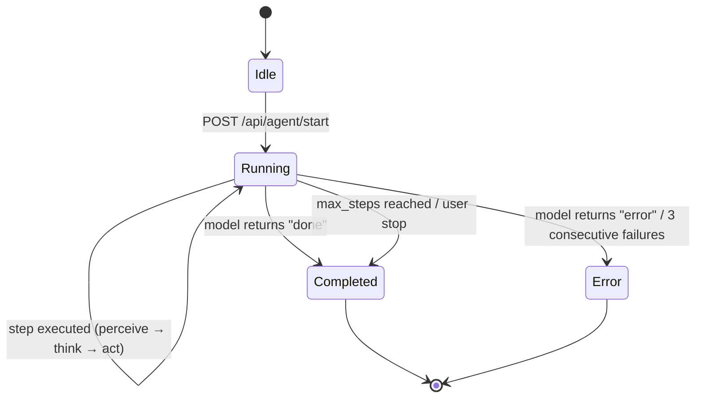

<div align="center">

# 🖥️ CUA — Computer Using Agent

**An open-source workbench for building, testing, and observing autonomous computer-using agents powered by native Computer Use protocols from Google Gemini, Anthropic Claude, and OpenAI.**

[](LICENSE)
[](https://python.org)
[](https://react.dev)
[](https://fastapi.tiangolo.com)
[](https://docker.com)
[](#-testing)
[](.github/workflows/ci.yml)
[](#-supported-models)
[](#-supported-models)
[](#-supported-models)

---

Run a full **Linux desktop inside Docker**, stream it live to a **React web UI**, and let a vision-language model drive desktop tasks autonomously using pixel-level **perceive → think → act** loops.

**Built for** AI/ML engineers, researchers, and developers who need a local, sandboxed environment to experiment with computer-using agents — without giving LLMs access to their real machines.

[Quickstart](#-quickstart) · [Architecture](#-architecture) · [API Reference](#-api--websocket-reference) · [Configuration](#-configuration) · [Contributing](#-contributing)

</div>

---

## Table of Contents

| | | |
|---|---|---|
| 1. [Overview](#-overview) | 7. [API & WebSocket Reference](#-api--websocket-reference) | 13. [Troubleshooting](#-troubleshooting) |
| 2. [Features](#-features) | 8. [Quickstart](#-quickstart) | 14. [Safety & Security](#-safety--security) |
| 3. [Architecture](#-architecture) | 9. [Installation](#-installation) | 15. [Roadmap & Known Limitations](#-roadmap--known-limitations) |
| 4. [How The Engine Works](#-how-the-engine-works) | 10. [Configuration](#-configuration) | 16. [Contributing](#-contributing) |
| 5. [Agent Loop & Lifecycle](#-agent-loop--lifecycle) | 11. [Usage](#-usage) | 17. [License](#-license) |
| 6. [Supported Models](#-supported-models) | 12. [Testing](#-testing) | |

---

## 🔭 Overview

CUA implements a closed-loop **perceive → think → act** cycle for autonomous computer control:

1. **Perceive** — capture a screenshot of a virtual Linux desktop running inside a Docker container
2. **Think** — send the screenshot and user task to a vision-language model (Gemini, Claude, or OpenAI)
3. **Act** — receive a structured action command via the model's native Computer Use tool protocol and execute it inside the sandbox

The cycle repeats until the task completes, an unrecoverable error occurs, or the configured step limit is reached.

The system uses **native Computer Use protocols exclusively** — Gemini `function_call`, Claude `tool_use`, and the OpenAI Responses API `computer_call` — for pixel-level interaction. No text parsing or regex extraction is required. All actions execute inside a resource-constrained Docker container through a **desktop-mode** runtime powered by `xdotool` + `scrot` for any X11 application.

A single-page React workbench provides real-time desktop streaming (WebSocket screenshots + interactive noVNC), a step-by-step action timeline, session management, log viewing, JSON/HTML export, approximate cost estimation, dark/light theming, and a first-run onboarding overlay.

---

## ✨ Features

| Category | Details |
|---|---|
| **Native CU Engine** | Gemini, Claude, and OpenAI native Computer Use tool protocols — structured, pixel-level desktop automation with no prompt hacks |
| **Desktop Runtime** | `xdotool` + `scrot` to control and observe any X11 application inside the sandbox |
| **Multi-Provider AI** | Google Gemini, Anthropic Claude, and OpenAI with a centralized model allowlist enforced at the API layer. OpenAI supports configurable reasoning effort (`none`/`low`/`medium`/`high`/`xhigh`) and ZDR (Zero Data Retention) orgs via stateless conversation chaining |
| **Docker Sandbox** | Ubuntu 24.04 container with resource limits (4 GB RAM, 2 CPUs), `no-new-privileges`, and localhost-only port bindings. Union-of-best-practice package baseline: Anthropic computer-use-demo reference (xvfb + xdotool + scrot + imagemagick + mutter + x11vnc + firefox-esr + xterm + x11-apps + xpdf + tint2 + sudo + build-essential + software-properties-common + netcat-openbsd), OpenAI CU Option-1 WM (XFCE4, lockscreen/screensaver packages removed), and Google Gemini reference (chromium). Single 1440×900 viewport default covers all four providers; Opus 4.7 can opt into its native 2576 px ceiling via `CUA_OPUS47_HIRES=1`. |
| **Real-Time Streaming** | Live screenshot stream via WebSocket + interactive noVNC desktop access proxied through the backend |
| **Cross-Platform Host** | Backend + frontend run on Windows, macOS, or Linux; Docker provides the sandboxed Linux desktop |
| **Safety Confirmation** | CU safety gates surface to the UI with a 60-second countdown — auto-deny on timeout |
| **API Key Validation** | Pre-flight key validation via `POST /api/keys/validate` — makes a lightweight live API call to the provider (not just format checks) |
| **Input Validation** | Rate limiting (10 starts/min), concurrent session cap (3), model allowlist enforcement, UUID session IDs, task length bounds (10 000 chars) |
| **Context Pruning** | Automatic pruning of old screenshots from conversation context to prevent unbounded token growth |
| **Session History** | Bounded localStorage history (50 sessions) with task, model, step count, and status |
| **Export** | One-click JSON and HTML session reports with safely escaped content; copy logs to clipboard |
| **Cost Estimation** | Approximate per-session cost display based on centralized model pricing data |
| **Theming** | Dark and light themes with persistent toggle via `data-theme` attribute |
| **Onboarding** | First-run welcome overlay with 3-step guide, dismissible and remembered via localStorage |
| **Accessibility** | Minimum 12 px font sizes, SVG icons via `lucide-react`, `aria-label` on all icon-only buttons, keyboard-navigable timeline, focus-visible outlines |
| **Hermetic Test Suite** | 409 tests (unit + integration) using mocks/patches — no running container or network required |
| **Structured Observability** | Session-scoped log correlation via `session_id` ContextVar (propagates across async tasks) + per-turn duration metrics (`turn_duration_ms`) for every provider |
| **Outbound WS Schema** | Pydantic-validated WebSocket events (`backend/ws_schema.py`) with matching TypeScript discriminated union (`frontend/src/types/ws.d.ts`); schema drift logged as warnings |
| **Versioned REST API** | Every `/api/*` route is also reachable at `/api/v1/*` via an ASGI path-rewrite middleware — zero decorator duplication |
| **Origin + Token WebSocket Auth** | `/ws` and `/vnc/websockify` enforce an `Origin` allowlist against `CORS_ORIGINS`; optional shared-secret gate via `CUA_WS_TOKEN` (close code 4401 on mismatch, 4403 on bad origin) |
| **Host-Header Allowlist** | DNS-rebinding defense: HTTP requests whose `Host` header is outside `CUA_ALLOWED_HOSTS` (populated from `CORS_ORIGINS`) are rejected at the middleware layer |
| **Secret Scrubbing** | Log messages, `raw_model_response` strings, and persisted session snapshots are passed through `scrub_secrets()` which redacts OpenAI / Anthropic / Google / GitHub / Slack / AWS key shapes before they reach disk or the WS stream |
| **Stuck-Agent Detection** | Three consecutive identical action fingerprints (action + coords + text) auto-terminate the session so a looping model doesn't burn `max_steps` of LLM spend |
| **Retry with Backoff + Jitter** | Every provider LLM call is wrapped in `_call_with_retry` — transient `RateLimitError` / `APIConnectionError` / `httpx.TimeoutException` retry with exponential backoff and jitter |
| **Fully Async Provider SDKs** | `AsyncAnthropic`, `AsyncOpenAI`, and `genai.Client(...).aio` — no more per-call `asyncio.to_thread` thread-pool pressure |
| **Immediate Stop Cancellation** | `POST /api/agent/stop` cancels the in-flight provider call via `asyncio.Task.cancel()` instead of waiting for the next turn boundary |
| **xdotool Key Allowlist** | Model-emitted key combinations are validated against an explicit allowlist (letters, digits, named keys, modifiers). Disruptive tokens like `super+l` / `xkill` are rejected before reaching xdotool |
| **Non-Root Container** | Docker image runs as UID 1000 (`agent` user) with least-privilege file permissions, `cap_drop: ALL`, `no-new-privileges`, and `prlimit`-bounded `run_command` |
| **VNC Fail-Closed** | Container startup fails unless `VNC_PASSWORD` is set or `CUA_ALLOW_NOPW=1` is explicitly passed — no more accidentally unauthenticated VNC |

---

## 🏗️ Architecture

The system is a **three-process architecture** spanning the host and a Docker container:

| Layer | Technology | Entry Point | Port |
|---|---|---|---|
| **Frontend** | React 19 / Vite 6 / React Router 7 | `frontend/src/main.jsx` | `3000` |
| **Backend** | Python 3.11+ / FastAPI / Uvicorn | `backend/main.py` → `backend.server:app` | `8000` |
| **Container** | Ubuntu 24.04 / XFCE 4 / Xvfb / desktop automation tools | `docker/entrypoint.sh` → `docker/agent_service.py` | `9222` |

<details>
<summary>View connection details</summary>

| Path | Protocol | Description |
|---|---|---|
| Frontend → Backend | HTTP REST + WebSocket | `api.js` → `/api/*` endpoints; `useWebSocket.js` → `/ws` |
| Frontend → Container | noVNC (WebSocket) | `ScreenView.jsx` → `/vnc/websockify` proxy in `server.py` |
| Backend → Agent Service | HTTP | `loop.py` / `screenshot.py` → `:9222/action`, `:9222/screenshot` |
| Backend → LLM APIs | HTTPS | `google-genai` / `anthropic` / `openai` SDKs → cloud endpoints |
| Backend → Docker CLI | Subprocess | `docker_manager.py` → `docker build/run/rm/exec` |

</details>

---

## ⚙️ How The Engine Works

The sole supported engine is **`computer_use`**, implementing the native Computer Use protocols from Gemini, Claude, and OpenAI. Engine capabilities are registered in `backend/engine_capabilities.json` (schema v3.0).

The model receives a **screenshot** (base64 PNG) and the **user's task**, then returns a structured action via Gemini `function_call`, Claude `tool_use`, or the OpenAI Responses API `computer_call`. The engine executes that action inside the Docker container and captures a new screenshot. This loop repeats until the model determines the task is **done** or encounters an **error**.

### Provider Comparison

| | Google Gemini | Anthropic Claude | OpenAI GPT-5.4 |
|---|---|---|---|
| **SDK** | `google-genai` | `anthropic` | `openai` |
| **Tool Protocol** | `types.Tool(computer_use=...)` | `computer_20251124` tool + beta endpoint | Responses API built-in `computer` tool |
| **Coordinates** | Normalized 0–999 grid, denormalized to pixels by engine | Real pixel values matching reported display size | Real pixel values matching the screenshot |
| **Screenshot Handling** | Sent as inline `Part` | Current `computer_20251124` models use the 2576px / ~3.75 MP path with 1:1 coordinates; legacy Claude models keep the 1568px / 1.15 MP scaling path | Returned as `computer_call_output` with `detail: "original"` |
| **Context Pruning** | Old screenshots replaced with text placeholders after 3 turns | Same pruning logic | Stateless replay of sanitized output items plus `reasoning.encrypted_content`; no `previous_response_id` |
| **System Prompt** | Detailed action instructions + coordinate semantics | Minimal — Anthropic auto-injects CU schema | OpenAI-specific computer-tool guidance |

### Supported Actions (15)

| Category | Actions |
|---|---|
| **Navigation** | `open_web_browser`, `navigate`, `go_back`, `go_forward`, `search` |
| **Mouse** | `click_at`, `hover_at`, `drag_and_drop` |
| **Keyboard** | `type_text_at`, `key_combination` |
| **Scroll** | `scroll_document`, `scroll_at` |
| **Wait** | `wait_5_seconds` |
| **Terminal** | `done`, `error` |

---

## 🔄 Agent Loop & Lifecycle

### Core Loop

`AgentLoop.run()` in `backend/agent/loop.py` delegates to `_run_computer_use_engine()`, which constructs a `ComputerUseEngine` and calls `execute_task()`. The engine runs its own internal perceive → act → screenshot loop for up to `max_steps` turns (default 50, hard cap 200).

1. **Perceive** — capture screenshot via agent service HTTP API (`/screenshot`) or `docker exec scrot` fallback
2. **Think** — send screenshot + task + conversation history to the LLM
3. **Act** — receive structured CU action, execute via the desktop executor
4. **Record** — emit `CUTurnRecord` to the loop, which maps it to a `StepRecord` and broadcasts via WebSocket
5. **Loop or terminate** — continue on success; stop on `done`/`error` from model, user stop request, or step limit

### Safety Confirmation Flow

When the CU engine encounters a `require_confirmation` safety decision (e.g., for sensitive actions), the flow pauses:

1. Engine emits safety callback → `AgentLoop._on_safety()` broadcasts a `safety_confirmation` WebSocket event
2. Frontend shows a confirmation dialog to the user
3. User clicks confirm/deny → `POST /api/agent/safety-confirm`
4. Backend signals the waiting `asyncio.Event` → engine resumes or skips the action
5. **Timeout:** if no response within 60 seconds, the action is **denied** by default

### Session State Machine



### In-Memory State

All session state lives in memory — no persistent database. State is lost on backend restart.

```python
_active_loops: dict[str, AgentLoop]     # session_id → loop instance
_active_tasks: dict[str, asyncio.Task]  # session_id → running task
_ws_clients: list[WebSocket]            # connected WebSocket clients
_safety_events: dict[str, Event]        # session_id → safety confirmation events
```

---

## 🤖 Supported Models

Defined in `backend/allowed_models.json` — the single source of truth for both backend validation and frontend dropdowns.

| Provider | Model ID | Display Name | Runtime Mode | CU Support | Notes |
|---|---|---|---|---|---|
| Google | `gemini-2.5-flash` | Gemini 2.5 Flash | Desktop | ✅ Native | Compatibility model id retained for existing sessions; Gemini 3 Flash Preview is the preferred current default |
| Google | `gemini-2.5-pro` | Gemini 2.5 Pro | Desktop | ✅ Native | Compatibility model id retained for existing sessions; Gemini 3.1 Pro Preview is the preferred current default |
| Google | `gemini-3-flash-preview` | Gemini 3 Flash Preview | Desktop | ✅ Native | Fast, lightweight CU model. Safety thresholds default to Google's published default ("Off" on Gemini 3); opt-in `BLOCK_ONLY_HIGH` via `CUA_GEMINI_RELAX_SAFETY=1`. Browser launches route to Chromium (Google reference) with Firefox-ESR fallback; optional Playwright-native single-tab path via `CUA_GEMINI_USE_PLAYWRIGHT=1` |
| Google | `gemini-3.1-pro-preview` | Gemini 3.1 Pro Preview | Desktop | ✅ Native | Built-in Computer Use; `thinking_level=high` recommended |
| Anthropic | `claude-sonnet-4-5` | Claude Sonnet 4.5 | Desktop | ✅ Native | Compatibility model id on the legacy `computer_20250124` path |
| Anthropic | `claude-opus-4-6` | Claude Opus 4.6 | Desktop | ✅ Native | Compatibility model id on the current `computer_20251124` path |
| Anthropic | `claude-opus-4-7` | Claude Opus 4.7 | Desktop | ✅ Native | Beta endpoint + `computer_20251124` tool; native 1:1 up to 2576px long edge (opt-in via `CUA_OPUS47_HIRES=1` + larger docker-run viewport); adaptive thinking + `enable_zoom`; lean system prompt (4.6-era scaffolding stripped per Anthropic migration guide) |
| Anthropic | `claude-sonnet-4-6` | Claude Sonnet 4.6 | Desktop | ✅ Native | Beta `computer-use-2025-11-24` endpoint + `computer_20251124` tool + `enable_zoom`; retains scaffolded system prompt. Shares Opus 4.7's sandbox contract; `CUA_OPUS47_HIRES` intentionally ignored (1568 px / 1.15 MP ceiling with internal downscaling) |
| OpenAI | `gpt-5` | GPT-5 | Desktop | ✅ Native | Compatibility model id retained for existing sessions; GPT-5.4 is the preferred current default |
| OpenAI | `gpt-5.4` | GPT-5.4 | Desktop | ✅ Native | Responses API built-in `computer` tool; ZDR-compatible |

> Browser mode was removed from the backend and frontend runtime. All supported providers now run through the desktop harness only.

> Compatibility model ids remain allowlisted for existing sessions and frontends; new sessions should generally prefer Gemini 3 previews, Claude Opus 4.7 / Sonnet 4.6, and GPT-5.4.

> **Adding models:** Edit `backend/allowed_models.json`, restart the backend. The UI auto-refreshes via `GET /api/models`.

---

## 📡 API & WebSocket Reference

### REST Endpoints

| Method | Path | Purpose |
|---|---|---|
| `GET` | `/api/health` | Liveness probe — returns `{ "status": "ok" }` |
| `GET` | `/api/models` | Canonical model allowlist for frontend dropdowns |
| `GET` | `/api/engines` | Available engines (currently only `computer_use`) |
| `GET` | `/api/keys/status` | API key availability per provider (masked preview) |
| `POST` | `/api/keys/validate` | Live API key validation (lightweight call to the provider) |
| `GET` | `/api/screenshot` | Current screenshot as base64 PNG |
| `GET` | `/api/container/status` | Docker container + agent service health |
| `POST` | `/api/container/start` | Build-if-needed and start the sandbox container |
| `POST` | `/api/container/stop` | Stop all agents then remove the container |
| `POST` | `/api/container/build` | Trigger Docker image build |
| `GET` | `/api/agent-service/health` | Check if the in-container agent service responds |
| `POST` | `/api/agent-service/mode` | Confirm desktop mode; reject browser mode |
| `POST` | `/api/agent/start` | **Start a new agent session** (see payload below) |
| `POST` | `/api/agent/stop/{session_id}` | Stop a running session |
| `GET` | `/api/agent/status/{session_id}` | Session status + last action |
| `GET` | `/api/agent/history/{session_id}` | Full step history (without screenshots) |
| `POST` | `/api/agent/safety-confirm` | Respond to CU safety confirmation prompt |
| `GET` | `/vnc/{path}` | noVNC static file proxy (whitelisted paths only) |
| `WS` | `/vnc/websockify` | noVNC WebSocket proxy to container |

> **Versioning:** Every path above is also reachable under `/api/v1/...` (e.g., `GET /api/v1/health`). The v1 prefix is a stable alias implemented as an ASGI middleware; new breaking changes will land under a future `/api/v2/...` prefix while `/api/v1/...` remains frozen.

### `POST /api/agent/start` — Request Body

| Field | Type | Default | Constraints |
|---|---|---|---|
| `task` | `string` | *(required)* | Non-empty, max 10,000 chars |
| `provider` | `string` | *(required)* | `"google"`, `"anthropic"`, or `"openai"` |
| `model` | `string` | `"gemini-3-flash-preview"` | Must be in allowlist |
| `mode` | `string` | *(required)* | `"desktop"` only |
| `api_key` | `string?` | `null` | Optional — resolved from env if empty |
| `max_steps` | `int` | `50` | 1–200 |
| `engine` | `string` | `"computer_use"` | Only `"computer_use"` accepted |
| `execution_target` | `string` | `"docker"` | Only `"docker"` accepted |
| `reasoning_effort` | `string?` | `null` | OpenAI only: `"none"`, `"low"`, `"medium"`, `"high"`, `"xhigh"`. Falls back to `OPENAI_REASONING_EFFORT` env var, then `"low"`. |

### WebSocket Events (`/ws`)

**Server → Client:**

| Event | Payload | Description |
|---|---|---|
| `screenshot` | `{ screenshot: <base64> }` | Screenshot from agent step |
| `screenshot_stream` | `{ screenshot: <base64> }` | Periodic desktop capture (1.5 s interval) |
| `log` | `{ log: LogEntry }` | Agent log message |
| `step` | `{ step: StepRecord }` | Step completion (action, timestamp, error) |
| `agent_finished` | `{ session_id, status, steps }` | Agent loop terminated |
| `auth_failed` | `{ provider, status }` | Agent service rejected screenshot streaming credentials (401/403) |
| `pong` | `{}` | Heartbeat response |

All outbound events are validated against Pydantic models in [`backend/ws_schema.py`](backend/ws_schema.py). The matching TypeScript discriminated-union types live in [`frontend/src/types/ws.d.ts`](frontend/src/types/ws.d.ts).

**Client → Server:** `{ "type": "ping" }` every 15 seconds for keepalive. If `CUA_WS_TOKEN` is set on the backend, connect with `ws://…/ws?token=<value>` (mismatches are closed with code 4401).

---

## 🚀 Quickstart

### Prerequisites

| Requirement | Version |
|---|---|
| **Docker** | With BuildKit support |
| **Python** | 3.11+ |
| **Node.js** | 18+ (npm included) |

### 1. Clone

```bash
git clone https://github.com/pypi-ahmad/computer-use.git
cd computer-use
```

### 2. Automated Setup

**Windows:**
```bat
setup.bat
```

**Linux / macOS:**
```bash
bash setup.sh
```

Both scripts: verify prerequisites → **purge the previous CUA container (`cua-environment`) and image (`cua-ubuntu:latest`)** → rebuild the Docker image with `--no-cache` → create Python venv → install pip dependencies → install frontend npm packages. The default purge is scoped to this project only — unrelated Docker resources are untouched. Pass `--clean` for a full destructive rebuild (`docker system prune -a --volumes -f`) that also wipes other Docker images on the host.

### 3. Configure API Key (at least one required)

```bash
# Option A: .env file in project root
echo "GOOGLE_API_KEY=your-key-here" >> .env
# or
echo "ANTHROPIC_API_KEY=your-key-here" >> .env
# or
echo "OPENAI_API_KEY=your-key-here" >> .env

# Option B: system environment variable
# Option C: paste directly in the UI at runtime
```

### 4. Run

| Terminal | Command |
|---|---|
| **Backend** | `python -m backend.main` (activate venv first) |
| **Frontend** | `cd frontend && npm run dev` |
| **Open** | [http://127.0.0.1:3000](http://127.0.0.1:3000) |

> **Container:** The Docker container starts automatically when you click **Start Agent** in the UI. You can also start it manually with `docker compose up -d` if you want the desktop available before launching a task.

> **Windows:** Prefer `127.0.0.1` over `localhost` to avoid IPv6 binding issues with Docker.

---

## 📦 Installation

### Manual Setup (Full Detail)

```bash
# 1. Clone
git clone https://github.com/pypi-ahmad/computer-use.git
cd computer-use

# 2. Build Docker image
docker compose build
# or: docker build -t cua-ubuntu:latest -f docker/Dockerfile .

# 3. Python backend
python -m venv .venv
# Windows: .venv\Scripts\activate
# Linux/macOS: source .venv/bin/activate
pip install --upgrade pip
pip install -r requirements.txt

# 4. Frontend
cd frontend && npm install && cd ..
```

### Key Dependencies

**Backend** (`requirements.txt`):

| Package | Purpose |
|---|---|
| `fastapi` + `uvicorn` | HTTP API + WebSocket server |
| `google-genai` | Google Gemini API client |
| `anthropic` | Anthropic Claude API client |
| `openai` | OpenAI API client |
| `httpx` | Async HTTP client (agent service communication) |
| `Pillow` | Screenshot resizing for Claude coordinate scaling |
| `python-dotenv` | `.env` file loading |
| `pydantic` | Request/response validation |
| `websockets` | noVNC WebSocket proxy |
| `langgraph` + `langgraph-checkpoint-sqlite` | Per-session state persistence |

**Frontend** (`package.json`):

| Package | Purpose |
|---|---|
| `react` 19 + `react-dom` | UI framework |
| `react-router-dom` 7 | Client-side routing (`/` → Workbench, `/workbench` → redirect, `*` → 404) |
| `lucide-react` | SVG icon library (replaces emoji icons) |
| `vite` 6 | Dev server with HMR + configurable API proxy |

### Platform Notes

- **Docker container** is always Linux (Ubuntu 24.04) regardless of host OS
- The Docker image is still large because it includes XFCE, Chrome, LibreOffice, and other desktop applications

---

## 📝 Configuration

### API Key Resolution

Keys are resolved in priority order — the first non-empty value wins:

| Priority | Source | Setup |
|---|---|---|
| 1 (highest) | **UI input** | Paste directly in the Workbench |
| 2 | **`.env` file** | `GOOGLE_API_KEY=...`, `ANTHROPIC_API_KEY=...`, or `OPENAI_API_KEY=...` in project root |
| 3 | **System env var** | Same variable names set in your shell |

### Environment Variables

**Backend** (set in `.env` or system environment — `.env` values do not override existing system environment variables):

| Variable | Default | Description |
|---|---|---|
| `GOOGLE_API_KEY` | — | Google Gemini API key |
| `ANTHROPIC_API_KEY` | — | Anthropic Claude API key |
| `OPENAI_API_KEY` | — | OpenAI API key |
| `OPENAI_BASE_URL` | — | Custom OpenAI API base URL (e.g., `https://us.api.openai.com/v1` for regional endpoints or ZDR orgs) |
| `OPENAI_REASONING_EFFORT` | `low` | OpenAI reasoning effort: `none`, `low`, `medium`, `high`, `xhigh` |
| `GEMINI_MODEL` | `gemini-3-flash-preview` | Default model name |
| `CONTAINER_NAME` | `cua-environment` | Docker container name |
| `AGENT_SERVICE_HOST` | `127.0.0.1` | Agent service hostname |
| `AGENT_SERVICE_PORT` | `9222` | Agent service port |
| `AGENT_MODE` | `desktop` | Default and only supported runtime mode |
| `SCREEN_WIDTH` | `1440` | Virtual display width (pixels) |
| `SCREEN_HEIGHT` | `900` | Virtual display height (pixels) |
| `MAX_STEPS` | `50` | Default max steps per session |
| `STEP_TIMEOUT` | `30.0` | Per-step timeout (seconds) |
| `HOST` | `127.0.0.1` | Backend server bind address. **Defaults to loopback** so the unauthenticated REST + WS surface doesn't leak to the LAN. Non-loopback binds are guarded — see `CUA_ALLOW_PUBLIC_BIND`. |
| `CUA_ALLOW_PUBLIC_BIND` | `0` | Explicit opt-in for non-loopback `HOST` values. `backend/main.py` refuses to start (exit code 2) on a non-loopback `HOST` unless **both** `CUA_ALLOW_PUBLIC_BIND=1` **and** `CUA_WS_TOKEN` are set. A warning is still logged even when allowed. |
| `PORT` | `8000` | Backend server port |
| `DEBUG` | `false` | Enable debug logging. No longer implies hot-reload. |
| `CUA_RELOAD` | `false` | Enable uvicorn `--reload`. Previously conflated with `DEBUG`; kept separate so a prod-ish deploy can't accidentally hot-reload on disk writes. |
| `CORS_ORIGINS` | *(see below)* | Comma-separated allowed CORS origins. Also feeds the WebSocket `Origin` allowlist and the HTTP `Host`-header allowlist. |
| `CUA_ALLOWED_HOSTS` | *(derived from `CORS_ORIGINS` + loopback)* | Comma-separated additional hosts accepted in the `Host` header. Anti-DNS-rebinding layer. |
| `CUA_WS_TOKEN` | — | Optional shared secret for `/ws`. If set, clients must send `?token=<value>` or the connection is closed with 4401. Bad `Origin` closes with 4403. |
| `CUA_SESSIONS_DB` | `~/.cua/sessions.sqlite` | Path for the LangGraph sqlite checkpointer. Must end in `.sqlite` and live under `$HOME` or a system temp dir (override with `CUA_SESSIONS_DB_ALLOW_DIR`). Path containment is enforced with `Path.is_relative_to`, not prefix-string matching. |
| `CUA_SESSIONS_DB_ALLOW_DIR` | — | Additional absolute directory allowed to contain the sessions db |
| `CUA_SESSIONS_MAX_THREADS` | `1000` | Hard cap on persisted LangGraph threads; oldest rows are swept at startup |
| `CUA_UI_SETTLE_DELAY` | `0.25` | Seconds to pause after UI-mutating actions |
| `CUA_SCREENSHOT_SETTLE_DELAY` | `0.15` | Seconds to wait before capturing a screenshot |
| `CUA_POST_ACTION_SCREENSHOT_DELAY` | `0.4` | Seconds to wait after an action before re-screenshotting |
| `CUA_CLAUDE_MAX_TOKENS` | `32768` | Per-turn Claude `max_tokens` budget. Clamped to `[1024, 65536]`. Raised from the old 16 k default because Opus 4.7 long-plan turns truncated mid-reasoning. |
| `CUA_CLAUDE_CACHING` | `0` | Set to `1` to stamp `cache_control: {type: ephemeral}` on the `computer_20251124` tool definition. Anthropic caches the tool block across turns, cutting repeated tool-def tokens to ~10 % of first-turn cost on multi-turn sessions. Opt-in for zero-risk default. |
| `CUA_OPUS47_HIRES` | `0` | Opus 4.7-only opt-in. Set to `1` to drop the default 3.75 MP pixel-count cap on screenshots sent to Claude Opus 4.7 while still enforcing the 2576 px long-edge ceiling (so 4000×2500 → 2576×1610). Gated on `_is_opus_47(model)`; ignored for Sonnet 4.6, Opus 4.6, and any other model (which downscale internally and gain no accuracy from the extra framebuffer tokens). Pair with a larger docker-run viewport up to 2560×1600 to actually exercise the hi-res path. |
| `CUA_GEMINI_THINKING_LEVEL` | `high` | Gemini 3 `thinking_level`: `minimal` / `low` / `medium` / `high`. Drop to `medium`/`low` to trade task accuracy for lower latency and token spend. |
| `CUA_GEMINI_RELAX_SAFETY` | `0` | Set to `1` to attach `BLOCK_ONLY_HIGH` safety thresholds across the four `HarmCategory` buckets on every Gemini CU request. Default delegates to Google's published default ("Off" for Gemini 2.5 / 3 models, per the safety-settings docs). The ToS-mandated `require_confirmation` + `safety_acknowledgement` handshake is unaffected either way. |
| `CUA_GEMINI_USE_PLAYWRIGHT` | `0` | Set to `1` to opt into Google's Playwright-driven reference CU path for Gemini sessions (hard single-tab interception, matches `github.com/google-gemini/computer-use-preview`). Requires the Playwright package + browser bundles (~500 MB) — rebuild the sandbox image with `--build-arg INSTALL_PLAYWRIGHT=1`. When the flag is set but Playwright isn't importable, the adapter logs an ERROR and degrades cleanly to the xdotool path so sessions still run. Off by default to keep the image lean. |

**Container-side** (set in `docker-compose.yml` or on the host before `docker run`):

| Variable | Default | Description |
|---|---|---|
| `VNC_PASSWORD` | *(unset)* | Required — container entrypoint **fails closed** unless this is set or `CUA_ALLOW_NOPW=1` is passed. |
| `CUA_ALLOW_NOPW` | `0` | Opt-in escape hatch to run x11vnc with `-nopw`. Intended for local-dev loops where VNC is only reachable on `127.0.0.1`. |
| `CUA_ALLOW_NETWORK_CMDS` | `0` | Opt-in to include `curl`/`wget` in the `run_command` allowlist. Default is closed: the VLM can't issue outbound HTTP from inside the sandbox, which removes a common prompt-injection exfiltration path. |
| `XDO_SYNC_SLEEP_MS` | `75` | Compensation sleep (ms) after a `mousemove`/`click` since `xdotool --sync` hangs on Xvfb without a compositor. Increase on slow CI hosts. |
| `XDO_WINDOW_SLEEP_MS` | `400` | Same, for `windowactivate`. |
| `AGENT_SERVICE_TOKEN` | *(auto-generated)* | Shared secret between the host backend and the in-container agent service. Generated per process and passed to `docker run --env-file` (a 0600 temp file that is unlinked immediately after container start). **Not** visible in `docker inspect`. |
| `DISPLAY` | `:99` | X11 display identifier |
| `SCREEN_DEPTH` | `24` | X11 color depth |

**Frontend** (set in system environment before running `npm run dev`):

| Variable | Default | Description |
|---|---|---|
| `VITE_API_PORT` | `8000` | Backend port for the Vite dev proxy (must match `PORT`) |

**CORS defaults** (when `CORS_ORIGINS` is not set):
`http://localhost:5173`, `http://127.0.0.1:5173`, `http://localhost:3000`, `http://127.0.0.1:3000`

---

## ▶️ Usage

### Workbench (`/`)

The single-page workbench is the canonical interface — a responsive three-pane layout:

| Pane | Content |
|---|---|
| **Left sidebar** | Provider/model selection, API key source toggle (manual / `.env` / system), key validation, collapsible advanced settings (max steps, reasoning effort), task textarea with character counter, example task chips, Start/Stop/Clear buttons |
| **Center** | Live desktop via interactive noVNC iframe (falls back to WebSocket screenshots), progress bar during agent execution |
| **Right panel** | Expandable step-by-step timeline with action icons, session history toggle, log panel with severity badges, JSON/HTML export, log download |

**Header** includes: environment start/stop controls with loading state, connection status pill, agent running indicator, approximate cost estimate, step counter, API docs link, and dark/light theme toggle.

**Routing:**

| Path | Behavior |
|---|---|
| `/` | Workbench (canonical) |
| `/workbench` | Redirects to `/` |
| `*` | 404 page with link back to `/` |

### Typical Workflow

1. **Select provider and model** — e.g., Google / `gemini-3-flash-preview`
2. **Configure API key** — use `.env`, system env, or paste in UI (with pre-flight validation)
3. **Describe the task** — *"Go to wikipedia.org and search for 'artificial intelligence'"*
4. **Click Start** — the container auto-starts if needed, the agent loop begins
5. **Observe** — watch the live desktop, step timeline, and logs in real time
6. **Result** — a completion banner shows the outcome; session is saved to history

### First Run

On first visit, a welcome overlay explains the 3-step flow (choose provider → describe task → watch). It is dismissed once and remembered via localStorage.

### Viewing the Desktop

| Method | Description |
|---|---|
| **noVNC** (embedded) | Full interactive desktop in the center pane — the default when the container is running |
| **noVNC** (standalone) | `http://127.0.0.1:6080` — direct noVNC access outside the app |
| **Screenshot stream** | Automatic base64 PNGs via WebSocket when noVNC is unavailable |

### Export & History

- **JSON export** — full session data (task, steps, logs, timestamps)
- **HTML export** — formatted, self-contained session report with safely escaped content
- **Log download** — timestamped `.txt` file
- **Session history** — last 50 sessions stored in localStorage, viewable from the timeline panel

### Stopping

```bash
# Stop the container
docker compose down

# Stop backend/frontend: Ctrl+C in their respective terminals
```

### 📖 Detailed Usage Guide

For in-depth operational documentation — including feature-by-feature breakdowns, every configuration option, full API/WebSocket references, keyboard shortcuts, troubleshooting, and known limitations — see the **[Usage Guide](docs/USAGE.md)**.

<details>
<summary>Usage Guide contents</summary>

| Section | Topics |
|---|---|
| [Who This Is For](docs/USAGE.md#who-this-is-for) | Target audience |
| [Prerequisites](docs/USAGE.md#prerequisites) | Docker, Python, Node.js requirements |
| [Installation](docs/USAGE.md#installation) | Automated and manual setup |
| [Running Locally](docs/USAGE.md#running-locally) | Starting the backend, frontend, and container |
| [Using the Workbench](docs/USAGE.md#using-the-workbench) | First run, environment, providers, API keys, tasks, monitoring, safety, stopping |
| [Features](docs/USAGE.md#features) | Multi-provider AI, Docker sandbox, streaming, timeline, history, export, cost estimation, context pruning, safety flow, reasoning effort, key management, noVNC, theming, toasts, error boundary |
| [Supported Models](docs/USAGE.md#supported-models) | Model allowlist and how to add models |
| [Supported Actions](docs/USAGE.md#supported-actions) | High-level actions and low-level primitives |
| [Configuration Reference](docs/USAGE.md#configuration-reference) | All environment variables with defaults |
| [API Endpoints](docs/USAGE.md#api-endpoints) | Full REST API reference with request/response schemas |
| [WebSocket Events](docs/USAGE.md#websocket-events) | Server→Client and Client→Server event contracts |
| [Keyboard Shortcuts](docs/USAGE.md#keyboard-shortcuts) | Workbench keyboard bindings |
| [Troubleshooting](docs/USAGE.md#troubleshooting) | Common issues and fixes |
| [Limitations](docs/USAGE.md#limitations) | Known constraints and caveats |

</details>

---

## 🧪 Testing

| | |
|---|---|
| **Framework** | pytest (+ `pytest-asyncio` in `asyncio_mode=auto`) |
| **Tests** | 243 tests across 14 files (unit coverage + `test_gap_coverage.py` and `test_audit_fixes.py` regression tests + `test_integration_hot_paths.py` integration tests) |
| **Hermetic** | All tests use mocks/patches — no running container or network required. Shared env is pinned via `tests/conftest.py` (`CUA_TEST_MODE=1`). |

### Running Tests

```bash
# Activate venv, then:
pytest tests/ -v               # All tests, verbose
pytest tests/ -v --tb=short    # Concise tracebacks
pytest tests/ -q               # Quick summary
```

### Test Coverage

| File | Scope |
|---|---|
| `test_computer_use_engine.py` | Coordinate denormalization, executor mocking, safety decisions, OpenAI runtime path + helpers |
| `test_claude_actions.py` | Claude action dispatch into the shared desktop executor interface |
| `test_coordinate_scaling.py` | Claude screenshot scaling & coordinate math |
| `test_context_pruning.py` | Conversation context pruning logic |
| `test_config.py` | Config singleton, `from_env()`, agent service URL, OpenAI key resolution |
| `test_models.py` | ActionType enum, Pydantic model validation, StructuredError |
| `test_model_policy.py` | `allowed_models.json` integrity, model endpoint, provider rejection |
| `test_prompts.py` | Prompt separation (Gemini vs Claude vs OpenAI), viewport injection, drift detection |
| `test_server_validation.py` | API input validation: engines, providers, models, desktop-only mode enforcement, rate limiting, safety, v1 alias, WS schema drift |
| `test_docker_security.py` | Container security settings validation |
| `test_gap_coverage.py` | Coverage for noVNC proxy error paths, docker_manager branches, Claude refusal stop_reason, agent handler auth (including hmac), `/api/v1/*` alias, and outbound WS schema validation |
| `test_audit_fixes.py` | Audit regression tests: viewport placeholder substitution, sessions-db path containment, OpenAI scroll magnitude clamp, xdotool key allowlist (incl. `hold_key`), screenshot HTTP-5xx fallback, secret scrubbing, `_call_with_retry` transient/non-transient, origin/host gating, WebSocket `Origin` gating, public-bind guardrail, upload-path containment, `AGENT_SERVICE_TOKEN` env-file perms, stuck-agent detection (including engine-task cancellation), Gemini native-async path. |
| `test_integration_hot_paths.py` | Integration coverage for the highest-risk glue paths: `POST /api/agent/start` → background run → `agent_finished` broadcast → cleanup; `/ws` ping/pong + broadcast fan-out; `/api/screenshot` round-trip; OpenAI `_execute_openai_action` dispatch for left/right click. |
| `test_sandbox_opus47.py` | S1 \u2014 Dockerfile Anthropic reference package set, XFCE4 preserved, shared 1440\u00d7900 default with `WIDTH`/`HEIGHT` aliases, entrypoint Xvfb geometry string, and `CUA_OPUS47_HIRES` branches (hi-res allowed at 2560\u00d71600 for Opus 4.7; clamped at 2576 px for a 4000\u00d72500 framebuffer; ignored for Sonnet 4.6; off by default). |
| `test_sandbox_sonnet46.py` | S2 \u2014 Sonnet 4.6 sandbox parity: shared 1440\u00d7900 default named in the viewport comment; shared reference package set with no per-model install branch; `CUA_OPUS47_HIRES=1` ignored for Sonnet 4.6 (still downscales 2560\u00d71600, no hi-res log). |
| `test_sandbox_gpt54.py` | S3 \u2014 OpenAI CU guide alignment: XFCE4 present, lockscreen/screensaver conflicts removed at build time, shared 1440\u00d7900 viewport intact (negative assert on 1280\u00d7800), `_build_openai_computer_call_output` stamps `detail="original"`, and a static-analysis guard that no `detail="high"` / `"low"` literal exists in the OpenAI adapter path. |
| `test_sandbox_gemini_flash.py` | S4 \u2014 Google Gemini reference alignment: `chromium` installed with `chromium-browser` 22.04 fallback, `firefox-esr` retained, 1440\u00d7900 viewport intact; `_gemini_resolve_browser_binary` prefers Chromium, falls back to Firefox with a one-shot WARNING, returns `None` when no browser present; 0\u2013999 coordinate denormalization extremes and midpoint; `CUA_GEMINI_USE_PLAYWRIGHT` strict `"1"` semantics (not `"true"` / `"yes"`) with clean fallback when Playwright is not importable; single-tab hint present in `SYSTEM_PROMPT_GEMINI_CU`. |

---

## 🐳 Docker Runtime

### Container: `cua-environment`

Built from `docker/Dockerfile` on **Ubuntu 24.04**. The entrypoint (`docker/entrypoint.sh`) starts services in sequence:

1. **D-Bus** — system + session bus for desktop communication
2. **Xvfb** — virtual X11 framebuffer at `:99`, resolution `1440×900×24`
3. **XFCE 4** — full desktop environment with window manager
4. **x11vnc** — VNC server on port 5900 (optional password via `VNC_PASSWORD`)
5. **noVNC + websockify** — browser-accessible VNC on port 6080
6. **Browser bootstrap** — sets Chrome as default browser, seeds profile to skip first-run dialogs
7. **Agent Service** — `agent_service.py` runs as PID 1 to receive signals cleanly

### Pre-installed Software

Google Chrome, xdotool, wmctrl, xclip, scrot, ffmpeg, Node.js 20, LibreOffice, VLC, gedit, file manager, terminal emulators

### Agent Service (`docker/agent_service.py`)

An HTTP server running inside the container handling desktop automation and screenshot capture:

| Endpoint | Method | Purpose |
|---|---|---|
| `/health` | GET | Liveness check with supported mode metadata |
| `/screenshot` | GET | Capture the desktop via scrot |
| `/action` | POST | Execute a single desktop action |
| `/mode` | POST | Confirm desktop mode; reject browser mode |

### Port Map

| Port | Service | Binding |
|---|---|---|
| `3000` | Frontend (Vite dev server) | Host |
| `5900` | VNC (x11vnc) | `127.0.0.1` |
| `6080` | noVNC (websockify) | `127.0.0.1` |
| `8000` | Backend API (FastAPI) | `127.0.0.1` (default; override with `HOST=0.0.0.0`) |
| `9222` | Agent Service | `127.0.0.1` |

---

## �️ Recent Hardening (Audit Remediation)

This codebase has been through **two** systematic audit passes covering security (S), reliability (R), performance (P), code quality (Q), testing (T), DevOps (D), UX (U), and AI/ML hygiene (AI). All findings are fixed and covered by regression tests in `tests/test_gap_coverage.py` and `tests/test_audit_fixes.py`.

### Phase 1 — Initial audit

| Group | Findings | What was fixed |
|---|---|---|
| **S — Security** | S1, S2, S3 | Middleware order audit, `CORS_ORIGINS` validation, numeric env vars (`MAX_STEPS`, `STEP_TIMEOUT`, `CUA_SESSIONS_MAX_THREADS`, etc.) clamped at parse time to reject negative/zero/absurd values |
| **R — Reliability** | R1–R5 | Docker-start race lock; VNC-proxy message timeouts; screenshot-loop error envelope; broadcast awaited before cleanup; `_cleanup_session` fully isolated per-session so one failing step can't poison siblings |
| **P — Performance** | P1–P3 | Screenshot dedup/hash fast-path; uniform `_SUBPROCESS_TIMEOUT` across every `docker` subprocess call; tighter rate-limiter eviction window (`_EVICT_TO`) |
| **Q — Quality** | Q1, Q2 | `min_length=1` on `AgentStartRequest.task`; the 1,992-line `backend/engine.py` split into focused per-provider modules under `backend/engine/` (gemini, claude, openai, shared base) |
| **T — Testing** | T1–T3 | New regression tests for concurrent-session cap, screenshot HTTP timeout, and safety-confirmation 60 s timeout auto-deny |
| **D — DevOps** | D1–D4 | `docker/entrypoint.sh` now verifies XFCE / x11vnc / websockify via `kill -0` + `pgrep` after background launch; `docker/Dockerfile` apt install split into core → python → desktop tiers for stable layer caching; `docker-compose.yml` healthcheck `start_period: 30s`; `cap_drop: [ALL]` + ephemeral `tmpfs` for `/tmp` and `/var/run` |
| **U — UX / Frontend** | U1–U3 | Every `api.js` export forwards an `AbortSignal`; `useWebSocket` reconnect backoff adds 0.5–1.0× jitter to break synchronized reconnect storms; Workbench container-status poll wires an `AbortController` so unmount cancels in-flight fetches (no `setState` on dead components) |

### Phase 2 — Second audit (this pass)

| ID | Finding | Fix |
|---|---|---|
| **C1 / AI1** | Prompt `{viewport_width}/{viewport_height}` placeholders didn't exist in template strings — every model was told "1440×900" regardless of `SCREEN_WIDTH`. | Placeholders added to all three provider prompts and substituted with the real configured dimensions. |
| **C2** | WebSocket `/ws` had no `Origin` check. Any webpage the user visited while the backend was running could open a WS and stream live desktop screenshots. | `_ws_origin_ok` enforces the `CORS_ORIGINS` allowlist. Bad origin → close code 4403. Also applied to `/vnc/websockify`. |
| **C3** | `HOST` defaulted to `0.0.0.0`, exposing the unauthenticated REST + WS surface to the LAN. | Default switched to `127.0.0.1`. Public bind is now opt-in via explicit env override. |
| **S9** | No `Host` header check — DNS-rebinding could map `attacker.com → 127.0.0.1` and bypass CORS. | `_host_allowlist` middleware derives allowed hosts from `CORS_ORIGINS` + loopback + optional `CUA_ALLOWED_HOSTS`. |
| **C4** | `startswith` path check accepted `/home/alice2/...` when `/home/alice` was allowlisted. | `_resolve_sessions_db_path` and `_is_safe_upload_path` now use `Path.is_relative_to` / component-aware containment. |
| **C5** | OpenAI scroll adapter clamped `magnitude = min(max(m, 200), 999)` — silently promoted 20-pixel micro-scrolls to 200 pixels and broke calendar/dropdown interactions. | Clamp is now `min(max(m, 1), 999)`. |
| **C6** | All three providers wrapped sync SDKs in `asyncio.to_thread`, burning a thread-pool slot per LLM call. | Switched to `AsyncAnthropic`, `AsyncOpenAI`, and `google-genai`'s `aio` client. |
| **C7** | `xdotool --sync` hangs on Xvfb without a compositor; compensation sleep was a hard-coded 50 ms / 300 ms. | Configurable via `XDO_SYNC_SLEEP_MS` / `XDO_WINDOW_SLEEP_MS` (defaults 75 ms / 400 ms). |
| **C8** | `_act_key_combination` passed model-supplied key strings to xdotool verbatim. A prompt-injected screenshot could emit `super+l` (lock screen) or `ctrl+alt+BackSpace` (zap X). | Explicit allowlist (letters, digits, named special keys, modifiers); unknown tokens reject cleanly with a logged warning. |
| **C9** | Broadcast tasks were globally tracked; `_cleanup_session` didn't cancel per-session fan-out still queued behind WS writes. | Per-session `_session_broadcast_tasks` registry; cleanup cancels the bucket. |
| **C10** | Screenshot fallback only triggered on `ConnectError`/`TimeoutException` — a 5xx from the agent service raised instead of falling back. | Now falls back on HTTP 5xx and `{"error": ...}` payloads; 401/403 still propagate so token mismatches are visible. |
| **C12** | Claude CU refusal (`stop_reason="refusal"`) didn't notify the UI safety callback. | Refusal now calls `_invoke_safety(on_safety, refusal_reason)` so the frontend surfaces a clear explanation. |
| **C13** | `AGENT_SERVICE_TOKEN` was passed via `-e`, embedding the secret in `docker inspect` output. | Written to a 0600 temp env-file, passed via `--env-file`, unlinked immediately after `docker run` returns. |
| **C14–C17** | Frontend polled `/api/agent/status` every 2 s in addition to the WebSocket; `useWebSocket` leaked the ping interval on `onerror`; HTML exporter escaped 3/5 entities. | Status poll dropped to a 10 s safety net (WS is primary); ping cleared on `onerror`; HTML escaper now covers `& < > " '`. |
| **S1** | `/api/screenshot` was unauthenticated — LAN exposure on `0.0.0.0`. | Gated by `_rest_origin_ok` + optional `CUA_WS_TOKEN`. |
| **S2** | `run_command` allowlist included `curl` / `wget` — exfiltration channel. | Removed by default; opt back in with `CUA_ALLOW_NETWORK_CMDS=1`. |
| **S4** | Container started with `x11vnc -nopw` when `VNC_PASSWORD` was unset. | Entrypoint fails closed unless `VNC_PASSWORD` is set or `CUA_ALLOW_NOPW=1` is explicit. |
| **S5** | `run_command` had no CPU/memory caps. | Wrapped in `prlimit --cpu=20 --as=1GiB --nofile=256` when `prlimit` is available. |
| **S10** | CSP was minimal; no cross-origin isolation. | Added `Cross-Origin-Opener-Policy`, `Cross-Origin-Embedder-Policy`, `Cross-Origin-Resource-Policy`, `Permissions-Policy`. |
| **AI2** | No loop detection — a stuck model burned `max_steps` worth of LLM calls on the same failing action. | `_fingerprint` on (action + coords + text); 3 consecutive identical fingerprints trip `_stop_requested`. |
| **AI4** | Transient `RateLimitError` / network timeout ended the session. | `_call_with_retry` wraps every provider call with exponential backoff + jitter (3 attempts, `base_delay=0.8s`). |
| **AI5** | Gemini `thinking_level` was hardcoded `high`. | Configurable via `CUA_GEMINI_THINKING_LEVEL` (minimal / low / medium / high). |
| **AI6** | API-key-shaped tokens echoed by models flowed verbatim into logs, WS frames, and the sqlite checkpoint. | `scrub_secrets()` redacts OpenAI / Anthropic / Google / GitHub / Slack / AWS patterns before persistence. |
| **AI7** | Claude `max_tokens=16384` hardcoded; Opus 4.7 truncated mid-plan. | Raised to 32 768 with env override `CUA_CLAUDE_MAX_TOKENS`. |
| **Q (stop cancel)** | `/api/agent/stop` only set a flag; the provider call kept running until its next turn boundary. | `request_stop()` cancels the in-flight `_run_task` via `asyncio.Task.cancel()`. |
| **Deps** | `opencv-python-headless` + `numpy` (~100 MB) were declared but never imported. | Removed from `requirements.txt`; `pydantic` bumped to `2.13`. |
| **CI** | Single pytest job on Python 3.11 only. | Extended with ruff lint + format, mypy (advisory), pip-audit, Trivy filesystem scan, hadolint, and a Python 3.11 + 3.13 matrix. |

Regression coverage for Phase 1 lives in [`tests/test_gap_coverage.py`](tests/test_gap_coverage.py); Phase 2 coverage is in [`tests/test_audit_fixes.py`](tests/test_audit_fixes.py). Both run with the default `pytest tests/` invocation.

---

## �🔧 Troubleshooting

### Agent service unreachable / timeouts

- Use `127.0.0.1` (not `localhost`) in `AGENT_SERVICE_HOST` — especially on Windows
- Verify: `curl http://127.0.0.1:9222/health`
- Check container: `docker compose ps`
- Wait 10–20 seconds after start for XFCE + agent service to fully boot

### `POST /api/agent/start` returns 400

| Cause | Fix |
|---|---|
| Invalid model | Use a model from `GET /api/models` |
| Empty task | Provide a non-blank task description |
| Missing API key | Set key in UI, `.env`, or system env |
| Wrong engine / target | Only `engine=computer_use` and `execution_target=docker` are valid |

### `POST /api/agent/start` returns 429

| Cause | Fix |
|---|---|
| Rate limit | Max 10 starts per 60 seconds — wait and retry |
| Concurrent cap | Max 3 simultaneous sessions — stop one first |

### noVNC shows a black desktop

Normal during the first 5–15 seconds after container start while XFCE boots. Check: `docker compose logs -f cua-environment`

### Screenshot capture fails

- Agent service may not be ready yet — check `/health`
- The system falls back to `docker exec scrot` automatically if the HTTP capture fails

### Gemini actions miss their targets

Gemini uses normalized 0–999 coordinates, which the engine denormalizes using `SCREEN_WIDTH` × `SCREEN_HEIGHT`. Ensure these values match the container's Xvfb resolution (default: 1440×900).

### Container build takes a long time

Expected — the image installs XFCE, Chrome, LibreOffice, and many utilities. First build is still large; subsequent builds use layer cache.

### `/ws` closes immediately with code 4401 or 4403

- **4401** — `CUA_WS_TOKEN` is set on the backend but the client didn't send `?token=<value>` (or sent a mismatch).
- **4403** — the `Origin` header doesn't match any entry in `CORS_ORIGINS`. Restart the dev server via the provided Vite proxy (which forwards same-origin), or add the origin to `CORS_ORIGINS`.

### Backend returns 400 "Invalid host header"

The `Host` header was outside the allowlist (DNS-rebinding defense). This trips when hitting the backend via a non-loopback / non-`CORS_ORIGINS` host. Add the hostname to `CUA_ALLOWED_HOSTS` (comma-separated) or adjust `CORS_ORIGINS`.

### Container fails to start with "VNC_PASSWORD is not set"

VNC is now fail-closed by default. Either:
- Set `VNC_PASSWORD=<something>` in your shell or in `docker-compose.yml`, OR
- Explicitly pass `CUA_ALLOW_NOPW=1` to the container environment to opt into unauthenticated VNC for local-loopback use.

### Model keeps clicking the same button forever

The second-audit stuck-agent detector auto-terminates after 3 consecutive identical action fingerprints (action + coords + text). If this kicks in too eagerly on legitimate retries, the detector lives in `backend/agent/loop.py` and only counts turns that produced an action — pure "look, then act" turns don't count.

### OpenAI/Claude/Gemini calls time out during a burst

Every provider call goes through `_call_with_retry` with 3 attempts, exponential backoff, and jitter. If the third attempt still fails, the session ends in `error` status. Check `/api/agent/status/<session_id>` and the log panel for the underlying exception.

---

## 🔐 Safety & Security

### Input Validation

| Protection | Details |
|---|---|
| Rate limiting | 10 agent starts per 60-second sliding window |
| Concurrent session cap | Max 3 active sessions |
| Max steps hard cap | 200 regardless of client input |
| Provider/model allowlists | Server-side validation against `allowed_models.json` |
| Session ID validation | UUID format enforced |
| Task length limit | 10,000 characters |
| API key masking | Keys truncated in all audit logs |
| Key-shape scrubbing | `raw_model_response` and log messages pass through `scrub_secrets()` before persistence |
| Key-combo allowlist | Only letters, digits, named special keys, and modifiers reach xdotool |
| `run_command` allowlist | Explicit list of safe binaries; no `curl`/`wget` unless `CUA_ALLOW_NETWORK_CMDS=1` |
| `run_command` resource caps | `prlimit --cpu=20 --as=1GiB --nofile=256` when available |

### Network-Edge Protections

| Protection | Details |
|---|---|
| `HOST` default | Loopback only (`127.0.0.1`). LAN exposure is opt-in. |
| Host-header allowlist | `_host_allowlist` middleware rejects requests whose `Host` isn't derived from `CORS_ORIGINS` or `CUA_ALLOWED_HOSTS` (DNS-rebinding defense). |
| WebSocket `Origin` check | `_ws_origin_ok` enforces the CORS allowlist on both `/ws` and `/vnc/websockify`. Cross-origin upgrades are closed with 4403. |
| Optional WS token | `CUA_WS_TOKEN` enables a shared-secret gate — mismatches close with 4401. |
| Cross-origin isolation | `Cross-Origin-Opener-Policy`, `Cross-Origin-Embedder-Policy`, `Cross-Origin-Resource-Policy` set on every HTTP response (except the noVNC iframe proxy). |
| Permissions policy | Camera, microphone, geolocation, USB, payment, etc. explicitly disabled. |
| CSP | `default-src 'none'; connect-src 'self' ws: wss:; frame-ancestors 'none'` — API-only surface, no HTML served from this origin. |

### Container Security

| Setting | Value |
|---|---|
| `security_opt` | `no-new-privileges:true` |
| `cap_drop` | `ALL` (agent runs as non-root UID 1000 and only needs userspace syscalls) |
| `shm_size` | `2gb` |
| Memory limit | `4g` |
| CPU limit | `2` cores |
| Port binding | `127.0.0.1` only |
| Healthcheck | `curl -f http://127.0.0.1:9222/health` every 30s, `start_period: 30s` |
| VNC | **Fail-closed** — requires `VNC_PASSWORD` or explicit `CUA_ALLOW_NOPW=1` |
| Agent-service token | Passed via 0600 `--env-file` (unlinked after `docker run`), **not** `-e` — no leak into `docker inspect` |
| `run_command` | Allowlisted binaries + `prlimit` caps; no outbound HTTP unless opted in |

### CU Safety Confirmation

Actions flagged with `require_confirmation` by the Gemini CU protocol, OpenAI Responses API `pending_safety_checks`, or Claude `stop_reason=refusal` surface to the user via WebSocket. The agent loop blocks until the user explicitly confirms or denies (60-second timeout defaults to **deny**).

### Security Boundaries

- **No authentication** on the REST API by default — designed for local development. Optional `CUA_WS_TOKEN` gates WebSocket connections; REST remains unauthenticated.
- **No TLS** between backend and agent service (localhost-only).
- **VNC fail-closed by default** — `VNC_PASSWORD` required unless `CUA_ALLOW_NOPW=1` is explicit.
- **WebSocket connections** enforce `Origin` allowlist + optional token; no authentication beyond that.
- **Model output is untrusted** — all actions execute inside the sandboxed container, not on the host; `run_command` uses an allowlist + `prlimit`; key combinations are allowlisted before reaching `xdotool`.
- **Secret scrubbing** — before any model-produced text reaches logs, WS frames, or the sqlite checkpoint, known key shapes (OpenAI / Anthropic / Google / GitHub / Slack / AWS) are replaced with `[REDACTED:<label>]`.

---

## 📁 Project Structure

```
computer-use/
├── backend/
│   ├── main.py                    # Uvicorn entry point
│   ├── server.py                  # FastAPI routes, WebSocket, noVNC proxy, key validation
│   ├── config.py                  # Config dataclass, env loading, API key resolution
│   ├── models.py                  # ActionType enum, Pydantic request/response models
│   ├── engine/                    # CU engine package (split per-provider)
│   │   ├── __init__.py            # ComputerUseEngine, DesktopExecutor, run loops
│   │   ├── gemini.py              # GeminiCUClient re-export
│   │   ├── claude.py              # ClaudeCUClient + helpers re-export
│   │   └── openai.py              # OpenAICUClient + helpers re-export
│   ├── _models_loader.py          # Shared loader for allowed_models.json
│   ├── logging_ctx.py             # session_id ContextVar + log filter
│   ├── ws_schema.py               # Pydantic models for outbound WS events
│   ├── allowed_models.json        # Canonical model allowlist (6 models, 3 providers)
│   ├── engine_capabilities.json   # Engine capability schema (v3.0)
│   ├── engine_capabilities.py     # Schema loader for engine_capabilities.json
│   ├── certifier.py               # Runtime engine certification checks
│   ├── parity_check.py            # ActionType ↔ capabilities ↔ prompt drift audit
│   ├── action_aliases.py          # CU action alias resolution
│   ├── docker_manager.py          # Container lifecycle (build, start, stop, health)
│   └── agent/
│       ├── loop.py                # AgentLoop orchestrator (perceive → think → act)
│       ├── prompts.py             # System prompts for Gemini, Claude, and OpenAI CU
│       └── screenshot.py          # Screenshot capture via agent service + fallback
├── docker/
│   ├── Dockerfile                 # Ubuntu 24.04, XFCE 4, Chrome, desktop apps
│   ├── entrypoint.sh              # Service startup: Xvfb → XFCE → VNC → agent service
│   └── agent_service.py           # In-container HTTP server: action dispatch + screenshots
├── frontend/
│   ├── package.json               # React 19, Vite 6, React Router 7, lucide-react
│   ├── vite.config.js             # Dev server + configurable API/WS/VNC/docs proxy
│   ├── index.html                 # Meta tags, OG tags
│   └── src/
│       ├── main.jsx               # Router: / → Workbench, /workbench → redirect, * → 404
│       ├── api.js                 # REST client (9 exports incl. validateKey)
│       ├── index.css              # Global styles, design tokens, light theme, component CSS
│       ├── hooks/
│       │   └── useWebSocket.js    # WS with auto-reconnect (2s), heartbeat (15s), safety detection
│       ├── components/
│       │   ├── ScreenView.jsx     # noVNC iframe + screenshot fallback
│       │   ├── SafetyModal.jsx    # 60s countdown, approve/deny, auto-deny on timeout
│       │   ├── CompletionBanner.jsx  # Success/error/stopped banner with lucide icons
│       │   ├── ToastContainer.jsx # Toast notification system (4s auto-dismiss)
│       │   ├── WelcomeOverlay.jsx # First-run 3-step onboarding guide
│       │   └── ErrorBoundary.jsx  # React error boundary with recovery UI
│       ├── pages/
│       │   ├── Workbench.jsx      # Canonical single-page: sidebar + screen + timeline + logs
│       │   ├── Workbench.css      # 3-pane layout, responsive breakpoints, theme toggle
│       │   └── NotFound.jsx       # 404 page with link to /
│       ├── types/
│       │   └── ws.d.ts            # Discriminated-union WSEvent TypeScript types
│       └── utils/
│           ├── formatTime.js      # Timestamp → locale time string
│           ├── pricing.js         # Centralized approximate model pricing + estimateCost()
│           ├── sessionHistory.js  # Bounded localStorage session history (50 cap)
│           └── theme.js           # Theme get/set/init with data-theme attribute
├── docs/
│   └── USAGE.md                   # Detailed usage guide
├── tests/
│   ├── conftest.py                # Sets CUA_TEST_MODE=1 before backend.* imports
│   ├── test_computer_use_engine.py
│   ├── test_claude_actions.py
│   ├── test_coordinate_scaling.py
│   ├── test_context_pruning.py
│   ├── test_config.py
│   ├── test_models.py
│   ├── test_model_policy.py
│   ├── test_prompts.py
│   ├── test_server_validation.py
│   ├── test_docker_security.py
│   ├── test_agent_graph_safety.py
│   ├── test_gap_coverage.py       # Phase-1 audit regression coverage
│   ├── test_audit_fixes.py        # Phase-2 audit regression coverage
│   └── test_integration_hot_paths.py  # End-to-end glue tests (hermetic)
├── .github/
│   └── workflows/
│       └── ci.yml                 # 4 jobs: lint, test (3.11+3.13), security, frontend build
├── docker-compose.yml             # Container orchestration (resource limits, ports)
├── requirements.txt               # Python dependencies
├── pyproject.toml                 # Project metadata
├── setup.bat                      # Windows one-command setup
├── setup.sh                       # Linux/macOS one-command setup
└── LICENSE                        # MIT License
```

---

## 🗺️ Roadmap & Known Limitations

### Current Limitations

- **Minimal persistence** — LangGraph checkpointer persists per-session state to sqlite (`CUA_SESSIONS_DB`) with a row-cap sweep at startup; in-flight WebSocket state and active loops still live in memory.
- **No authentication by default** — designed for local development. A shared-secret gate on `/ws` is available via `CUA_WS_TOKEN`; REST endpoints remain unauthenticated.
- **Single container** — one Docker container serves all sessions; no per-session isolation
- **Preview models** — Gemini, Claude, and OpenAI CU capabilities are in preview/beta and subject to change
- **CI quality gates are partially advisory** — `ruff`, `ruff format --check`, `mypy`, `pip-audit`, and Trivy all run in CI but are either `|| true` (ruff/mypy) or `continue-on-error: true` (security job) until the existing lint/typing/CVE backlog is resolved in a dedicated pass. `pytest`, `npm run build`, and `hadolint` are strict and block merges.
- **Container size** — ~3–4 GB image due to full desktop environment
- **Coordinate precision** — Gemini's 0–999 normalization can cause slight pixel misalignment on non-standard resolutions
- **Cost estimates** — based on approximate per-token pricing; actual costs depend on token usage patterns

### Potential Future Work

- Persistent session storage (SQLite or Redis) with full replay
- Per-session container isolation
- Authentication and role-based access
- Flip ruff / mypy / pip-audit / Trivy from advisory to strict in `.github/workflows/ci.yml` once the legacy lint, typing, and CVE backlog is cleared
- Production deployment configuration (TLS, reverse proxy)
- Additional model providers as CU support expands
- Configurable action timeouts and retry policies

---

## 🤝 Contributing

Contributions are welcome. To get started:

1. **Fork** the repository and **clone** locally
2. Run `setup.sh` or `setup.bat` for a complete local environment
3. Create a **feature branch** from `main`
4. Make changes — follow existing code conventions:
   - Python: `"""triple-quote"""` docstrings, type hints, consistent formatting
   - JS/JSX: `/** JSDoc */` comments on exported functions and components, `lucide-react` for icons
5. **Write tests** for any new behavior; keep tests hermetic (mocks/patches, no live network or container required)
6. **Run the test suite**: `pytest tests/ -v --tb=short`
7. **Open a pull request** with a clear description of changes

### Development Commands

```bash
# Run all tests
pytest tests/ -v

# Run a specific test file
pytest tests/test_computer_use_engine.py -v

# Start backend in debug mode (auto-reload)
DEBUG=true python -m backend.main

# Frontend dev server (with API proxy to :8000)
cd frontend && npm run dev

# Tool parity check
python -m backend.parity_check
```

---

## 📄 License

This project is licensed under the **MIT License** — see [LICENSE](LICENSE) for details.

Copyright (c) 2026 Ahmad

---

<div align="center">

**[Back to Top](#️-cua--computer-using-agent)** · **[Quickstart](#-quickstart)** · **[Architecture](#-architecture)** · **[Configuration](#-configuration)** · **[Contributing](#-contributing)**

</div>
