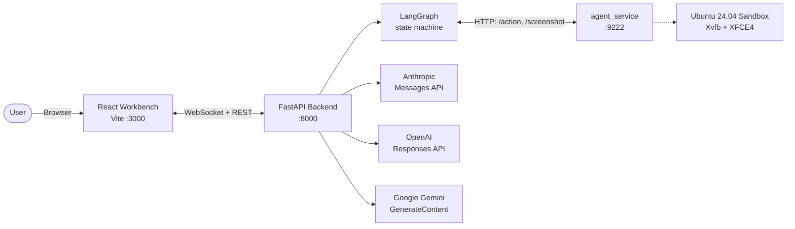

# computer-use

A local workbench for running and inspecting provider-native computer-use agents.

[](LICENSE)
[](pyproject.toml)
[](https://github.com/pypi-ahmad/computer-use/commits)

`computer-use` pairs a React workbench with a FastAPI backend and an
Ubuntu/XFCE sandbox in Docker. You pick a supported model, describe a
task, and watch the agent drive the desktop through Anthropic, OpenAI,
or Google's native Computer Use API.

It is built for local experiments, adapter work, and safety debugging -
not as a shared service. The backend binds to loopback by default,
streams the sandbox over WebSocket and noVNC, and keeps each provider's
request shape, safety handshake, and reasoning-continuation logic
separate.

## Architecture

The runtime is a three-tier loop: the React UI holds a WebSocket to the
FastAPI backend; the backend talks HTTP to an in-container agent service
that executes desktop actions; the backend also talks to the chosen
provider's CU API. The LangGraph state machine (`preflight ->
model_turn <-> tool_batch -> approval_interrupt -> finalize`) owns
orchestration and checkpoints every node transition to SQLite so a
paused session can resume after a backend restart.



## Quickstart

Prerequisites: Docker 24+, Python 3.11+, Node.js 20+, and one provider
API key.

```bash
git clone https://github.com/pypi-ahmad/computer-use.git && cd computer-use
cp .env.example .env                              # add your API key(s)
bash setup.sh && docker compose up -d
source .venv/bin/activate && python -m backend.main
cd frontend && npm run dev
```

Run the last two commands in separate terminals, then open
`http://localhost:3000`, click **Start Environment**, pick a model, and
describe a task.

On Windows, replace `cp .env.example .env` with
`Copy-Item .env.example .env`, use `.\setup.bat && docker compose up -d`,
and replace `source .venv/bin/activate` with
`.venv\Scripts\activate`.

## Features

- Four current Computer Use model choices across three providers:
  `claude-opus-4-7`, `claude-sonnet-4-6`, `gpt-5.4`, and
  `gemini-3-flash-preview`.
- Ubuntu 24.04 runs inside Docker with XFCE4 and Xvfb, so agent actions
  stay off the host.
- The React workbench streams screenshots, logs, step events, and a
  live noVNC desktop over WebSocket.
- Provider-specific safety signals (`pending_safety_checks`,
  `safety_decision`, `acknowledged_safety_checks`) route through one
  approval interrupt instead of being auto-cleared.
- LangGraph checkpoints and SQLite-backed traces let paused sessions
  resume after a backend restart.
- Single-user by design: loopback-first defaults, no multi-tenancy, and
  no built-in REST auth layer.

## Supported Computer Use models

| Provider | Model | Tool version | Status |
|---|---|---|---|
| Anthropic | `claude-opus-4-7` | `computer_20251124` | Current |
| Anthropic | `claude-sonnet-4-6` | `computer_20251124` | Current |
| OpenAI | `gpt-5.4` | built-in `computer` tool | Current |
| Google | `gemini-3-flash-preview` | `types.Tool(computer_use=...)` | Current |

`backend/allowed_models.json` also keeps compatibility IDs for existing
sessions and frontends: `claude-opus-4-6`, `claude-sonnet-4-5`, `gpt-5`,
`gemini-2.5-flash`, and `gemini-2.5-pro`.
`gemini-3.1-pro-preview` stays listed for non-CU calls only; see
[CHANGELOG.md](CHANGELOG.md) for the documented decision.

## Configuration

The key resolution order is UI input -> `.env` -> system environment.
Keep the README short and use
[USAGE.md - Configuration reference](USAGE.md#configuration-reference)
for the full matrix.

```bash
ANTHROPIC_API_KEY=...    # Claude models
OPENAI_API_KEY=...       # GPT-5.4 / GPT-5
GOOGLE_API_KEY=...       # Gemini models
OPENAI_BASE_URL=...      # Azure, proxy, or regional endpoint override
CUA_WS_TOKEN=...         # shared secret for /ws and /vnc/websockify when needed
```

## Development

```bash
python -m venv .venv && source .venv/bin/activate
pip install -r requirements.txt
cd frontend && npm install && cd ..
ruff check backend tests evals docker
pytest -q
```

Run `docker compose up -d`, `python -m backend.main`, and
`cd frontend && npm run dev` when you want the full workbench locally.
`python -m backend.certifier --json` audits engine capability support,
and `python -m backend.tracing list` inspects saved session traces.

## Testing

The suite covers adapter wire shapes, WebSocket and API lifecycle,
sandbox guardrails, and replay evals. `pytest --collect-only` currently
finds 440 tests. Run the fast path below, or add
`--cov=backend --cov-report=term-missing` when you want local coverage
output.

```bash
pytest -q
```

## Security

- Agent actions run inside a Dockerized Ubuntu desktop as a non-root
  `agent` user with `no-new-privileges`, dropped Linux capabilities,
  and no host filesystem mounts by default.
- API keys come from UI input, `.env`, or system env. Secret-shaped
  values are redacted in logs, WebSocket frames, and SQLite checkpoints.
- The in-container `agent_service.py` uses a per-session
  `AGENT_SERVICE_TOKEN`, and `/ws` plus `/vnc/websockify` can be gated
  with `CUA_WS_TOKEN`.
- Provider safety signals (`require_confirmation`,
  `pending_safety_checks`, `safety_decision`) surface to the user
  through LangGraph's `approval_interrupt`; required acknowledgements
  are not auto-bypassed.
- This is a **single-user research workbench**, not a multi-tenant
  service. Keep the REST surface on loopback or put your own auth in
  front of it before any external bind.

For sandbox internals, see [docker/SECURITY_NOTES.md](docker/SECURITY_NOTES.md).

## Contributing

Issues and pull requests are welcome. For larger changes, open an issue
first so the scope is clear. Adapter and sandbox changes should ship
with tests; `tests/test_adapters_april2026.py` and
`tests/test_sandbox_*.py` are good starting patterns.

## License

[MIT](LICENSE).

## Acknowledgments

- Anthropic's
  [computer-use-demo](https://github.com/anthropics/claude-quickstarts/tree/main/computer-use-demo)
  - sandbox and scaling reference.
- OpenAI's
  [Computer Use guide](https://developers.openai.com/api/docs/guides/tools-computer-use)
  - Responses API patterns, `detail: "original"`, and browser-hardening
  guidance.
- Google's
  [computer-use-preview](https://github.com/google-gemini/computer-use-preview)
  - Playwright reference and Gemini CU examples.
- [LangGraph](https://github.com/langchain-ai/langgraph) - the
  checkpointed orchestration layer behind the backend.
