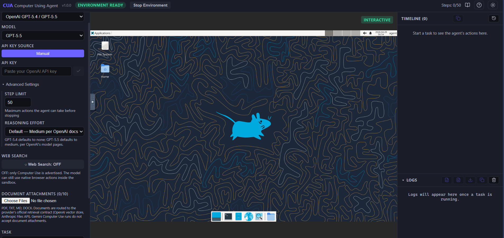

# Computer Use Workbench

Local operator console for official Computer Use models. You type a
task. The model sees screenshots of a **disposable Ubuntu/XFCE
desktop** in Docker, returns vendor actions (`click`, `type`,
`hotkey`, scroll, navigate), and those actions run **inside the
container**, not on your host. You watch the same XFCE screen in the
browser through noVNC.

No hosted agent. No account. Clone it, start three local processes,
pay the vendor with **your** API keys.

[](LICENSE)
[](https://github.com/pypi-ahmad/computer-use/actions/workflows/ci.yml)
[](pyproject.toml)
[](https://github.com/pypi-ahmad/computer-use/releases/latest)

Repository: [github.com/pypi-ahmad/computer-use](https://github.com/pypi-ahmad/computer-use)

Package `computer-use-workbench` **3.2.0**. Tree may include
Unreleased work — see [CHANGELOG.md](CHANGELOG.md).

[USAGE.md](USAGE.md) · [DATA.md](DATA.md) ·
[OPEN_SOURCE.md](OPEN_SOURCE.md) · [SUPPORT.md](SUPPORT.md)

> [!WARNING]
> Computer Use can delete files, submit forms, and spend money in a
> browser session. Use test accounts and non-sensitive data. This
> project is not a multi-tenant service and does not make model
> actions safe by itself.

> [!IMPORTANT]
> **Do not send money.** No donations, sponsorship, bounties, or
> paid support. Time and reports only. Every payload you put in the
> app — PDFs, uploads, sandbox files, keys, task text — is **yours**.

[Features](#features) · [Quick start](#quick-start) ·
[Usage](#usage) · [How it works](#how-it-works) ·
[Environment](#environment) · [Index](#index)

## What this is

Provider Computer Use APIs already look at a screen and pick a mouse
or keyboard action. They do **not** give you a desktop, a live view,
an audit log, or a place to approve risky steps. This repo is that
local layer.

**For:** one-workstation operators, people evaluating Computer Use on
bounded local tasks, contributors.

**Not for:** hosted agents, multi-user access, or a guarantee the
model stays inside the task. Isolation is a throw-away container.

| Piece | Role |
|---|---|
| React dashboard (`127.0.0.1:8505`) | Six tabs. Live **Mission control** is the left CONTROL sidebar; the main pane is XFCE. |
| FastAPI (`127.0.0.1:8100`) | Sessions, safety prompts, SQLite audit, cost estimates, noVNC proxy. |
| Docker sandbox `cua-environment` | Xvfb + XFCE + x11vnc (`-nopw`) + `docker/agent_service.py`. Loopback 5900 / 6080 / 9222. |

The model talks to the vendor API. The backend maps Computer Use
actions onto HTTP calls on the sandbox (`AGENT_SERVICE_TOKEN`).
Sandbox is Ubuntu 24.04, virtual display 1440×900.

| Not this | Why |
|---|---|
| Hosted / cloud agent | You run the clone. No sign-in on this repo. |
| Multi-user SaaS | Default bind is `127.0.0.1`. Public bind needs `CUA_ALLOW_PUBLIC_BIND=1` **and** `CUA_API_TOKEN`. |
| A safety system | The container limits *where* clicks land, not *whether* the task is wise. |
| A provider invoice | Session cost is list-rate arithmetic on recorded tokens. |
| A search engine | `mcp_fetch` fetches a URL the model already has. It does not search the web. |

## Features

- **Three Computer Use routes** (`backend/models/computer_use_models.v2.json`)
  - `gemini-direct` — Live default `gemini-3.7-flash`, fallback
    `gemini-3.5-flash-lite@gemini-direct`
  - `anthropic-direct` — Claude Sonnet 5 (`computer_20251124`)
  - `openai-direct` — GPT-5.6 Luna or GPT-5.6 Terra (Responses API)
- **Six-tab dashboard** — Live, Audit trail, Session cost, Workflow
  library, Providers, Analytics (`frontend/src/App.tsx`)
- **Live noVNC viewport** — XFCE as soon as the sandbox is healthy
  (`/vnc/vnc.html?path=vnc/websockify`, no VNC password). You do not
  start a run to see the screen.
- **Provider web search (MCP fetch)** — Live toggle `useBuiltinSearch`
  advertises `mcp_fetch`. The **model** chooses when to fetch a public
  `https` URL. Host runs `uvx mcp-server-fetch`. Not provider
  `web_search`, not a pre-run URL brief.
- **Session event socket** — `/api/v2/ws/desktop` idle, then
  `/api/v2/ws/{session_id}` after Start run. CUAF preview frames are
  decoded but **not** shown; the picture is noVNC.
- **Session cost** — `EXECUTION` tokens × list rates
  (`frontend/src/pricing.ts`)
- **Safety policies** — `provider_default`, `confirm_mutating`,
  `read_only`; Approve/Deny (60 s then auto-deny)
- **Process-local credentials** — keys stay in memory, expire within
  eight hours, never written to SQLite. User/process `GOOGLE_API_KEY`
  wins over `.env`.
- **SQLite WAL audit** — `data/computer-use-v2.sqlite3`; frames under
  `data/audit-frames` (7-day or 1 GiB eviction)
- **Desktop target** — Live dropdown: sandbox Docker (default) or
  native host. Host drives this machine; sandbox is unchanged.
- **Windows one-file launcher** — `run.cmd`

Live catalog: `backend/models/allowed_models.json`.

## Quick start

### Requirements

- Docker Desktop (engine running)
- Node.js 22+
- [uv](https://docs.astral.sh/uv/) and Python 3.12 (3.13 / 3.14 also
  in CI)
- Windows 11 for `run.cmd` / `START.bat`; Linux/macOS use `setup.sh`
  and `dev.sh`

### Windows

```powershell
git clone https://github.com/pypi-ahmad/computer-use.git
cd computer-use
.\run.cmd
```

`run.cmd` installs missing host tools via winget, copies
`.env.example` → `.env` if needed, fills empty `AGENT_SERVICE_TOKEN`,
syncs deps, builds `cua-ubuntu:latest` if missing, then starts
`dev.py --open-browser`. Opens
[http://127.0.0.1:8505](http://127.0.0.1:8505) when Vite is up.

`START.bat` always runs `setup.bat --bootstrap-only` first, then
launches.

If Docker asks for a reboot or WSL setup, finish that and run
`run.cmd` again.

### Manual (Windows, Linux, macOS)

```powershell
git clone https://github.com/pypi-ahmad/computer-use.git
cd computer-use
Copy-Item .env.example .env   # then set AGENT_SERVICE_TOKEN
uv sync --frozen
npm --prefix frontend ci
docker compose build
uv run python dev.py --open-browser
```

Linux/macOS:

```bash
cp .env.example .env
# set AGENT_SERVICE_TOKEN
bash setup.sh
bash dev.sh
```

Daily start: `uv run python dev.py --open-browser`. Backend only:
`uv run python -m backend.main` (default `127.0.0.1:8100`).

### URLs

| URL | What listens |
|---|---|
| http://127.0.0.1:8505 | Vite dashboard. Proxies `/api`, `/api/v2/ws`, `/vnc`. |
| http://127.0.0.1:8100 | FastAPI. Production UI is `frontend/dist` when built. |
| http://127.0.0.1:9222/health | In-container agent service (loopback) |
| http://127.0.0.1:6080 | noVNC inside the container (prefer dashboard `/vnc`) |

A non-loopback `HOST` requires `CUA_ALLOW_PUBLIC_BIND=1` and
`CUA_API_TOKEN`, or `backend/main.py` exits 2.

## Demo



*Isolated XFCE in the Live noVNC viewport. Screenshot is from an
earlier UI; current surface is the six-tab dashboard (Mission control
in the left CONTROL sidebar).*

Smoke task (no web search, no attachments):

```text
Open the file manager. Stop when the file manager window is visible.
```

If the file manager appears and the session badge reaches
`COMPLETED`, the install works. Full steps: [TESTING.md](TESTING.md).

## Usage

1. Start the stack (`run.cmd` or `dev.py --open-browser`).
2. Open `http://127.0.0.1:8505`.
3. **Providers** — credential session if keys are not in the
   environment or `.env`.
4. **Live session** — CONTROL sidebar. Defaults: `gemini-3.7-flash` /
   `gemini-direct`, fallback `gemini-3.5-flash-lite@gemini-direct`.
   Optional reasoning, safety policy, **Provider web search**
   (`mcp_fetch`), reference files on non-Gemini models. **Start run**
   sends `POST /api/v2/sessions` with `maxSteps: 50`.
5. Approve or deny amber banners
   (`POST /api/v2/sessions/{id}/safety-decisions`). Unanswered
   prompts auto-deny after 60 seconds.
6. **Stop run** patches the session to `STOPPING`. Sidebar **Stop
   app** posts `POST /api/v2/system/shutdown`. `Ctrl+C` in the
   launcher stops Vite, the backend, and `docker compose down`.

| Path | Tab |
|---|---|
| `/` | Live — Mission control, noVNC, pipeline stages |
| `/audit` | Audit trail — action journal, events, ZIP export |
| `/cost` | Session cost — `EXECUTION` tokens × list rates |
| `/workflows` | Named step lists; compile into a Live task |
| `/providers` | Route readiness and ephemeral credentials |
| `/analytics` | Aggregates, diagnostics, retention prune |

### Session cost

USD = `tokens / 1,000,000 × list rate`. Batch, cache, and Terra
long-context doubling are **not** applied. Not a provider invoice.

| Model | Input / 1M | Output / 1M |
|---|---:|---:|
| Sonnet 5 (`claude-sonnet-5`) | $2.00 | $10.00 |
| Gemini Flash 3.7 (`gemini-3.7-flash`) | $0.75 | $3.75 |
| Gemini 3.5 Flash Lite (`gemini-3.5-flash-lite`) | $0.30 | $2.50 |
| GPT 5.6 Luna (`gpt-5.6-luna`) | $0.20 | $1.20 |
| GPT 5.6 Terra (`gpt-5.6-terra`) | $2.00 | $12.00 |

### HTTP

```http
POST /api/v2/sessions
Content-Type: application/json

{
  "task": "Open the file manager. Stop when the file manager window is visible.",
  "model": "gemini-3.7-flash",
  "primaryRoute": "gemini-direct",
  "fallbackRoutes": [{ "model": "gemini-3.5-flash-lite", "route": "gemini-direct" }],
  "maxSteps": 50,
  "safetyPolicy": "provider_default",
  "useBuiltinSearch": false,
  "attachedFiles": [],
  "retainAuditFrames": true,
  "executionTarget": "docker"
}
```

If `CUA_API_TOKEN` is set, send `X-CUA-Token` (or `?token=`).

### Production-style single process

```powershell
npm --prefix frontend run build
docker compose up -d --wait --wait-timeout 90
uv run python -m backend.main
```

Then open [http://127.0.0.1:8100](http://127.0.0.1:8100). Detail:
[docs/deployment.md](docs/deployment.md).

### Commands

| Command | Purpose |
|---|---|
| `run.cmd` | Windows: setup if needed, then launch |
| `START.bat` | Always bootstrap, then launch |
| `uv run python dev.py --open-browser` | Sandbox + backend + Vite |
| `uv run python -m backend.main` | Backend only |
| `uv run pytest` | Offline backend tests (`not integration`) |
| `uv run ruff check .` / `uv run mypy` | Lint / type-check |
| `npm --prefix frontend run test:run` | Frontend unit tests |
| `npm --prefix frontend run build` | Production bundle |

### Safety and files

| `safetyPolicy` | Behavior |
|---|---|
| `provider_default` | Provider’s own confirmation rules |
| `confirm_mutating` | Extra operator confirm for mutating actions |
| `read_only` | Reject mutating actions |

Gemini **File Search** cannot combine with Computer Use. Live hides
the file input for `GEMINI`. Non-Gemini routes accept `.md`, `.txt`,
`.pdf`, `.docx` as reference files.

## How it works

```text
Browser (127.0.0.1:8505)
    │  REST /api/v2/*
    │  WS   /api/v2/ws/desktop  or  /api/v2/ws/{session_id}
    │  HTTP+WS /vnc/*  (noVNC + websockify)
    ▼
FastAPI (127.0.0.1:8100)     backend/server, backend/v2
    │  AgentLoop, safety, SQLite, CUAF frames
    ▼
Provider SDK                 backend/engine, backend/providers
    OpenAI Responses  |  Anthropic Messages  |  Gemini Interactions
    │  Computer Use actions
    ▼
DesktopExecutor              backend/executor.py
    │  HTTP + AGENT_SERVICE_TOKEN
    ▼
cua-environment              docker/agent_service.py
    Xvfb :99 1440×900 → XFCE → x11vnc :5900 → websockify :6080
```

1. `dev.py` waits for agent `/health` and noVNC `vnc.html` before
   Vite starts.
2. Live loads `/api/v2/desktop` (`path=vnc/websockify`, no
   `password=`). Iframe waits until `/vnc/vnc.html` returns 200.
3. If **Provider web search** is on, the engine advertises
   `mcp_fetch`. Localhost / private URLs are rejected.
4. Start run stores the session in SQLite, calls the engine, maps
   official desktop actions onto the sandbox.
5. Fallback runs only if the primary route fails (`max_attempts=1`
   per route; circuit opens after 3 failures for 30 s).
6. Interactive desktop is noVNC, not CUAF preview frames.

More: [TECHNICAL.md](TECHNICAL.md) ·
[docs/codebase/ARCHITECTURE.md](docs/codebase/ARCHITECTURE.md).

### Tech stack

| Layer | What this repo uses |
|---|---|
| Backend | Python 3.12–3.14, FastAPI 0.141.1, Uvicorn, Pydantic 2, httpx, Pillow |
| Providers | `openai` 2.30, `anthropic` 0.88, `google-genai` 2.7, `google-auth` |
| Frontend | React 19, React Router 7, Vite 6, TypeScript 5.7, Lucide |
| Sandbox | Docker Compose, Ubuntu 24.04, Xvfb, XFCE, x11vnc (`-nopw`), noVNC |
| Persistence | SQLite WAL + on-disk audit frames |
| Tooling | uv, Ruff, mypy, pytest 9, Vitest 3, GitHub Actions |

### Project structure

```text
computer-use/
├── backend/                  # FastAPI app
│   ├── main.py               # Uvicorn entry; public-bind guardrail
│   ├── server/               # HTTP/WS, noVNC proxy, lifespan
│   ├── v2/                   # /api/v2 REST, credentials, SQLite
│   ├── engine/               # OpenAI / Anthropic / Gemini CU clients
│   ├── providers/            # Run adapters
│   ├── executor.py           # Desktop actions → agent_service
│   ├── loop.py               # Session / step orchestration
│   ├── infra/                # Config, Docker, logging, mcp_fetch
│   └── models/               # Catalogs and schemas
├── frontend/                 # React + Vite dashboard
├── docker/                   # Sandbox image + agent_service
├── docker-compose.yml
├── tests/                    # Offline pytest
├── evals/                    # Offline HTTP/runtime evals
├── docs/
├── run.cmd                   # Windows setup-if-needed + launch
├── START.bat                 # Always setup, then launch
├── dev.py / dev.bat / dev.sh
└── .env.example
```

## Environment

Copy `.env.example` to `.env`. Never commit the populated file.

`GOOGLE_API_KEY` already set in the user/process environment is
snapshotted before `.env` loads (`backend/infra/config.py`
`_USER_ENV`) and wins over a `.env` assignment. Keys stay
process-local.

### Required for the sandbox

| Variable | Default | Role |
|---|---|---|
| `AGENT_SERVICE_TOKEN` | generated by `run.cmd` if empty | Shared secret with `docker/agent_service.py` |

If the token in `.env` does not match the container, screenshots
return `401` and the viewport stays blank. Confirm with
`docker exec cua-environment printenv AGENT_SERVICE_TOKEN`.

### Provider credentials (at least one route)

| Variable | Role |
|---|---|
| `OPENAI_API_KEY` | `openai-direct` |
| `OPENAI_BASE_URL` | Optional OpenAI-compatible base URL override |
| `OPENAI_REASONING_EFFORT` | Overrides the per-model default reasoning effort sent to the Responses API |
| `ANTHROPIC_API_KEY` | `anthropic-direct` |
| `CUA_CLAUDE_MAX_TOKENS` | Max output tokens for Claude, default `32768`, clamped to `1024`–`128000` |
| `CUA_CLAUDE_CACHING` | Set `1` to opt into Anthropic prompt caching (tool + system blocks). Default off — no billing/wire-shape change unless set. |
| `CUA_ANTHROPIC_WEB_SEARCH_ENABLED` | Set `1` to force-enable the Anthropic web search probe |
| `GOOGLE_API_KEY` or `GEMINI_API_KEY` | `gemini-direct`. User/process `GOOGLE_API_KEY` wins. |
| `GEMINI_MODEL` | Overrides the default Gemini model id |

Or create an ephemeral credential session in the Providers tab.
Google OAuth needs `GOOGLE_OAUTH_CLIENT_ID` and
`GOOGLE_OAUTH_CLIENT_SECRET` (or `GOOGLE_OAUTH_CLIENT_SECRET_FILE`).
`CUA_GOOGLE_OAUTH_REDIRECT_URI` overrides the callback URL the backend
derives by default. `GOOGLE_CLOUD_PROJECT` is an optional quota-project
fallback for the OAuth flow.

### Networking

| Variable | Default | Role |
|---|---|---|
| `HOST` | `127.0.0.1` | Backend bind |
| `PORT` | `8100` | Backend port |
| `CUA_ALLOW_PUBLIC_BIND` | unset | Required for non-loopback `HOST` |
| `CUA_API_TOKEN` | unset | Shared secret for `/api/*` (except Google OAuth callback), `/ws`, `/api/v2/ws/*`, `/vnc/websockify`. HTTP: `X-CUA-Token` or `?token=`. Open on loopback when unset. |
| `CUA_WS_TOKEN` | unset | **Deprecated** fallback for `CUA_API_TOKEN` when the latter is unset. Prefer `CUA_API_TOKEN`. |
| `CORS_ORIGINS` | 8505 / 8100 / 5173 / 3000 on localhost and 127.0.0.1 | Comma-separated Origin allowlist |
| `CUA_ALLOWED_HOSTS` | derived from `CORS_ORIGINS` | Extra comma-separated allowed `Host` headers |
| `CUA_MAX_BODY_BYTES` | `262144` (256 KiB) | Max request body size |
| `CUA_MAX_SESSION_BROADCAST_BACKLOG` | `64` | Max pending WS broadcasts queued per session |

### Sandbox and agent

| Variable | Default | Role |
|---|---|---|
| `CONTAINER_NAME` | `cua-environment` | Docker container name |
| `AGENT_MODE` | `desktop` | Agent-service mode; desktop is the only supported mode |
| `AGENT_SERVICE_HOST` / `PORT` | `127.0.0.1` / `9222` | Action service |
| `SCREEN_WIDTH` / `SCREEN_HEIGHT` | `1440` / `900` | Virtual display |
| `MAX_STEPS` | `50` | Default step budget (hard cap 200). Live always sends `maxSteps: 50`. |
| `STEP_TIMEOUT` | `30.0` | Seconds before one action is treated as hung |
| `VNC_PASSWORD` | unused | Ignored. x11vnc starts with `-nopw`. |
| `CUA_ENABLE_LEGACY_ACTIONS` | `0` | Re-enables shell/clipboard/window-management in the sandbox. Do not enable off loopback. |
| `CUA_ALLOWED_NAV_HOSTS` | unset | Optional comma-separated host allowlist for navigation |
| `CUA_MCP_FETCH_CMD` | `uvx mcp-server-fetch` | Fetch MCP when Live Provider web search is on |

> [!NOTE]
> `VNC_PASSWORD` is unused. noVNC has no password. Do not treat the
> viewport as authenticated.

### Persistence

| Variable | Default | Role |
|---|---|---|
| `CUA_V2_DB_PATH` | `data/computer-use-v2.sqlite3` | SQLite WAL store |
| `CUA_V2_FRAME_PATH` | `data/audit-frames` | Audit screenshots |
| `CUA_UPLOAD_DIR` | library default | Root directory for the reference-file store |
| `CUA_TRACE_DIR` | `~/.computer-use/traces/` | CUAF trace JSON output directory |
| `CUA_FRONTEND_DIST` | `frontend/dist` | Production UI bundle |
| `LOG_FORMAT` | `console` | Set `json` for one JSON object per line |
| `LOG_LEVEL` | `INFO` | Python log level |
| `DEBUG` | `0` | Debug verbosity |
| `CUA_RELOAD` | unset | Uvicorn `--reload` (`DEBUG` does not turn this on) |

Frontend Vite: `VITE_API_PORT` (default `8100`), `VITE_WS_TOKEN`,
`VITE_PORT` (default `8505`).

Full template: [.env.example](.env.example).

## Index

Jump: [operator](#operator-docs) · [community](#community-docs) ·
[technical](#technical-docs) · [templates and CI](#templates-and-ci).

### Operator docs

| Document | What it is |
|---|---|
| [USAGE.md](USAGE.md) | Tabs, credentials, REST, troubleshooting |
| [TESTING.md](TESTING.md) | Manual smoke test and CI-equivalent commands |
| [DATA.md](DATA.md) | Local storage; operator owns every payload |
| [docs/deployment.md](docs/deployment.md) | Local and single-process production start |
| [docs/migration-v2.md](docs/migration-v2.md) | Migrating from v1 to v2 (no compatibility shim) |
| [docs/rollback-v2.md](docs/rollback-v2.md) | v2 rollback runbook and triggers |
| [docs/computer-use-prompt-guide.md](docs/computer-use-prompt-guide.md) | How to write bounded Computer Use tasks |
| [docs/business-guide.md](docs/business-guide.md) | Pilot, risk, and go/no-go for an org evaluation |
| [docs/zero-to-hero-study-handbook.md](docs/zero-to-hero-study-handbook.md) | Study handbook (markdown source) |
| [docs/zero-to-hero-study-handbook.html](docs/zero-to-hero-study-handbook.html) | Study handbook (standalone HTML) |
| [docs/zero-to-hero-study-handbook.pdf](docs/zero-to-hero-study-handbook.pdf) | Study handbook (PDF; may lag the HTML build) |
| [docs/release-notes-v3.2.0.md](docs/release-notes-v3.2.0.md) | Latest per-version release notes; earlier versions (v2.0.0–v3.1.1) live alongside it in `docs/` |

### Community docs

| Document | What it is |
|---|---|
| [OPEN_SOURCE.md](OPEN_SOURCE.md) | Clone, local use, own keys; no hosted service |
| [DISCLAIMER.md](DISCLAIMER.md) | No warranty, data responsibility, provider terms, no financial support |
| [SUPPORT.md](SUPPORT.md) | How to get help; what this repo will not debug |
| [CONTRIBUTING.md](CONTRIBUTING.md) | Branch, test, and PR rules |
| [SECURITY.md](SECURITY.md) | Security model and vulnerability reports |
| [CODE_OF_CONDUCT.md](CODE_OF_CONDUCT.md) | Contributor Covenant 3.0 |
| [LICENSE](LICENSE) | MIT license text |
| [CHANGELOG.md](CHANGELOG.md) | Released and Unreleased changes |
| [AGENTS.md](AGENTS.md) | Terse-response rules for coding agents |

### Technical docs

| Document | What it is |
|---|---|
| [TECHNICAL.md](TECHNICAL.md) | Runtime contracts, routes, models |
| [docs/codebase/ARCHITECTURE.md](docs/codebase/ARCHITECTURE.md) | Modular monolith and sandbox split |
| [docs/codebase/STACK.md](docs/codebase/STACK.md) | Languages, frameworks, and tools |
| [docs/codebase/STRUCTURE.md](docs/codebase/STRUCTURE.md) | Top-level repository map |
| [docs/codebase/CONVENTIONS.md](docs/codebase/CONVENTIONS.md) | Naming and code conventions |
| [docs/codebase/INTEGRATIONS.md](docs/codebase/INTEGRATIONS.md) | Providers, tokens, and external APIs |
| [docs/codebase/CONCERNS.md](docs/codebase/CONCERNS.md) | Prioritized risks |
| [docs/codebase/TESTING.md](docs/codebase/TESTING.md) | Test stack and how to run it |
| [MODERNIZATION_PLAN.md](MODERNIZATION_PLAN.md) | Phased modernization plan: runtime upgrades, stack migration, safety ladder |
| [docs/gemini-successor-evaluation.md](docs/gemini-successor-evaluation.md) | Checklist for evaluating a Gemini Computer Use model successor |
| [docs/research-audit-2026-07-23.md](docs/research-audit-2026-07-23.md) | Computer Use model/platform audit vs. official vendor docs |
| [docker/SECURITY_NOTES.md](docker/SECURITY_NOTES.md) | Sandbox / agent-service attack surface |
| [evals/README.md](evals/README.md) | Offline deterministic evals |
| [.env.example](.env.example) | Environment template (never commit `.env`) |

### Templates and CI

| Document | What it is |
|---|---|
| [Bug template](.github/ISSUE_TEMPLATE/bug.yml) | GitHub bug report form |
| [Idea template](.github/ISSUE_TEMPLATE/feature.yml) | GitHub feature / improvement form |
| [Issue chooser](.github/ISSUE_TEMPLATE/config.yml) | Issue picker plus contact links |
| [PR template](.github/PULL_REQUEST_TEMPLATE.md) | Pull-request checklist |
| [CI workflow](.github/workflows/ci.yml) | Lint, typecheck, tests, sandbox image, Trivy |
| [Release workflow](.github/workflows/release.yml) | Tagged-release job |
| [Gemini changelog watchdog](.github/workflows/gemini-changelog-watchdog.yml) | Scheduled Gemini changelog check |

Bugs: [bug.yml](https://github.com/pypi-ahmad/computer-use/issues/new?template=bug.yml).
Ideas: [feature.yml](https://github.com/pypi-ahmad/computer-use/issues/new?template=feature.yml).
Security reports go to [SECURITY.md](SECURITY.md), not public issues.

Computer Use protocols belong to OpenAI, Anthropic, and Google. This
workbench is an independent local operator surface, not an official
vendor product.

<p align="center">Made with ❤️ by Ahmad Mujtaba</p>
