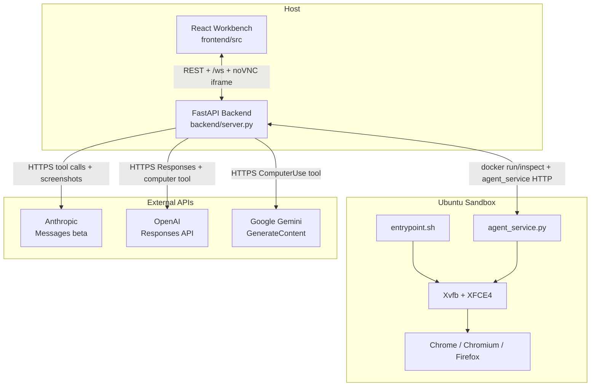

# TECHNICAL.md

## 1. Scope and audience

This document is for people reading, reviewing, or changing the code. It
explains the runtime shape of the system, the contracts between modules,
and the places where a small edit can quietly break provider behavior,
resume semantics, or safety handling. End users should start with
[USAGE.md](USAGE.md), and evaluators or first-time visitors should start
with [README.md](README.md). The project is a local, single-user
research workbench, not a multi-tenant SaaS, and many choices below only
make sense under that constraint.

## 2. System overview

### 2.1 Three-plane architecture

`computer-use` is split into three planes. The frontend is a React/Vite
workbench that owns form state, screen toggles, drawers, and WebSocket
session state, but not provider logic. The backend is a FastAPI process
that validates requests, resolves keys and models, starts the sandbox,
orchestrates LangGraph runs, proxies noVNC, and translates
provider-native Computer Use responses into one shared desktop executor.
The sandbox is an Ubuntu 24.04 Docker container running Xvfb, XFCE4,
`x11vnc`, `websockify`, and `docker/agent_service.py`; it executes UI
actions and captures screenshots, but it never receives the user's
prompt directly.



### 2.2 Request lifecycle

1. The user selects a provider and model in
  `frontend/src/pages/WorkbenchPage.jsx` and submits a task through
  `frontend/src/hooks/useSessionController.js`. The mirrored
  `frontend/src/pages/Workbench.jsx` is kept in sync for compatibility,
  but `frontend/src/main.jsx` loads `WorkbenchPage.jsx`.
2. The frontend keeps `/ws` open via
   `frontend/src/hooks/useWebSocket.js`. If the user switches to the
   interactive desktop, `frontend/src/components/ScreenView.jsx` loads
   `/vnc/vnc.html` and points its `path=` query at `/vnc/websockify`.
3. `POST /api/agent/start` in `backend/server.py` validates the request,
   checks origin policy, resolves the API key, enforces the allowlisted
  model registry from `backend/models/allowed_models.json`, and calls
  `backend/infra/docker.py::start_container()`.
4. The backend waits for `docker/agent_service.py` to answer `/health`,
   then creates an `AgentLoop` from `backend/agent/loop.py`. The loop
   builds a LangGraph `NodeBundle`, wraps it with tracing, and compiles
   the six-node graph from `backend/agent/graph.py`.
5. The provider adapter begins the core loop: capture screenshot, call
   provider, translate returned actions, execute them through
   `DesktopExecutor`, capture another screenshot, and yield the next
   `TurnEvent`.
6. If a provider demands confirmation, the graph moves into
   `approval_interrupt` and the backend exposes the pause to the UI over
   `/ws`. The user resolves it through `POST /api/agent/safety-confirm`.
7. The run ends when the provider returns a terminal answer, the user
   stops the session, the graph exhausts retries, or the turn limit is
   hit. The backend broadcasts `agent_finished`, writes the trace sidecar
   JSON, and keeps a screenshot-free session snapshot in the LangGraph
   SQLite checkpoint store.

## 3. Repository layout

Only the directories that define architecture or contracts are listed
here.

```text
.
|-- .github/workflows/ci.yml
|-- README.md
|-- USAGE.md
|-- TECHNICAL.md
|-- backend/
|   |-- main.py
|   |-- server.py
|   |-- config.py
|   |-- docker_manager.py
|   |-- tracing.py
|   |-- models.py
|   |-- _models_loader.py
|   |-- engine/
|   |   |-- __init__.py
|   |   |-- claude.py
|   |   |-- openai.py
|   |   `-- gemini.py
|   |-- agent/
|   |   |-- loop.py
|   |   |-- graph.py
|   |   |-- prompts.py
|   |   |-- screenshot.py
|   |   `-- safety.py
|   |-- engine_capabilities.py
|   |-- parity_check.py
|   `-- certifier.py
|-- frontend/src/
|   |-- api.js
|   |-- pages/WorkbenchPage.jsx
|   |-- pages/workbench/ControlPanelView.jsx
|   |-- hooks/useSessionController.js
|   |-- hooks/useWebSocket.js
|   `-- components/ScreenView.jsx
|-- docker/
|   |-- Dockerfile
|   |-- entrypoint.sh
|   |-- agent_service.py
|   `-- SECURITY_NOTES.md
|-- tests/
`-- evals/
```

Start with `backend/server.py`, `backend/agent/graph.py`,
`backend/agent/loop.py`, `backend/engine/__init__.py`, and the
provider-specific engine files. Those areas define most of the hidden
contracts in the repo.

## 4. Provider adapter layer

The clean abstraction boundary is not one perfectly uniform class per
provider. The real shared boundary is `ComputerUseEngine` plus the
`TurnEvent` union in `backend/engine/__init__.py`, backed by one
`DesktopExecutor`. The provider clients are intentionally uneven:
Claude and Gemini expose native `iter_turns()` async generators, while
OpenAI still exposes a callback-driven `run_loop()` and is adapted into
the event stream by `iter_turns_via_run_loop()`.

### 4.1 Shared contract

`backend/engine/__init__.py` owns the cross-provider types:
`CUActionResult`, `CUTurnRecord`, `ModelTurnStarted`,
`ToolBatchCompleted`, `SafetyRequired`, `RunCompleted`, and `RunFailed`.
`ComputerUseEngine` chooses a provider client, builds a
`DesktopExecutor`, and offers two public execution styles:
`execute_task()` for the legacy callback path and `iter_turns()` for the
LangGraph driver. `backend/models/allowed_models.json`, loaded through
`backend/models/schemas.py`, is the single source of truth for exposed
model ids and CU capability flags.

At the product layer, web search is optional and controlled by the workbench's
toggle button. `ComputerUseEngine` therefore accepts `use_builtin_search` as a
plain availability flag: when false, the provider adapter emits only the
computer-use tool; when true, it adds the provider-native search tool without
flattening vendor-specific request shapes into one synthetic abstraction.

The shared helpers in `backend/engine/__init__.py` are also part of that
contract. `_call_with_retry()`, `scrub_secrets()`, `_is_opus_47()`,
`get_claude_scale_factor()`, `denormalize_x()`, `denormalize_y()`, and
the OpenAI replay helpers affect more than one provider at once.

### 4.2 Anthropic

`backend/engine/claude.py` implements `ClaudeCUClient` on top of
`anthropic.AsyncAnthropic.beta.messages.create()`. Tool version and beta
header are resolved from `backend/models/allowed_models.json` when possible,
then auto-detected from the model id as a fallback. In current code,
Claude Opus 4.7, Claude Opus 4.6, and Claude Sonnet 4.6 all run on the
`computer_20251124` path with beta header
`computer-use-2025-11-24`. Older compatibility ids stay on the
`computer_20250124` path.

All `computer_20251124` models share the high-resolution,
real-coordinate path. `_is_opus_47()` only changes the Opus 4.7 prompt
variant in `backend/agent/prompts.py` and the optional
`CUA_OPUS47_HIRES=1` long-edge-only scaling override. `enable_zoom: true`
is advertised on this path and served by `docker/agent_service.py`.
Claude never yields `SafetyRequired`; refusal is server-side through
`stop_reason == "refusal"`. `CUA_CLAUDE_CACHING=1` adds
`cache_control: {"type": "ephemeral"}` and `_prune_claude_context()`
removes old image payloads.
When `use_builtin_search` is true, the adapter also advertises Anthropic's
official `web_search_20250305` server tool in the same `tools` array as the
computer-use tool. When false, it emits only the computer-use tool.

When `attached_file_ids` is non-empty, `ClaudeCUClient` resolves the
local `f_...` ids against `backend.file_store`, adds the
`files-api-2025-04-14` beta, uploads `.pdf` / `.txt` files through
`client.beta.files.upload()`, and emits `document` content blocks with
the returned `file_...` ids. `.md` and `.docx` are not legal Claude
document blocks, so the adapter extracts them to plain text and inlines
that text into the initial user turn instead. Upload ids and extracted
text are cached on the client instance so multi-turn runs do not
re-upload or re-extract the same material.

### 4.3 OpenAI

`backend/engine/openai.py` implements `OpenAICUClient` against the
Responses API. For `gpt-5.5` and `gpt-5.4` it emits the built-in short-form
`{"type": "computer"}` tool; the old `computer-use-preview` branch is
still present only as compatibility code.
When `use_builtin_search` is true, `OpenAICUClient` also attaches the official
Responses `web_search` tool alongside `computer`, which is the documented
OpenAI combined-tool path for live web context plus UI action execution.

Server-side request validation resolves `reasoning_effort` as request override
>`OPENAI_REASONING_EFFORT`>`default_openai_reasoning_effort_for_model()` from
`backend/engine/__init__.py`. That keeps the default doc-backed per model:
GPT-5.5 falls back to `medium`, GPT-5.4 falls back to `none`. The active
workbench path in `frontend/src/pages/WorkbenchPage.jsx` and
`frontend/src/pages/workbench/ControlPanelView.jsx` exposes those exact models
with a `Reasoning Effort` dropdown and a blank `Default` option that follows
the selected model page.

The core invariant is stateless, ZDR-safe replay. The adapter sets
`include=["reasoning.encrypted_content"]`, `store=False`,
`parallel_tool_calls=False`, and `truncation="auto"`, then replays
sanitized output items instead of using `previous_response_id`.
`_sanitize_openai_response_item_for_replay()` must preserve `phase`, and
screenshots always use `detail: "original"`. One `computer_call` may
contain `actions[]`, and the adapter executes the whole batch before the
next screenshot. Safety is still callback-driven:
`pending_safety_checks` arrive through `on_safety` and return as
`acknowledged_safety_checks`. In the graph this client still comes
through `iter_turns_via_run_loop()`.

### 4.4 Google

`backend/engine/gemini.py` implements `GeminiCUClient` using
`google-genai` and
`types.Tool(computer_use=types.ComputerUse(...))`. Gemini is the most
natural fit for the graph because it already yields a native
`iter_turns()` stream and resumes safety decisions through
`agen.asend(bool)`. The adapter sends the initial screenshot as inline
PNG bytes, then on each tool turn returns `FunctionResponse` parts that
embed the next screenshot directly.
When `use_builtin_search` is true, `GeminiCUClient` also attaches
`Tool(google_search=GoogleSearch())` alongside `computer_use` and sets
`include_server_side_tool_invocations=True`, which is required for Google's
documented combined-tool path.

Gemini coordinates are normalized on a 0-999 grid. `DesktopExecutor`
denormalizes them before the action reaches `docker/agent_service.py`.
When Gemini returns
`safety_decision.decision == "require_confirmation"`, the adapter yields
`SafetyRequired`; confirmed tool results include
`safety_acknowledgement: "true"`. `CUA_GEMINI_RELAX_SAFETY=1` changes
harm-block thresholds, not that handshake. The Playwright path is
now the default for Gemini browser-mode sessions: ``docker/entrypoint.sh``
pre-launches Google Chrome inside the unified sandbox with
``--remote-debugging-port=9223``, ``docker-compose.yml`` publishes
that port to host loopback, and
``backend.engine.playwright_executor.GeminiPlaywrightExecutor``
attaches via ``playwright.connect_over_cdp("http://127.0.0.1:9223")``
so the same Chromium is driven through the docs-recommended
``page.mouse`` / ``page.keyboard`` / ``page.goto`` /
``page.screenshot()`` API while remaining sandboxed and visible in
the existing noVNC viewer. Set ``CUA_GEMINI_USE_PLAYWRIGHT=0`` to
fall back to the xdotool ``DesktopExecutor``; set
``CUA_DISABLE_CDP=1`` on the container to skip the CDP launch when
debugging the desktop path.

When `attached_file_ids` is non-empty, `_ensure_file_search_store()`
creates a per-session Gemini File Search store and uploads the selected
files before the loop starts. Google's File Search docs say
`file_search` cannot be combined with other tools, so the adapter does
not attach `Tool(file_search=...)` to the same Computer Use call.
Instead `_run_file_search_pre_step()` performs a one-shot
File-Search-only `generate_content()` call, captures the grounded text
and citations, and prepends that context to the first Computer Use user
turn. This keeps the loop doc-compliant while preserving the optional
`google_search` tool during later Computer Use turns when the toggle is on.

`gemini-3.1-pro-preview` and every other non-Flash Gemini id have been
removed from `backend/models/allowed_models.json`. Google's official Computer
Use docs list only `gemini-3-flash-preview` (and the legacy
`gemini-2.5-computer-use-preview-10-2025`); the repo standardises on
Flash as the single Gemini CU SKU. See [CHANGELOG.md](CHANGELOG.md).

## 5. Agent orchestration (LangGraph)

`backend/agent/graph.py` is the real orchestrator. It defines
`AgentGraphState`, a process-wide `GraphRuntime` backed by
`AsyncSqliteSaver`, and a six-node state machine with these nodes:
`preflight`, `model_turn`, `tool_batch`, `approval_interrupt`,
`recover_or_retry`, and `finalize`. The graph does not talk to SDKs or
Docker directly; it consumes a `NodeBundle` supplied by `AgentLoop`.

`preflight` performs the desktop health check and registers the session's
provider iterator. `model_turn` advances the iterator until it sees the
next `TurnEvent`. `tool_batch` expects `ToolBatchCompleted`, emits a
step, and hands control back to `model_turn`. `approval_interrupt` calls
LangGraph's `interrupt()` with the safety explanation and forwards the
resumed boolean back into the iterator via `asend()`.
`recover_or_retry` applies the retry budget, which is currently two
retries. `finalize` stores a screenshot-free session snapshot and clears
the iterator registry entry.

Two contracts here are easy to miss. First, the iterator registry is
process-local and not checkpointed. `pending_approval` survives restarts,
but the live async generator does not. That is why
`backend/server.py::_try_resume_graph()` can resume a paused approval
only when a live `AgentLoop` can also rebuild the iterator; otherwise the
graph will finalize quickly with an error. Second, the graph is native
only for Claude and Gemini. OpenAI still reaches the graph through
`iter_turns_via_run_loop()`, and the legacy
`backend/agent/safety.py` registry remains because older callback-driven
paths still exist.

`backend/agent/loop.py` is the bridge between the graph and the rest of
the application. It builds the `NodeBundle`, maps provider strings to
`Provider` enums, emits sanitized logs, turns `ToolBatchCompleted` into
`StepRecord` objects, detects three identical consecutive actions as a
"stuck agent" condition, and owns session lifecycle plus trace
finalization.

## 6. Sandbox design

### 6.1 Isolation posture

The sandbox image is defined in `docker/Dockerfile` and launched from
`backend/infra/docker.py`. It runs as user `agent` (UID 1000), with
loopback-only port mappings for 5900, 6080, and 9222, plus
`no-new-privileges`, memory/CPU limits, and no host mounts. The host
generates `AGENT_SERVICE_TOKEN` if needed and passes it through a
temporary env-file so it does not appear in `docker inspect` command-line
metadata.

There is no outbound domain allowlist in the current image. Browser
hardening comes from loopback-only publication, minimal browser
subprocess environments, first-run dialog suppression, and the action
surface below. `docker/entrypoint.sh` also requires either
`VNC_PASSWORD` or `CUA_ALLOW_NOPW=1`.

### 6.2 Action execution

Every desktop action goes through `DesktopExecutor` in
`backend/engine/__init__.py`, which turns provider-native actions into
`POST /action` requests against `docker/agent_service.py`.

Inside the container, `AgentHandler.do_POST()` resolves aliases through
`backend.action_aliases.resolve_action()` and rejects anything not in the
always-on `_ENGINE_ACTIONS` set unless `CUA_ENABLE_LEGACY_ACTIONS=1` is
set. Additional guards limit keyboard tokens, block dangerous shell
patterns on the legacy `run_command` path, and keep upload helpers
inside approved prefixes. `backend/certifier.py` is not a runtime gate;
it is an offline validator.

### 6.3 Screenshot publishing

There are two display surfaces and they are intentionally separate. `/ws`
is the backend event stream; it can carry screenshot frames when a client
subscribes through the `screenshot_mode` message. `/vnc/websockify` is an
interactive noVNC proxy into the desktop. Both surfaces share the same
origin checks and the same `_ws_token_ok()` gate in `backend/server.py`,
but they are not backed by the same capture loop.

`backend/server.py::_screenshot_publisher_loop()` is a single,
process-wide screenshot loop. It starts lazily, dedupes by hash, caches
the last frame for late joiners, and pauses when no `/ws` clients want
screenshots and `config.ws_screenshot_suspend_when_idle` is true. noVNC
viewers do not count as screenshot subscribers.

### 6.4 Why one container, not three

The repo ships one sandbox image that is the union of Anthropic's,
OpenAI's, and Google's published requirements. That keeps the backend on
one execution target and lets the same `DesktopExecutor` serve every
provider at the cost of a larger, broader image to audit.

That shared image now also includes a wider task-app surface used in
docs and evals: LibreOffice, XFCE Settings/Task Manager, Ristretto,
galculator, GIMP, Inkscape, and VS Code (`code`) alongside the browser
stack.

## 7. Observability and tracing

`backend/tracing.py` records every session as an in-memory event stream
and flushes it to `$CUA_TRACE_DIR/<session_id>.json` on terminal states.
Tracing is additive: it wraps the `NodeBundle` and provider iterator.

Traces are separate from the LangGraph checkpoint store. Checkpoints are
SQLite state snapshots; traces are append-only redacted JSON sidecars.
`_redact()` replaces screenshot blobs with digests and lengths, and
`assert_invariants()` checks one session start/end pair, valid terminal
status, and no tool batch while approval is pending.

`evals/_harness.py` builds on that trace model by running fake iterators
through the real graph and approval path. The same module exposes
`python -m backend.tracing dump <session_id>` and
`python -m backend.tracing list`.

## 8. Configuration surface

This section lists the project-specific configuration knobs and the layer
that reads them.

### 8.1 Credentials and auth

- `ANTHROPIC_API_KEY`, `OPENAI_API_KEY`, and `GOOGLE_API_KEY`
  (strings, no defaults) are resolved in `backend/infra/config.py`.
  `GEMINI_API_KEY` is honored as a fallback alias for the Gemini
  provider when `GOOGLE_API_KEY` is unset.
- `VITE_WS_TOKEN` (string, build-time frontend env, no default) is read
  in `frontend/src/hooks/useWebSocket.js` and
  `frontend/src/components/ScreenView.jsx`; it must match
  `CUA_WS_TOKEN` when WebSocket auth is enabled.
- `CUA_WS_TOKEN` (string, default empty) is read in `backend/server.py`
  and guarded again in `backend/main.py`.
- `CUA_ALLOW_PUBLIC_BIND` (bool, default false) is read in
  `backend/main.py` and is required, alongside `CUA_WS_TOKEN`, for
  non-loopback binds.

### 8.2 Backend server and persistence

- `HOST` and `PORT` (string/int, defaults `127.0.0.1` and `8100`) are
  read in `backend/infra/config.py` and enforced in `backend/main.py`.
- `DEBUG`, `LOG_LEVEL`, and `LOG_FORMAT` control backend logging and are
  read in `backend/infra/config.py` and `backend/logging_ctx.py`.
- `CUA_RELOAD` (bool, default false) controls hot reload.
- `CORS_ORIGINS` and `CUA_ALLOWED_HOSTS` are parsed in
  `backend/server.py` for origin and `Host` validation.
- `CUA_MAX_BODY_BYTES` (int, default 256 KiB) and
  `CUA_MAX_SESSION_BROADCAST_BACKLOG` (int, default 64 with floor 8) are
  read in `backend/server.py`.
- `CUA_SESSIONS_DB` and `CUA_SESSIONS_DB_ALLOW_DIR` are read in
  `backend/server.py` and control the checkpoint database path and its
  safe-parent allowlist.
- `CUA_SESSIONS_MAX_THREADS` (int, default 1000 with floor 50) is read
  in `backend/server.py`.
- `CUA_TRACE_DIR` (path string, default
  `~/.computer-use/traces/`) is read in `backend/tracing.py`.
- `CUA_TEST_MODE` enables test-only behavior in `backend/server.py`.
- `CUA_DEBUG_TB` re-enables executor tracebacks in
  `backend/engine/__init__.py`.

### 8.3 Runtime and container lifecycle

- `GEMINI_MODEL` (string, default `gemini-3-flash-preview`) supplies the
  default model when the request does not specify one.
- `CONTAINER_NAME` (string, default `cua-environment`) is read in
  `backend/infra/config.py` and used by `backend/infra/docker.py`.
- `AGENT_SERVICE_HOST` and `AGENT_SERVICE_PORT` (default `127.0.0.1` and
  `9222`) are read in `backend/infra/config.py`; the same port is also read in
  `docker/agent_service.py`.
- `AGENT_MODE` (string, default `desktop`) is read in
  `backend/infra/config.py` and `docker/agent_service.py`.
- `SCREEN_WIDTH` and `SCREEN_HEIGHT` (ints, defaults `1440` and `900`)
  are read in `backend/infra/config.py`, passed to Docker, and read again by
  `docker/entrypoint.sh` and `docker/agent_service.py`.
- `MAX_STEPS` (int, default 50, clamped to 200) and `STEP_TIMEOUT`
  (float, default 30.0) are read in `backend/infra/config.py`.
- `CUA_WS_SCREENSHOT_INTERVAL` (float, default 1.5) and
  `CUA_WS_SCREENSHOT_SUSPEND_WHEN_IDLE` (bool, default true) are read in
  `backend/infra/config.py`.
- `CUA_UI_SETTLE_DELAY`, `CUA_SCREENSHOT_SETTLE_DELAY`, and
  `CUA_POST_ACTION_SCREENSHOT_DELAY` shape post-action pacing in
  `DesktopExecutor`.
- `CUA_CONTAINER_READY_TIMEOUT`, `CUA_CONTAINER_READY_POLL_BASE`, and
  `CUA_CONTAINER_READY_POLL_CAP` are read in `backend/infra/config.py` and used
  by `backend/infra/docker.py::_wait_for_service()`.
- `AGENT_SERVICE_TOKEN` is usually generated by
  `backend/infra/docker.py::_ensure_agent_token()` and then read by
  `backend/agent/screenshot.py`, `backend/engine/__init__.py`,
  `backend/server.py`, and `docker/agent_service.py`.

### 8.4 Provider-specific knobs

- `OPENAI_BASE_URL` (string, no default) is read in
  `backend/engine/openai.py`. Use it to target regional endpoints
  (e.g. `https://us.api.openai.com/v1`) or Azure / proxy deployments.
- `OPENAI_REASONING_EFFORT` (string, model-specific default) is read in
  `backend/server.py`; request handling resolves it as request override >
  env var > helper default. For the documented OpenAI CU models that means
  `gpt-5.5 -> medium` and `gpt-5.4 -> none`. `OpenAICUClient` still accepts
  `minimal` as a compatibility alias when callers bypass the workbench.
- `CUA_CLAUDE_MAX_TOKENS`, `CUA_CLAUDE_CACHING`, and
  `CUA_OPUS47_HIRES` are read in `backend/engine/claude.py`.
- `CUA_GEMINI_THINKING_LEVEL`, `CUA_GEMINI_RELAX_SAFETY`, and
  `CUA_GEMINI_USE_PLAYWRIGHT` are read in `backend/engine/gemini.py`.

### 8.5 Entrypoint and agent-service knobs

- `WIDTH`, `HEIGHT`, and `SCREEN_DEPTH` are read in
  `docker/entrypoint.sh`.
- `VNC_PASSWORD` and `CUA_ALLOW_NOPW` are read in
  `docker/entrypoint.sh`.
- `ACTION_DELAY`, `CUA_ENABLE_LEGACY_ACTIONS`, `CUA_WINDOW_NORMALIZE`,
  `CUA_WINDOW_X`, `CUA_WINDOW_Y`, `CUA_WINDOW_W`, and `CUA_WINDOW_H` are
  read in `docker/agent_service.py`.
- `DISPLAY` is set in `docker/entrypoint.sh`, checked by
  `backend/certifier.py`, and passed through by `docker/agent_service.py`.

## 9. Testing strategy

The regular `tests/` tree is the main hermetic suite and currently
collects 440 tests. The separate `evals/` tree is offline and drives
fake `TurnEvent` iterators through the real graph and trace recorder.
The frontend is covered structurally through its build job rather than a
dedicated JS test runner.

Run `python -m pytest -p no:warnings --tb=short` for the main suite,
`pytest evals/` for replay evals, `ruff check .` and `mypy backend` for
static checks, and `python -m backend.certifier --deep` when changing the
action surface. CI runs backend tests on Python 3.11 and 3.13, frontend
build on Node 20, and a security job with `pip-audit`, Trivy, and
Hadolint. Ruff and mypy are advisory in CI, `pytest-cov` is installed but
unused as a gate, and evals are outside the default CI `pytest`
invocation because `pyproject.toml` pins `testpaths = ["tests"]`.

## 10. Design decisions log

1. **One shared sandbox image.** `docker/Dockerfile` is the union of the
   provider reference environments, not three different images. See
   `docker/SECURITY_NOTES.md` and the commit in repo history that
   introduced the unified image.
2. **Desktop-only runtime.** Browser mode still exists as a historical
   enum and comment trail, but `backend/server.py` and
   `backend/engine/__init__.py` reject it. See the browser-mode removal
   commit in repo history.
3. **OpenAI uses stateless replay by default.** The adapter threads
   encrypted reasoning content and replays sanitized output items instead
   of using `previous_response_id`. See `backend/engine/openai.py` and
   the relevant commit in repo history.
4. **LangGraph checkpoints state, not iterators.** Persisting raw async
   generators would make checkpointing fragile and provider-specific. The
   repo accepts the tradeoff that after-restart continuation needs a live
   loop to rebuild the iterator. See `backend/agent/graph.py` and
   `backend/server.py::_try_resume_graph()`.
5. **Screenshot publishing is refcounted and independent of noVNC.**
   `/ws` screenshot capture should stop when everyone is on noVNC. See
   `backend/server.py::_screenshot_publisher_loop()` and the
   screenshot-publisher tests.
6. **Gemini is restricted to `gemini-3-flash-preview`.**
   All other Gemini ids (including `gemini-3.1-pro-preview` and
   `gemini-2.5-computer-use-preview-10-2025`) have been removed from
  `backend/models/allowed_models.json` to match Google's official Computer
   Use supported-model list and avoid `400 INVALID_ARGUMENT: Computer
   Use is not enabled` errors. See [CHANGELOG.md](CHANGELOG.md).
7. **Host-to-container auth uses a generated token, not a plain `-e`
  flag.** `backend/infra/docker.py` writes `AGENT_SERVICE_TOKEN` to a
   temporary env-file and unlinks it after `docker run`, reducing leakage
   through `docker inspect`. See the token-env-file hardening commit in
   repo history.

## 11. Extension points

### 11.1 Add a new provider adapter

- Add the model ids and CU support flags to `backend/models/allowed_models.json`.
- Create a provider client under `backend/engine/` and expose it through
  `backend/engine/__init__.py::ComputerUseEngine`.
- Add or adjust the system prompt in `backend/agent/prompts.py`.
- Add provider tests following `tests/test_adapters_april2026.py` and the
  existing sandbox/provider-specific files.

### 11.2 Add a new sandbox action

- Add the backend-side mapping in `DesktopExecutor` so the engine has a
  canonical method name to call.
- Update `docker/agent_service.py` in `_ENGINE_ACTIONS`, the dispatcher,
  and the concrete helper implementation.
- If the action should appear in prompt/schema parity checks, update
  `backend/engine_capabilities.json`, `backend/models.py`, and
  `backend/agent/prompts.py`.
- Add tests in `tests/test_agent_service_action_gate.py`,
  `tests/test_docker_cmd_policy.py`, or the closest action-specific file.

### 11.3 Add or change a LangGraph node

- Edit `backend/agent/graph.py` state, node factory, and edge routing
  together.
- If the node needs new I/O, extend `NodeBundle` and then update
  `backend/agent/loop.py::_build_graph_bundle()`.
- Add routing tests in `tests/test_agent_graph_nodes.py` and any safety
  interaction tests in `tests/test_agent_graph_safety.py`.

### 11.4 Add a new invariant eval

- Build a small fake iterator that yields `TurnEvent`s for the scenario.
- Use `evals/_harness.py::run_graph_with_decision()` to run the real
  graph and finalize a trace.
- Assert over the persisted trace with `backend/tracing.iter_events()` and
  `backend/tracing.assert_invariants()`.

### 11.5 Update a provider tool version

- Change the canonical metadata first in `backend/models/allowed_models.json`.
- Update the provider client comments and request builder in
  `backend/engine/claude.py`, `backend/engine/openai.py`, or
  `backend/engine/gemini.py`.
- Re-check prompt wording in `backend/agent/prompts.py` if the tool's
  action vocabulary or coordinate semantics changed.
- If the decision changes public support, record it in
  [CHANGELOG.md](CHANGELOG.md) and, when appropriate, in `README.md`.

## 12. Known limitations and non-goals

- No multi-user auth or tenancy model. The backend is loopback-first and
  the REST surface is not token-gated.
- No horizontal scaling. One backend process and one shared sandbox
  container are the intended deployment shape.
- No complete resume after backend restart unless a live loop can
  rebuild the provider iterator. Checkpoints preserve graph state, not
  SDK execution state.
- No outbound domain allowlist in the sandbox today. Network egress is
  broader than the provider docs ideally recommend.
- No built-in cost accounting or quota tracking. Provider dashboards are
  the source of truth.
- No fine-grained per-session action policy. The action allowlist is
  global to the build and the runtime flags.

## 13. Glossary

- **CU**: Computer Use.
- **TurnEvent**: The event union that bridges provider adapters and the
  LangGraph driver.
- **NodeBundle**: The injected set of closures the graph uses for health
  checks, iterator startup, step emission, log emission, and snapshots.
- **ZDR**: Zero Data Retention; in this repo it matters most for OpenAI's
  stateless replay path and Anthropic's documented eligibility.
- **noVNC**: The HTML5 VNC client served through `/vnc/` and proxied to
  the container's `websockify`.
- **Approval interrupt**: The LangGraph pause point entered when a
  provider demands human confirmation.
- **Session snapshot**: The screenshot-free session state persisted in
  the LangGraph SQLite checkpoint store.
- **Trace**: The redacted append-only JSON sidecar written by
  `backend/tracing.py`.

## 14. References

- Anthropic Computer Use tool docs:
  <https://docs.anthropic.com/en/docs/agents-and-tools/tool-use/computer-use-tool>
- OpenAI Computer Use guide:
  <https://developers.openai.com/api/docs/guides/tools-computer-use>
- Google Gemini Computer Use guide:
  <https://ai.google.dev/gemini-api/docs/computer-use>
- LangGraph overview:
  <https://docs.langchain.com/oss/python/langgraph/overview>
- 12-factor App: <https://12factor.net>
- Anthropic reference sandbox:
  <https://github.com/anthropics/claude-quickstarts/tree/main/computer-use-demo>
- Google reference implementation:
  <https://github.com/google-gemini/computer-use-preview>
