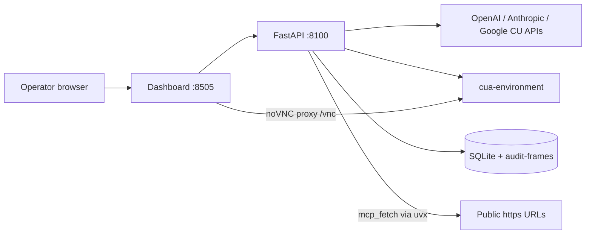
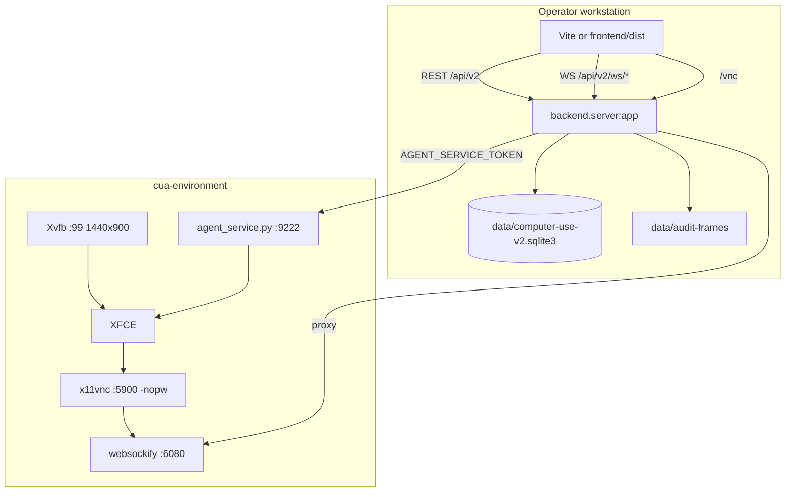
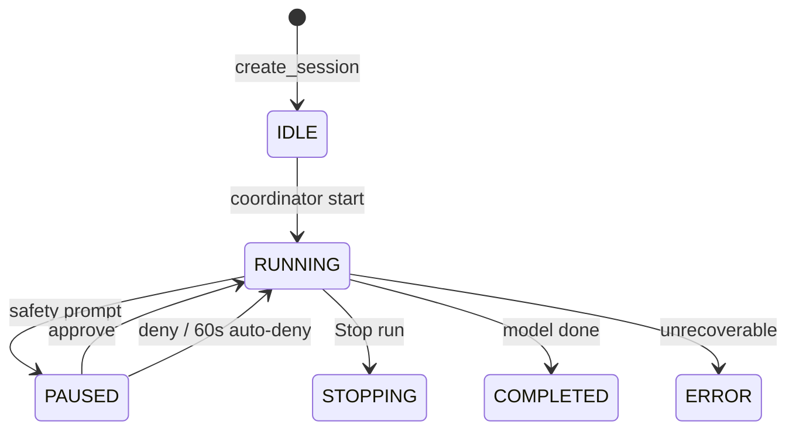

# Architecture

Cited onboarding map of this checkout. Every load-bearing claim
points at a local path. `[INFERRED]` = reasoned, not stated.
`[UNVERIFIED]` = not confirmed from disk.

**Snapshot:** remote `https://github.com/pypi-ahmad/computer-use.git`,
branch `main`, HEAD `56d2f756bc4f963c05616f4de843c146fe720acc`
(`docs: drop History docs section from README`, 2026-08-16).
Working tree also has uncommitted `README.md` and Live/Audit UI
edits in `frontend/src/` — this document describes **HEAD plus
backend on disk**, not those UI diffs.

---

## Part 1 — Whole-repo technical deep-dive

### What this repository is

Computer Use Workbench is a local operator console for official
Computer Use models. The model sees screenshots of a disposable
Ubuntu/XFCE desktop in Docker and returns vendor actions that run
**inside the container**, not on the host. The operator watches the
same XFCE screen through noVNC. There is no hosted agent.
([README.md](../../README.md) opening paragraphs.)

### Tech-stack detection

| Layer | Technology | Evidence |
|---|---|---|
| Language / runtime | Python `>=3.12,<3.15` | [pyproject.toml](../../pyproject.toml#L10) |
| Package | `computer-use-workbench` 3.1.1 | [pyproject.toml](../../pyproject.toml#L6-L8) |
| HTTP | FastAPI 0.141.1, Uvicorn 0.35.0 | [pyproject.toml](../../pyproject.toml#L15-L27) |
| Contracts | Pydantic 2.13.0 | [pyproject.toml](../../pyproject.toml#L21) |
| Providers | openai 2.30.0, anthropic 0.88.0, google-genai 2.7.0, google-auth 2.49.1 | [pyproject.toml](../../pyproject.toml#L14-L18) |
| Frontend | React 19, React Router 7.13.1, Vite 6, TypeScript 5.7, Vitest 3 | [frontend/package.json](../../frontend/package.json#L7-L40) |
| Dashboard Node | Node.js 22 in CI | [.github/workflows/ci.yml](../../.github/workflows/ci.yml#L64-L66) |
| Sandbox OS | `ubuntu:24.04` | [docker/Dockerfile](../../docker/Dockerfile#L1) |
| Persistence | SQLite WAL | [backend/v2/persistence.py](../../backend/v2/persistence.py#L51-L61) |
| Tooling | uv, Ruff 0.14.4, mypy 1.18.2, pytest 9.0.3 | [pyproject.toml](../../pyproject.toml#L31-L38) |

### Entry points

| Surface | Entry | Evidence |
|---|---|---|
| Backend process | `backend.main:main` → `uvicorn.run("backend.server:app", …)` | [backend/main.py](../../backend/main.py#L75-L98) |
| FastAPI app | `backend/server/__init__.py` | [backend/server/__init__.py](../../backend/server/__init__.py#L1) |
| Frontend mount | `frontend/src/main.tsx` → `App` inside `BrowserRouter` | [frontend/src/main.tsx](../../frontend/src/main.tsx#L1-L9) |
| Dev stack | `dev.py` (sandbox + backend + Vite 8505) | [dev.py](../../dev.py#L17-L20) |
| Windows launch | `run.cmd` / `START.bat` | [START.bat](../../START.bat#L1-L12) |
| Sandbox boot | `docker/entrypoint.sh` → `docker/agent_service.py` | [docs/codebase/STRUCTURE.md](STRUCTURE.md#L27) |
| Production SPA | Uvicorn serves `frontend/dist` when present | [README.md](../../README.md) URLs table |

`uvicorn.run` does not set `workers`. Default is one process.
Credentials, WS clients, safety nonces, and circuit state are
process-local. `[INFERRED]` from missing `workers=` plus
[docs/codebase/CONCERNS.md](CONCERNS.md#L8-L9).

### Commands & Verification Inventory

Verified against manifests / CI / TESTING.md. Not guessed.

| Command | Purpose | Evidence |
|---|---|---|
| `uv sync --frozen` | Install locked Python deps | [ci.yml](../../.github/workflows/ci.yml#L26) |
| `uv run python dev.py --open-browser` | Sandbox + backend + Vite | [TESTING.md](../../TESTING.md#L17) |
| `uv run python -m backend.main` | Backend only | [README.md](../../README.md) |
| `uv run ruff check .` | Lint | [ci.yml](../../.github/workflows/ci.yml#L28) |
| `uv run ruff format --check .` | Format gate | [ci.yml](../../.github/workflows/ci.yml#L30) |
| `uv run mypy` | Typecheck | [ci.yml](../../.github/workflows/ci.yml#L32) |
| `uv run pip-audit` | Python advisory audit | [ci.yml](../../.github/workflows/ci.yml#L34) |
| `uv run pytest` | Offline backend tests (`not integration` default) | [pyproject.toml](../../pyproject.toml#L46) |
| `uv run pytest path/to/test_foo.py` | Single file | pytest default; `[INFERRED]` |
| `uv run pytest -m integration` | Live SDK tests (opt-in) | [docs/codebase/TESTING.md](TESTING.md#L12) |
| `uv run pytest -o addopts='' evals/` | Offline evals | [ci.yml](../../.github/workflows/ci.yml#L54) |
| `npm --prefix frontend ci` | Frontend deps | [ci.yml](../../.github/workflows/ci.yml#L69) |
| `npm --prefix frontend run lint` | ESLint `--max-warnings=0` | [frontend/package.json](../../frontend/package.json#L10) |
| `npm --prefix frontend run typecheck` | `tsc --noEmit` | [frontend/package.json](../../frontend/package.json#L11) |
| `npm --prefix frontend run test:run` | Vitest once | [frontend/package.json](../../frontend/package.json#L14) |
| `npm --prefix frontend run test` | Vitest watch | [frontend/package.json](../../frontend/package.json#L13) |
| `npm --prefix frontend run build` | Production bundle | [frontend/package.json](../../frontend/package.json#L9) |
| `npm --prefix frontend audit --audit-level=high` | npm advisory gate | [ci.yml](../../.github/workflows/ci.yml#L74) |
| Manual smoke | File manager task on Live | [TESTING.md](../../TESTING.md#L15-L44) |

**CI workflows**

| Workflow | Trigger | Jobs |
|---|---|---|
| [.github/workflows/ci.yml](../../.github/workflows/ci.yml) | `push`/`pull_request` to `main` | python-quality, python-tests (3.12/3.13/3.14, `--cov-fail-under=60`), frontend, container build + Trivy HIGH/CRITICAL (`exit-code: 1`) |
| [.github/workflows/release.yml](../../.github/workflows/release.yml) | tagged release | `[UNVERIFIED]` job body not re-read this pass |
| [.github/workflows/gemini-changelog-watchdog.yml](../../.github/workflows/gemini-changelog-watchdog.yml) | schedule | `[UNVERIFIED]` job body not re-read this pass |

**CI enforced as required status check / branch protection:**
`[UNVERIFIED]` — not visible from the checkout. Workflows *run* on
`main` PRs. Whether GitHub blocks merge is a repo setting.

### Directory layout

| Path | Purpose |
|---|---|
| `backend/` | FastAPI app |
| `backend/server/` | HTTP/WS, noVNC proxy, lifespan |
| `backend/v2/` | `/api/v2` REST, credentials, SQLite, frames |
| `backend/engine/` | OpenAI / Anthropic / Gemini CU clients |
| `backend/providers/` | Run adapters; leftover planner helper |
| `backend/infra/` | Config, Docker, logs, `mcp_fetch.py` |
| `backend/models/` | JSON catalogs + schemas |
| `backend/loop.py` | Session / step orchestration |
| `backend/executor.py` | CU actions → agent_service |
| `frontend/src/` | Six-tab dashboard |
| `docker/` | Sandbox image + `agent_service.py` |
| `tests/` | Offline pytest |
| `evals/` | Offline HTTP/runtime evals |
| `scripts/` | Handbook, release zip, watchdog |
| `docs/` | Operator + codebase docs |
| `.github/workflows/` | CI / release / watchdog |

### Deployment & Runtime Surface

| Pin | Where | Evidence |
|---|---|---|
| Python 3.12–3.14 | project + CI matrix | [pyproject.toml](../../pyproject.toml#L10); [ci.yml](../../.github/workflows/ci.yml#L42) |
| Node 22 | CI `setup-node` | [ci.yml](../../.github/workflows/ci.yml#L64-L66) |
| uv 0.11.29 | CI + image | [ci.yml](../../.github/workflows/ci.yml#L22-L24); [docker/Dockerfile](../../docker/Dockerfile#L3) |
| Ubuntu 24.04 | sandbox base | [docker/Dockerfile](../../docker/Dockerfile#L1) |
| Display 1440×900 | image + compose | [docker/Dockerfile](../../docker/Dockerfile#L19-L20); [docker-compose.yml](../../docker-compose.yml#L10-L11) |
| Loopback ports 5900 / 6080 / 9222 | compose | [docker-compose.yml](../../docker-compose.yml#L19-L22) |
| Health: agent `/health` AND noVNC `vnc.html` | compose | [docker-compose.yml](../../docker-compose.yml#L60-L65) |
| pids 256, cap_drop ALL, no-new-privileges | compose | [docker-compose.yml](../../docker-compose.yml#L28-L38) |
| Vite `127.0.0.1:8505` | vite config | [frontend/vite.config.ts](../../frontend/vite.config.ts#L6-L8) |
| Backend default `127.0.0.1:8100` | `dev.py` | [dev.py](../../dev.py#L19) |

No `.nvmrc` / `.tool-versions` / `runtime.txt` on disk.

**Drift:** CI builds the sandbox as `computer-use-sandbox:ci`; local
compose uses `cua-ubuntu:latest`. Same `docker/Dockerfile`. Different
tags only. `[INFERRED]`

### EOL / dead-dependency scan

| Item | Status | Note |
|---|---|---|
| Python 3.12–3.14 | current | supported range in 2026 `[INFERRED]` |
| Node 22 | current LTS line `[INFERRED]` | CI pin |
| Ubuntu 24.04 | current LTS `[INFERRED]` | sandbox base |
| React 19 / Vite 6 / FastAPI 0.141 | current majors `[INFERRED]` | not a rewrite target |
| `maybe_plan_with_web_search` | dead helper | defined, **no Python callers** — see contradiction below |
| `requirements.txt` | duplicate of `pyproject.toml` | [CONCERNS.md](CONCERNS.md#L50-L52) |
| `CUA_WS_TOKEN` | deprecated alias | [CONCERNS.md](CONCERNS.md#L17-L19) |

Nothing on the runtime path is EOL. **Leave-it-alone is valid.**
No `MODERNIZATION_PLAN.md` written.

### Data / APIs / jobs / CI / tests

- **Storage:** SQLite WAL at `CUA_V2_DB_PATH` (default
  `data/computer-use-v2.sqlite3`). Frames under `CUA_V2_FRAME_PATH`.
  Keys are **not** in SQLite ([CONCERNS.md](CONCERNS.md#L37-L39)).
- **Public HTTP:** `/api/v2/*` (sessions, safety, workflows,
  analytics, export, retention, diagnostics, shutdown). Vite proxies
  `/api`, `/api/v2/ws`, `/vnc` ([frontend/vite.config.ts](../../frontend/vite.config.ts#L8)).
- **WS:** `/api/v2/ws/desktop` idle, `/api/v2/ws/{session_id}` in-run.
- **Background:** in-process session coordinator (not a worker queue).
- **Tests:** offline pytest + Vitest. Live providers:
  `pytest -m integration`. No automated E2E UI suite
  ([TESTING.md](../../TESTING.md#L6-L7)).

### [Resolved contradiction] Provider web search

**Old docs said:** `useBuiltinSearch` runs
`maybe_plan_with_web_search()`, fetches ≤3 URLs, prepends a brief,
then builds CU clients with `use_builtin_search=False`
(previous text of this file; still in
[TECHNICAL.md](../../TECHNICAL.md) around the planner mention).

**Code now:**

1. `maybe_plan_with_web_search` exists at
   [backend/providers/_common.py](../../backend/providers/_common.py#L59-L117).
   Repo-wide Python search: **definition only, zero callers**.
2. `AgentLoop` stores `use_builtin_search` and passes it into
   `ComputerUseEngine`
   ([backend/loop.py](../../backend/loop.py#L147-L172),
   [backend/loop.py](../../backend/loop.py#L315-L326)).
3. Gemini (same pattern on Claude/OpenAI) advertises `mcp_fetch` on
   CU turns and appends `mcp_fetch_instruction()` to the goal
   ([backend/engine/gemini.py](../../backend/engine/gemini.py#L260-L261),
   [backend/engine/gemini.py](../../backend/engine/gemini.py#L362-L370)).
4. Host runs official Fetch MCP (`uvx mcp-server-fetch`)
   ([backend/infra/mcp_fetch.py](../../backend/infra/mcp_fetch.py#L1-L37)).

Live path = **model-called `mcp_fetch` on CU turns**. Not a planner
pre-brief. Not provider `web_search`.

---

## Part 2 — Context & ecosystem

### Checkout identity

| Field | Value |
|---|---|
| Remote | `https://github.com/pypi-ahmad/computer-use.git` |
| Branch | `main` |
| HEAD | `56d2f756bc4f963c05616f4de843c146fe720acc` |
| Version | 3.1.1 ([pyproject.toml](../../pyproject.toml#L7)) |
| License | MIT ([LICENSE](../../LICENSE#L1-L3)) |

### Agent / contributor docs

| File | Encodes |
|---|---|
| [AGENTS.md](../../AGENTS.md) | Caveman terse-response rule |
| [.github/copilot-instructions.md](../../.github/copilot-instructions.md) | Same caveman rule only |
| [CONTRIBUTING.md](../../CONTRIBUTING.md) | Issues, no money, focused PRs + tests |
| [SECURITY.md](../../SECURITY.md) | Vulnerability reports |
| [DATA.md](../../DATA.md) | Operator owns every payload |

No `CODEOWNERS`. No pre-commit config on disk.

### Developer gotchas

- Default pytest addopts `-m "not integration"` — live SDK tests
  skipped unless you pass `-m integration`
  ([pyproject.toml](../../pyproject.toml#L46-L48)).
- `npm --prefix frontend run test` is **watch** mode; CI uses
  `test:run` ([frontend/package.json](../../frontend/package.json#L13-L14)).
- Open `127.0.0.1`, not `localhost` ([TESTING.md](../../TESTING.md#L18)).
- `AGENT_SERVICE_TOKEN` mismatch → 401 screenshots, blank viewport.
- `VNC_PASSWORD` unused; x11vnc `-nopw`.
- User/process `GOOGLE_API_KEY` wins over `.env`.
- Vite watch vs one-shot is the only watch-mode trap found.

### Ecosystem (from disk only)

Independent local console over OpenAI / Anthropic / Google Computer
Use APIs. Not an official vendor product. Sandbox is the only OS-input
surface. No sibling deployables on disk.

---

## Part 3 — Architectural blueprint

### Style

Local single-operator **modular monolith** + one Docker sandbox.
FastAPI owns HTTP, WS, orchestration, in-memory runtime, and the
production SPA. SQLite + frame dir are durable audit state. Sandbox
is the only process allowed to inject OS input.

v2 is additive: richer contracts, then bridge into existing
`AgentLoop` + engines.

### C4 — Level 1 system context



### C4 — Level 2 containers



### C4 — Level 3 start-run lifecycle

```mermaid
sequenceDiagram
  participant UI as Live tab
  participant API as POST /api/v2/sessions
  participant Loop as AgentLoop
  participant Eng as ComputerUseEngine
  participant Ex as DesktopExecutor
  participant Box as agent_service
  UI->>API: task, model, route, maxSteps 50
  API->>API: SQLite session + coordinator
  API->>Loop: start
  Loop->>Eng: use_builtin_search flag
  loop each turn
    Eng->>Eng: screenshot + vendor CU
    opt mcp_fetch on
      Eng->>Eng: model may call mcp_fetch
    end
    Eng->>Ex: click/type/hotkey
    Ex->>Box: HTTP + token
    API-->>UI: WS events / safety prompt
  end
```

### Layering

| Layer | Owns | Must not own | Evidence |
|---|---|---|---|
| `backend/server` | HTTP/WS, middleware, v1, v2 bridge | Provider SDK protocol | [backend/server/__init__.py](../../backend/server/__init__.py) |
| `backend/v2/*` | v2 contract, routing, persistence, credentials/frames | OS input | [backend/v2/](../../backend/v2/) |
| `backend/loop.py` | Step-limited session lifecycle | HTTP schemas | [backend/loop.py](../../backend/loop.py#L134) |
| `backend/engine/*` | Provider CU clients, `mcp_fetch` tools | FastAPI routing | [backend/engine/gemini.py](../../backend/engine/gemini.py#L260-L365) |
| `backend/executor.py` | Action → agent_service | Provider selection | [backend/executor.py](../../backend/executor.py#L421) |
| `backend/infra/*` | Config, Docker, logs, MCP client | Public v2 domain | [backend/infra/](../../backend/infra/) |
| `docker/agent_service.py` | Allowlisted desktop actions | Provider inference | [docker/agent_service.py](../../docker/agent_service.py) |
| `frontend/src/*` | Operator UI, API/WS, CUAF decode | Credential persistence | [frontend/src/](../../frontend/src/) |

**Enforcement:** convention + review. No import-linter / CODEOWNERS.

### Cross-cutting concerns

| Concern | Where | Evidence |
|---|---|---|
| Auth | Loopback default; `CUA_API_TOKEN` for `/api/*`, WS, `/vnc/websockify`; public bind needs `CUA_ALLOW_PUBLIC_BIND=1` + token | [backend/main.py](../../backend/main.py#L26-L66) |
| Config | `.env` via `backend/infra/config.py`; `_USER_ENV` snapshot | [CONCERNS.md](CONCERNS.md) |
| Secrets | Process-local vault, 8 h expiry, not SQLite | [CONCERNS.md](CONCERNS.md#L37-L39) |
| Logging | `configure_logging()`; `LOG_FORMAT` / `LOG_LEVEL` | [backend/main.py](../../backend/main.py#L12-L16) |
| Metrics | SQLite `EXECUTION` tokens; Session cost = list rates | [frontend/src/pricing.ts](../../frontend/src/pricing.ts) |
| Safety | `provider_default` / `confirm_mutating` / `read_only`; 60 s auto-deny | [README.md](../../README.md); [CONCERNS.md](CONCERNS.md#L15-L16) |
| Feature flags | None as a platform. Live toggles: `useBuiltinSearch`, safety policy | dashboard |

### Inferred ADRs

1. **Sandbox-only execution.** Host desktop is not an action target.
   Isolation = throw-away container.
2. **One process.** Credentials + WS + safety are memory-local.
   Horizontal scale is out of scope.
3. **v2 bridges AgentLoop** rather than a second runtime.
4. **Fetch MCP, not vendor web_search.** Model fetches a URL it already
   has. Host `uvx mcp-server-fetch`.
5. **noVNC is the picture.** CUAF frames exist on the socket; UI does
   not show them as the live desktop.
6. **Fail-closed public bind.** Non-loopback `HOST` exits 2 without
   both knobs ([backend/main.py](../../backend/main.py#L49-L66)).

### Governance

- CI on `main` PRs/pushes: Ruff, format, mypy, pip-audit, pytest
  3.12–3.14 `--cov-fail-under=60`, evals, frontend
  lint/typecheck/test/build, npm audit high, image + Trivy.
- Enforcement of required checks: `[UNVERIFIED]`.
- PR template: [.github/PULL_REQUEST_TEMPLATE.md](../../.github/PULL_REQUEST_TEMPLATE.md).

### How to add a feature

1. Find the layer in the table above. Do not put OS input in `v2/`
   or provider SDK calls in `frontend/`.
2. Change the contract (`backend/models/` or `backend/v2/`) if the
   wire shape changes.
3. Add one offline test (`tests/` or `frontend/src/*.test.*`).
4. Update the matching operator doc (`README.md` / `USAGE.md` /
   `TECHNICAL.md`) in the same change if the operator surface moved.
5. Do not start a hours-long browser session. Manual smoke ≤ 5 min
   if the UI changed.

**Pitfalls:** token mismatch; `localhost` vs `127.0.0.1`; Gemini +
file attachments (File Search cannot combine with CU); treating
Session cost as an invoice; exposing 5900/6080 off loopback;
calling `maybe_plan_with_web_search` — it is unused.

---

## Subsystem deep-dives

### 1. Session coordinator → AgentLoop → engine

**Hard part:** v2 HTTP looks like a new platform; execution is still
`AgentLoop`.

- `POST /api/v2/sessions` validates catalog, writes SQLite, starts a
  background coordinator ([docs/codebase/ARCHITECTURE.md](#c4--level-3-start-run-lifecycle)
  flow; implementation in `backend/v2/api.py` +
  `backend/v2/orchestrator.py`).
- Coordinator resolves credentials (`credentialSessionId` vault, else
  `resolve_api_key()` / `_USER_ENV`), waits for sandbox health, starts
  `AgentLoop` ([backend/loop.py](../../backend/loop.py#L134-L172)).
- Loop builds `ComputerUseEngine` with `use_builtin_search`
  ([backend/loop.py](../../backend/loop.py#L315-L326)).
- Stuck-agent detector: three identical action fingerprints → stop
  ([backend/loop.py](../../backend/loop.py#L333-L336)).
- Risky steps pause on an in-memory nonce; dashboard
  `POST /api/v2/sessions/{id}/safety-decisions`.
- Crash between a desktop action and the next `ACTION` event can omit
  that step from the journal ([this file’s prior risk list](#part-1--whole-repo-technical-deep-dive)).



Statuses other than IDLE/create are `[INFERRED]` names from operator
docs; confirm literals in `backend/v2` before treating them as an API
contract.

### 2. Sandbox + executor + noVNC

**Hard part:** three ports, one token, no VNC password.

- Compose publishes 5900 / 6080 / 9222 on `127.0.0.1` only
  ([docker-compose.yml](../../docker-compose.yml#L19-L22)).
- Health requires **both** `9222/health` and `6080/vnc.html`
  ([docker-compose.yml](../../docker-compose.yml#L65)).
- `DesktopExecutor` maps vendor CU actions to
  `docker/agent_service.py` with `AGENT_SERVICE_TOKEN`
  ([backend/executor.py](../../backend/executor.py#L421)).
- Live iframe: `/vnc/vnc.html?path=vnc/websockify`, no `password=`
  ([TESTING.md](../../TESTING.md#L22-L24)).
- x11vnc `-nopw`. Loopback is the control, not a VNC secret
  ([CONCERNS.md](CONCERNS.md#L46-L47)).
- cap_drop ALL, non-root, pids 256, no-new-privileges
  ([docker-compose.yml](../../docker-compose.yml#L28-L38)).

### 3. `mcp_fetch` on Computer Use turns

**Hard part:** the toggle name says “web search”; the implementation
is URL fetch.

- Live `useBuiltinSearch` → `use_builtin_search=True` on the engine.
- Engine adds `mcp_fetch` tool + instruction
  ([backend/engine/gemini.py](../../backend/engine/gemini.py#L362-L370)).
- Host spawns `uvx mcp-server-fetch` (override `CUA_MCP_FETCH_CMD`)
  ([backend/infra/mcp_fetch.py](../../backend/infra/mcp_fetch.py#L29)).
- Localhost / private IPs rejected; hostnames with a dot are fetched.
  Not a complete SSRF guarantee ([CONCERNS.md](CONCERNS.md#L42-L45)).
- Fetch runs on the **host**, not in the sandbox.
- `maybe_plan_with_web_search` is leftover. Do not wire new code to it.

---

## Confidence assessment

| Area | Rating | Why |
|---|---|---|
| Stack versions | High | Read from `pyproject.toml` / `package.json` / Dockerfile / CI |
| Entry points | High | Read `main.py`, `main.tsx`, `dev.py` |
| Commands inventory | High | Matched CI + TESTING.md + package scripts |
| `mcp_fetch` live path | High | Read engine + loop; grep showed no planner callers |
| Process-local / one worker | High / Inferred | No `workers=`; concerns doc agrees |
| Session status state machine | Inferred | Names from operator docs, not every literal re-read |
| CI branch protection | Unverified | Repo setting |
| EOL claims | Inferred | Calendar/knowledge, not vendor pages this pass |
| Uncommitted frontend log UI | Out of scope | Working tree only |

---

## Footnotes — local file citations

| File | Establishes |
|---|---|
| [README.md](../../README.md) | Product identity, URLs, operator flow |
| [pyproject.toml](../../pyproject.toml) | Python package, deps, pytest default |
| [frontend/package.json](../../frontend/package.json) | Frontend scripts and versions |
| [frontend/vite.config.ts](../../frontend/vite.config.ts) | Bind, proxy, Vitest include |
| [backend/main.py](../../backend/main.py) | Public-bind guardrail, Uvicorn entry |
| [backend/loop.py](../../backend/loop.py) | `AgentLoop`, search flag into engine |
| [backend/engine/gemini.py](../../backend/engine/gemini.py) | `mcp_fetch` on CU turns |
| [backend/infra/mcp_fetch.py](../../backend/infra/mcp_fetch.py) | Fetch MCP client |
| [backend/providers/_common.py](../../backend/providers/_common.py) | Unused planner helper |
| [backend/v2/persistence.py](../../backend/v2/persistence.py) | SQLite WAL |
| [backend/executor.py](../../backend/executor.py) | `DesktopExecutor` |
| [docker/Dockerfile](../../docker/Dockerfile) | Ubuntu 24.04, 1440×900, uv 0.11.29 |
| [docker-compose.yml](../../docker-compose.yml) | Ports, health, hardening |
| [.github/workflows/ci.yml](../../.github/workflows/ci.yml) | Gates and matrix |
| [TESTING.md](../../TESTING.md) | Manual smoke + CI-equivalent commands |
| [docs/codebase/CONCERNS.md](CONCERNS.md) | Risks, token, SSRF, one-worker |
| [docs/codebase/STRUCTURE.md](STRUCTURE.md) | Directory map (planner line there is stale) |
| [LICENSE](../../LICENSE) | MIT, Copyright 2026 Ahmad |
